# PierrotOCRVLM — 설계 · 학습 · 실험 기록

문서 파싱 전용 **0.986B** VLM 한 대를 바닥부터 만들고, 한국어 문서 벤치마크에서
**3축 평균 76.90**(상용 1위와 동률)까지 올린 기록이다. 성공한 것뿐 아니라 **실패한 가설과 계측 실수**도
같이 적는다 — 이 프로젝트에서 가장 비쌌던 것이 그쪽이기 때문이다.

> 이 저장소는 **추론 배포본**이다. 학습 스크립트·하이퍼파라미터·데이터 빌더는 들어 있지
> 않으므로, 아래 본문에서 그런 파일을 가리키는 대목은 학습 저장소를 뜻한다.

**목차** — [1 개요](#1-개요) · [2 아키텍처](#2-아키텍처) · [3 태스크 설계](#3-태스크-설계) ·
[4 추론 파이프라인](#4-추론-파이프라인) · [5 학습 방법](#5-학습-방법) · [6 데이터](#6-데이터) ·
[7 실험 기록](#7-실험-기록) · [8 성능](#8-성능) · [9 기각된 가설](#9-기각된-가설) ·
[10 계측 결함 14건](#10-계측-결함-14건) · [11 남은 병목](#11-남은-병목)

---

## 1. 개요

**골격은 단일 체크포인트다.** 태스크별 헤드도 태스크별 모델도 두지 않고, **프롬프트만
바꿔** 레이아웃 검출과 영역 인식을 모두 수행한다 — coarse-to-fine 2단계, 좌표를 텍스트로
생성하는 detection-as-text, 표는 OTSL. 이 태스크 설계는 선행 연구에서 가져왔고 출처는
아래 계보 표에 적었다.

우리가 정한 것은 두 가지다.

1. **부품 구성** — 눈은 **Qwen3-VL-2B 의 비전 타워**(+DeepStack, 306.2M), 뇌는 별개
   모델인 **Qwen3-0.6B 디코더**(596.0M)다. Qwen3-VL-2B 를 통째로 쓴 게 아니라 **비전만**
   떼어 오고 언어는 버렸다 — 그래서 둘을 잇는 부품이 새로 필요하다(§2.1).
   선행 구성(눈 631M / 뇌 494M)과 견주면 **눈을 줄이고 뇌를 키운 배분**이다(§2.3)
2. **데이터 엔진** — 한국어 중심 배합 + 전량 공개 데이터 + 티처 증류

학습 방법은 "스크래치"가 아니라 **modular initialization** 이다. 비전·언어는 검증된
사전학습 부품에서 이식하고, 두 부품을 잇는 **PatchMerger 4개와 문서 파싱 능력만** 처음부터
배운다. (모델링 *코드* 는 HF 클래스 없이 직접 작성했다.)

### 기술 계보

뿌리가 다섯이다 — 뼈대, 문서를 볼 수 있게 하는 장치, 깊이 주입, 태스크 설계, 데이터·보상.

| 뿌리 | 물려받은 것 |
|---|---|
| **LLaVA** (2023) | ViT + 커넥터 + LLM 구성 / **백본 동결하고 커넥터만 정렬 → 전체 해제** 2단계 레시피 |
| **Qwen2-VL → Qwen3-VL** (2024–25) | 동적 해상도 · M-RoPE · 2×2 PatchMerger · DeepStack · 32배수 격자 |
| [**DeepStack**](https://arxiv.org/abs/2406.04334) (2024) | 시각 정보를 입력에 몰지 않고 **LLM 깊이 방향으로 나눠 넣는다**는 발상 (구현은 위 Qwen3-VL 것을 채택 — §2.4) |
| **MinerU2.5 / Pro** (2025) | **프롬프트로 태스크 전환** · coarse-to-fine · detection-as-text · OTSL · 정렬→파싱→hard-case 커리큘럼 |
| PaddleOCR-VL (2025) | hard-case 분류 · 렌더 검증 · **한국어 티처** |
| GLM-OCR (2025) | crop 병렬 추론 (MTP 는 스펙 비공개라 제외) |

여기에 **우리가 새로 넣은 것**은 어느 뿌리에도 없다.

| 추가 | 왜 |
|---|---|
| PatchMerger 4개(DeepStack 3개 출력층 zero-init) | 압축 2.0배 부담 + 작아진 ViT 보완 |
| 레이아웃 규약 3분리(fine/coarse/wild) | 데이터셋별 라벨 규약 충돌로 오분류 13.1% 발생(v1) |
| 태스크별 해상도 예산(인식 2048 / 레이아웃 1024 토큰) | 작은 글자 오독이 다운샘플 증상으로 확인됨(v1) |
| `Page Recognition:` 태스크 | 페이지 통읽기 데이터가 압도적으로 많음 |
| 한국어 중심 배합 + 전량 공개 데이터 | 재현성 |

---

## 2. 아키텍처

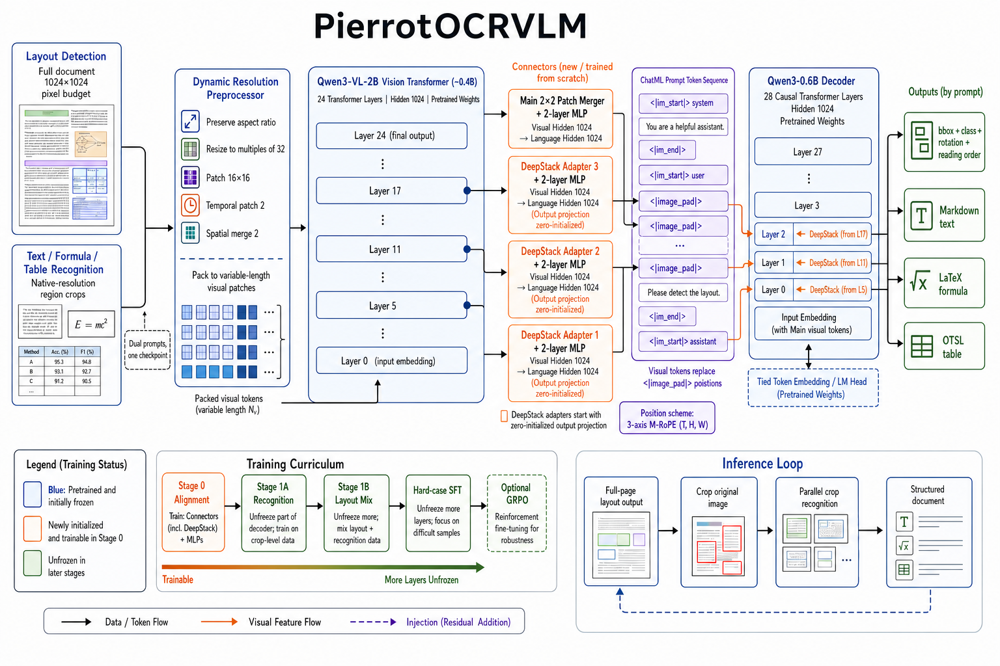

| 구성 | 내용 | 초기화 |
|---|---|---|
| 비전 인코더 | Qwen3-VL-2B ViT — hidden 1024, 24층, patch 16, merge 2, DeepStack [5,11,17] · **306.2M** | 공개 `visual.*` 이식 |
| PatchMerger 4개 | main 1 + DeepStack 3, 출력 1024 · **83.9M** | **전부 랜덤.** DeepStack 3개는 출력층 **zero-init** |
| 디코더 | Qwen3-0.6B — hidden 1024, 28층, head_dim 128, GQA 16/8, QK-Norm · **596.0M** | 공개 가중치 이식 + 1D RoPE → **interleaved M-RoPE** 교체 |

#### 무엇을 이식하고 무엇을 버렸나

"Qwen3-VL-2B 에서 ViT 만 가져왔다"는 말은 정확히는 **`visual.*` 에서 머저를 뺀 나머지**다.
그 모델의 언어 디코더(~1.7B)는 통째로 버리고 별개 모델 Qwen3-0.6B 를 붙였다.

```
Qwen3-VL-2B                          PierrotOCRVLM
├ visual.patch_embed  ───이식──▶  ├ visual.patch_embed         1.6M
├ visual.pos_embed    ───이식──▶  ├ visual.pos_embed           2.4M   합 306.2M
├ visual.blocks (24층) ──이식──▶  ├ visual.blocks (24층)      302.3M
├ visual.merger          ✗ 버림   ├ visual.merger              21.0M  ⬜ 랜덤
├ visual.deepstack_*     ✗ 버림   ├ visual.deepstack_*         63.0M  ⬜ 랜덤   합 83.9M
└ 언어 디코더 ~1.7B      ✗ 버림   │
                                  └ language_model  ◀─Qwen3-0.6B─    596.0M
```

머저까지 못 가져온 이유는 **뇌를 바꿨기 때문**이다. 원본 머저는 출력이 2048(그쪽 언어
hidden)이라 "2048짜리 뇌"를 향해 말하도록 학습돼 있는데, 우리 뇌는 1024 다 — 크기부터
안 맞아 파라미터 수도 다르다(원본 25.2M vs 우리 21.0M). 머저는 눈과 뇌를 잇는 부품이라
**뇌를 갈면 함께 갈아야 한다**([config.py:54-57](../../pierrot/models/pierrotocrvlm/config.py#L54-L57)).

### 2.1 PatchMerger — 유일하게 처음부터 배우는 부품

**눈과 뇌는 "원래 짝"이 아니다.** 이식이라고 하면 한 모델을 통째로 가져온 것처럼
들리지만, 우리는 눈과 뇌를 서로 다른 모델에서 떼어 왔다. ViT 가 원래 맞춰져
있던 언어 공간과 실제로 붙인 디코더의 hidden 이 다르므로 **둘을 잇는 부품은 재사용이
불가능하고 랜덤에서 다시 배워야 한다.** 그 부품이 PatchMerger 이고,
**PierrotOCRVLM 에서 처음부터 학습되는 것은 이 4개가 전부**다(83.9M = 8.5%).

한마디로 **ViT 가 낸 것을 디코더가 "토큰"으로 받아들일 수 있게 적응시키는 단계**다.
적응할 것이 두 가지다.

| | 무엇을 맞추나 | 어떻게 |
|---|---|---|
| ① **개수** | 패치가 너무 많다 | 이웃 m×m(=2×2)을 하나로 합쳐 **1/4** 로 줄인다 |
| ② **공간** | ViT 의 표현 공간 ≠ 디코더의 임베딩 공간 | **4096 → 1024** 로 투영하며 의미를 옮긴다 |

#### 왜 "4패치"가 아니라 "2×2 블록"이라고 말하나

①을 "패치 4개를 합친다"고만 하면 **어느 4개인지가 안 정해진다.** 패치는 줄이 아니라
격자로 놓여 있기 때문이다.

```
        0      16      32      48      ← x(px)
   0 ┌───────┬───────┬───────┬───────┐
     │   0   │   1   │   2   │   3   │
  16 ├───────┼───────┼───────┼───────┤     한 칸 = 패치 16×16px
     │   4   │   5   │   6   │   7   │
  32 ├───────┼───────┼───────┼───────┤
     │   8   │   9   │  10   │  11   │
  48 ├───────┼───────┼───────┼───────┤
     │  12   │  13   │  14   │  15   │
     └───────┴───────┴───────┴───────┘
```

`0,1,2,3` 도 4개고 `0,1,4,5` 도 4개다. 어느 쪽으로 묶느냐에 따라 **토큰 하나가 덮는 실제
영역**이 달라진다.

| 묶는 방법 | 예 | 토큰 하나가 덮는 영역 | |
|---|---|---|---|
| **2×2 블록** | `0,1,4,5` | **32×32 px** | 정사각 ✅ |
| 가로 1×4 | `0,1,2,3` | 16×64 px | 납작한 띠 ❌ |
| 세로 4×1 | `0,4,8,12` | 64×16 px | 긴 띠 ❌ |

정사각이어야 하는 이유가 셋이다.

1. **글자가 정사각이다.** 한글 음절 하나는 대략 정사각이라 32×32 토큰에 얌전히 들어간다.
   16×64 띠로 묶으면 **음절 하나가 위아래로 잘려** 여러 토큰에 흩어지고, 대신 옆 글자
   넷이 한 토큰에 섞인다.
2. **좌표가 정의되어야 한다.** M-RoPE 가 이미지 토큰에 주는 위치는 `(h//m, w//m)`,
   곧 **블록 좌표**다. "몇 행 몇 열"이라고 말하려면 직사각 한 칸이어야 한다 — 대각선으로
   묶은 4개는 행도 열도 정할 수 없다. 좌표를 텍스트로 뱉는 이 모델에는 치명적이다.
3. **설정값은 `m` 하나뿐이다.** 4는 `m²` 로 파생된 값이다
   ([vision.py:281](../../pierrot/models/pierrotocrvlm/modeling/vision.py#L281)).
   `m=3` 이면 3×3 = **9패치**가 된다 — 규칙은 언제나 **m×m 정사각**이다.

그래서 "4패치"는 **개수**만 말하고 "2×2 블록"은 **어디 있는 4개인지**까지 말한다.

②가 어려운 쪽이다. 단순히 차원을 맞추는 캐스팅이 아니라 **디코더가 쓰는 단어 임베딩과
같은 공간에 착지**해야 한다 — 본 머저의 출력이 `<\|image_pad\|>` 자리를 그대로 대체하므로,
디코더 입장에서 그것은 "이미지 특징"이 아니라 **그냥 토큰 하나**이고 텍스트 토큰과 구분
없이 어텐션을 받는다.

이름이 "Merger"(합치기)라 ①만 하는 것처럼 들리지만, 아무도 모르는 **"이 시각 패턴 = 저
언어 벡터"라는 대응을 세우는 것**이 이 부품의 본업이다. Stage 0 에서 ViT·LM 을 얼려 두고
이 4개만 먼저 학습시키는 이유가 그것이다(§5).

참고로 이식 원본의 출력은 2048(그쪽 언어 폭)인데 우리 디코더는 1024 다. 이 한 줄 때문에
사전학습 머저 가중치를 그대로 쓸 수 없다.

#### 입력과 출력 — 텐서 차원

배치를 패딩하지 않고 **패치를 한 줄로 이어붙인 시퀀스**로 다룬다. 이미지마다 격자가 달라
패딩이 불가능하고, 없으니 낭비도 없다. 이미지 경계는 `grid_thw` 가 알려 준다.

| 기호 | 뜻 | 레이아웃 패스 1장 예 |
|---|---|---:|
| `S` | 배치 전체 패치 수 (= Σ `t·h·w`) | 4,096 |
| `t` | 시간 축 격자 수 — **정지 이미지는 항상 1** 이라 사실상 `S = Σ h·w` | 1 |
| `D` | ViT hidden | 1,024 |
| `m` | `spatial_merge_size` (압축 배율) | 2 |
| `D·m²` | 이웃 m×m 을 채널로 접은 폭 | 4,096 |
| `Dout` | 디코더 hidden (= 이미지 토큰 임베딩 폭) | 1,024 |

머저 1개를 텐서가 지나가는 모양은 이렇다
([vision.py:263-295](../../pierrot/models/pierrotocrvlm/modeling/vision.py#L263-L295)).

```python
x                        # (S,     D)     = (4096, 1024)   비전 블록 출력
x = norm(x)              # (S,     D)     main: 패치 하나씩 정규화
x = x.view(-1, D*m*m)    # (S/m², D·m²)   = (1024, 4096)   이웃 4패치를 채널로 접는다
x = gelu(linear_fc1(x))  # (S/m², D·m²)   4096 → 4096
x = linear_fc2(x)        # (S/m², Dout)   = (1024, 1024)   ← 여기서 언어 공간으로 넘어간다
```

#### `view` 한 줄이 하는 일 — 복사도 전치도 아니다

가장 오해하기 쉬운 줄이라 따로 적는다. **숫자는 하나도 바뀌지 않고, "몇 개씩 끊어
읽을지"만 바뀐다.**

```
합치기 전  (4096행 × 1024열)  — 한 행 = 패치 하나
  행 0 : [a0 a1 … a1023]     ← 좌상단 패치
  행 1 : [b0 b1 … b1023]     ← 그 오른쪽
  행 2 : [c0 c1 … c1023]     ← 그 아래
  행 3 : [d0 d1 … d1023]     ← 대각선

view(-1, 4096) 뒤  (1024행 × 4096열)  — 한 행 = 2×2 블록 하나
  행 0 : [a0…a1023 │ b0…b1023 │ c0…c1023 │ d0…d1023]
```

**같은 것을 4번 복사하는 게 아니다** — 서로 다른 패치 4장을 한 줄에 이어 붙인다.
숫자 총 개수는 4096×1024 = 1024×4096 으로 **완전히 같고**, 메모리 주소도 그대로다.
"4배"가 두 번 나오지만 방향이 반대다:

| | 값 | 의미 |
|---|---|---|
| 행 **수** | 4096 → 1024 | **1/4 로 줄었다** (토큰이 줄어든 것) |
| 행 **길이** | 1024 → 4096 | **4배 늘었다** (한 줄에 4장이 들어와서) |

그래서 `view` 는 연산이 아니라 **재해석**이고 비용이 0 이다. **실제 압축은 그 다음
`linear_fc2`(4096 → 1024)에서 일어난다** — 거기서 처음으로 정보가 버려진다.

**전치(transpose)와 헷갈리기 쉽다.** 이 경우 두 결과의 *모양*이 (1024, 4096) 으로
똑같기 때문이다. 하지만 내용이 정반대다.

| | 0행에 무엇이 모이나 | 의미 |
|---|---|---|
| **`view`** | `a0…a1023 b0…b1023 c… d…` | **한 위치의 이웃 4패치** → fc 가 "이 2×2 구역을 어떻게 요약할까"를 배운다 |
| **전치** | 모든 패치의 0번 특징 | **특징 하나가 페이지 전체를 훑은 것** → 위치 개념이 사라져 좌표를 낼 수 없다 |

`view` 는 읽는 순서가 원본과 같아 메모리를 안 건드리지만(`is_contiguous() == True`),
전치는 순서가 뒤섞여 대개 `contiguous()` 복사가 필요하다.

**이게 가능한 전제**는 연속한 4행이 진짜 이웃이라는 것이고, 전처리가 그렇게 만들어 둔다
([processor.py:171-172](../../pierrot/models/pierrotocrvlm/processor.py#L171-L172)의 `permute`).
4×4 패치 격자로 확인하면:

```
원본 격자          펼친 순서: [0,1,4,5, 2,3,6,7, 8,9,12,13, 10,11,14,15]
 0  1  2  3
 4  5  6  7        연속 4개씩 끊으면
 8  9 10 11          토큰 0 ← 패치 0,1,4,5  = (0,0)(0,1)(1,0)(1,1)  ← 왼쪽 위 2×2
12 13 14 15          토큰 1 ← 패치 2,3,6,7
```

행 우선으로 펼쳤다면 연속 4개가 `0,1,2,3` — **가로 한 줄**이라 2×2 가 아니다. 무거운
재배치는 **전처리에서 한 번** 해 두고, 모델 안에서는 매 forward 마다 `view` 로 공짜로 접는다.

⚠ **시간 축 복제는 이것과 별개다.** 전처리에 같은 것을 실제로 2번 복사하는 줄이 있다
([processor.py:173](../../pierrot/models/pierrotocrvlm/processor.py#L173)). 이식해 온 ViT 가
원래 **동영상**용이라 시간 축(`temporal_patch_size = 2`)을 요구하는데, 정지 이미지는
프레임이 하나뿐이라 **같은 프레임을 2번 넣어** 형식을 맞춘다. 그래서 패치 하나의 길이가
3 × **2** × 16 × 16 = 1,536 이다. 정리하면 — 시간 축은 **복사**, 머저의 `view` 는
**이어 붙이기**다.

파라미터는 머저 1개당 **약 21.0M**(fc1 16.8M + fc2 4.2M + norm)이고, 4개 합쳐 **83.9M**
= 전체 0.986B 의 **8.5%** 다.

#### 왜 머저가 4개인가 — 읽는 곳이 4군데라서

ViT 를 마지막에 한 번만 읽지 않는다. **최종층 + 중간 3층**을 읽고, **읽는 지점마다 전용
머저가 하나씩** 붙는다. 네 개가 내는 텐서는 모양이 모두 `(S/m², 1024)` 로 같지만
**가는 곳과 역할이 다르다.**

| # | 모듈 | 읽는 곳 | 출력 | 가는 곳 | 초기화 |
|---:|---|---|---|---|---|
| 1 | `visual.merger` | ViT **최종층**(23) | (S/m², 1024) | `<\|image_pad\|>` 자리를 **교체** (masked_scatter) | 랜덤 |
| 2 | `deepstack_merger_list[0]` | ViT **5층** | 〃 | 디코더 **0층** 출력에 **덧셈** | `fc2` **zero** |
| 3 | `deepstack_merger_list[1]` | ViT **11층** | 〃 | 디코더 **1층** 출력에 덧셈 | 〃 |
| 4 | `deepstack_merger_list[2]` | ViT **17층** | 〃 | 디코더 **2층** 출력에 덧셈 | 〃 |

**1번만 필수다.** 비전에서 언어로 넘어가는 유일한 통로이고, 이것이 만든 벡터가 곧 이미지
토큰의 임베딩이 된다. 이것이 없으면 모델이 성립하지 않는다.

**2~4번은 보정이다.** 최종층 하나만 쓰면 작은 글자·획·표 경계처럼 저수준 정보가 위로
올라오면서 희석된다. 중간층이 아직 들고 있는 그 정보를 **이미지 토큰 위치에만** 더한다
([text.py:296-297](../../pierrot/models/pierrotocrvlm/modeling/text.py#L296-L297)).
시퀀스가 길어지지 않는 것이 핵심이다 — 토큰을 추가하는 게 아니라 있는 자리에 더한다.

**가중치를 공유하지 않는 이유**: 층마다 특징 분포가 다르고, 무엇보다 1번은 "임베딩을
만드는" 일이고 2~4번은 "0 에서 시작해 조금씩 고치는" 일이라 목표 자체가 다르다.

**덧셈이 성립하는 조건**은 네 출력의 **토큰 순서가 같다**는 것이다. 넷 다 같은 패치
시퀀스를 같은 규칙으로 접으므로 i 번째 행은 항상 같은 이미지 토큰을 가리킨다.

두 종류의 차이는 **정규화 시점** 하나뿐이다.

| | 개수 | LayerNorm 시점 | 정규화 대상 | 초기화 |
|---|---:|---|---|---|
| main | 1 | 합치기 **전** | 패치 하나 (D=1024) | 랜덤 |
| DeepStack | 3 | 합친 **후** | 합쳐진 토큰 (D·m²=4096) | `linear_fc2` **zero-init** |

DeepStack 쪽만 출력층을 0 으로 두는 이유: 학습 시작 시점의 주입이 **정확히 no-op** 이
되어 랜덤 잡음이 사전학습 디코더를 흔들지 않는다. `fc1`·`norm` 은 랜덤이라 출력은 0
이면서 gradient 는 흐른다. (조립은 학습 저장소의 로더가 한다.)

**여기가 이 모델의 최대 리스크였다.** 사전학습 부품 두 개 사이에 완전 랜덤인 층이
끼어 있으므로, Stage 0 에서 ViT·LM 을 얼려 두고 이 4개만 먼저 정렬시킨다(§5).
커넥터만 먼저 정렬하는 단계는 이 구조에서 **선택이 아니라 필연**이고, 우리 압축은
2.0배로 선행 구성(1.7배)보다 세다(§2.3 표).

단 ViT 가 **완전 생짜는 아니다** — Qwen3-VL 안에서 이미 멀티모달 정렬을 거쳤다.
Stage 0 이 1,111스텝(~1h)만에 정렬되고 Stage 1A 가 loss 0.2대에서 출발한 것이 그 증거다.

### 2.2 interleaved M-RoPE — 위치를 3축으로 준다

문서는 1차원이 아니다. 표의 한 셀은 "몇 번째 토큰"이 아니라 **몇 행 몇 열**에 있고,
좌표를 텍스트로 생성하려면 모델이 그 2차원 위치를 알아야 한다. M-RoPE 는 위치를
**(시간 t, 높이 h, 너비 w) 세 축**으로 주는 RoPE 변형이다.

**위치를 매기는 규칙** ([get_rope_index](../../pierrot/models/pierrotocrvlm/modeling/pierrotocrvlm.py)):

| 구간 | t · h · w |
|---|---|
| 텍스트 | 세 축이 **같은 값**으로 1씩 증가 → 1D RoPE 와 동치 |
| 이미지 | 격자 좌표를 그대로 (t, h/m, w/m) |
| 이미지 다음 텍스트 | `max(h, w)/m` 만큼 진행한 위치에서 이어받는다 |

마지막 줄이 요점이다. 이미지가 "위치를 얼마나 차지하는가"를 격자의 긴 변으로 정해,
그림 뒤 문장이 그림 속 토큰과 위치가 겹치지 않게 한다.

**예제 — 이미지 한 장에 붙는 위치 번호** (아래 표는 [get_rope_index](../../pierrot/models/pierrotocrvlm/modeling/pierrotocrvlm.py#L120-L174) 실행 결과 그대로다)

격자 `(t,h,w) = (1,4,6)` 패치 → 머저(m=2) 후 **2행 3열 = 이미지 토큰 6개**.
프롬프트는 `[텍스트 3토큰][이미지 6토큰][텍스트 2토큰]` 이다.

| 토큰 | 0 | 1 | 2 | 3 | 4 | 5 | 6 | 7 | 8 | 9 | 10 |
|---|--:|--:|--:|--:|--:|--:|--:|--:|--:|--:|--:|
| 구간 | 텍 | 텍 | 텍 | img | img | img | img | img | img | 텍 | 텍 |
| **t** | 0 | 1 | 2 | 3 | 3 | 3 | 3 | 3 | 3 | 6 | 7 |
| **h** | 0 | 1 | 2 | 3 | 3 | 3 | 4 | 4 | 4 | 6 | 7 |
| **w** | 0 | 1 | 2 | 3 | 4 | 5 | 3 | 4 | 5 | 6 | 7 |

읽는 법:

- **텍스트 구간**(0~2, 9~10)은 t·h·w 가 전부 같다 → 1D RoPE 와 동치.
- **이미지 구간**(3~8)은 t 를 고정하고 h·w 만 격자를 따라 움직인다. 2행 3열이라
  h 는 `3,3,3 / 4,4,4`, w 는 `3,4,5 / 3,4,5` 다 — **같은 열끼리 w 가 같다.**
  덕분에 모델이 "이 셀 바로 아래 셀"을 위치만으로 짚을 수 있다.
- **이미지 다음 텍스트**는 이미지 시작(3)에서 `max(h,w)/m = 6/2 = 3` 만큼 진행한 **6**
  부터 이어받는다. 그림이 차지한 위치 폭을 건너뛰므로, 이미지가 아무리 커도 뒤 문장이
  그림 속 토큰과 번호를 나눠 쓰지 않는다.

**interleaved 가 무엇인가.** head_dim 절반(64)의 주파수 슬롯을 세 축에 나눠 주는데,
나누는 **방식**이 두 가지다.

```python
# pierrot/models/pierrotocrvlm/modeling/text.py — PierrotOCRTextRotaryEmbedding._combine_axes
if not self.interleaved:                       # chunked (Qwen2-VL 방식)
    ...                                        # [T T … T][H H … H][W W … W] 로 구간을 통째로 분할
combined = freqs[0].clone()                    # interleaved: 기본은 전부 T 축
for axis, offset in enumerate((1, 2), start=1):    # H, W 만 3칸 간격으로 덮어쓴다
    idx = slice(offset, self.mrope_section[axis] * 3, 3)
    combined[..., idx] = freqs[axis, ..., idx]
```

`mrope_section = [24, 20, 20]`(합 64 = head_dim/2)을 chunked 로 쓰면 **H·W 가 특정
주파수 대역에만 몰린다.** interleaved 는 `[T H W T H W …]` 로 3칸 간격 교차 배치라
**세 축이 고주파부터 저주파까지 고르게 걸친다** — 뒤쪽 저주파(장거리) 슬롯은 전부
T 가 가져가 주파수 연속성도 유지된다.

**그래서 얻은 것.** 텍스트 전용 입력에서는 세 축 위치가 같아 어느 방식이든 **1D RoPE
와 수치적으로 일치**해야 하는데, 이 성질이 이식의 안전장치다 — Qwen3-0.6B 의 1D RoPE
를 M-RoPE 로 갈아 끼우고도 사전학습 언어능력이 보존됐음을 로짓으로 확인했다
(공식 HF 대비 **max abs diff 1.06e-04**, §8).

Qwen3-0.6B 의 `head_dim` 이 128 로 Qwen3-VL 과 같아 `[24, 20, 20]` 배분을 그대로 쓸 수
있었다. 다른 디코더로 바꾸면 합이 `head_dim/2` 와 어긋나는데, 로더가 그 자리에서
예외를 던지도록 해 뒀다(조용히 잘못된 배분으로 학습되는 것을 막는다).

### 2.3 다른 SOTA 모델과의 구조 비교

§1 의 계보 표가 "누구에게서 무엇을 받았나"라면, 여기는 **같은 항목을 모델별로 나란히**
놓은 것이다. 바뀐 것은 대부분 **"문서를 읽기 위해" 필요해서 추가된 것**이며, 순수 LLaVA
구성으로는 문서 OCR 이 성립하지 않는다.

> **읽는 법** — `Qwen2-VL → Qwen3-VL` 열은 **두 세대를 한 칸에** 넣었다. 그 열 안의 `→`
> 는 모델 간 비교가 아니라 **세대 변화**(Qwen2-VL 값 → Qwen3-VL 값)를 뜻한다.
> 예: `PatchMerger 1개 → main + DeepStack 3` = Qwen2-VL 은 1개였고 Qwen3-VL 은 4개다.
> 우리 열은 세대가 하나뿐이라 `→` 없이 최종값만 적었다.

| 항목 | LLaVA (2023) | Qwen2-VL → Qwen3-VL | MinerU2.5 | **PierrotOCRVLM** |
|---|---|---|---|---|
| 비전 인코더 | CLIP ViT-L/14 (대조학습) | NaViT 32층 h1280 → **24층 h1024** | Qwen2-VL NaViT 32층 h1280 | **Qwen3-VL 24층 h1024** |
| 눈 / 뇌 파라미터 | ~304M / 7B~13B | 306M / 1.7B (2B판) | 631M / 494M | **306M / 596M** |
| ViT 가 맞춰진 hidden → 붙인 디코더 | CLIP 은 언어 짝 없음 | 자기 짝(정합 완료) | 1536 → 896 (**1.7배** 압축) | **2048 → 1024** (**2.0배**) |
| 패치 / 유효단위 | 14 / 14px | 14 → **16** / 28 → **32px** | 14 / 28px | **16 / 32px** |
| 입력 해상도 | **336² 고정 정사각** | 동적, 종횡비 유지 | 레이아웃 **1036² 고정** + 인식 동적 | **전부 동적** |
| 이미지 토큰 수 | **576개 고정** | 가변 | 레이아웃 **1,369개 고정** | 가변(레이아웃 1024 / 인식 2048 예산) |
| 커넥터 | MLP 2층 | PatchMerger 1개 → **main 1 + DeepStack 3**(=4개) | PatchMerger **1개** | **PatchMerger 4개**(main 1 + DeepStack 3) |
| 토큰 병합 | 없음 | 2×2 (1/4) | 2×2 | 2×2 |
| 위치 인코딩 | 1D RoPE | sectioned → **interleaved M-RoPE** | sectioned M-RoPE [8,12,12] | **interleaved M-RoPE** |
| 중간층 feature | 안 씀 | 안 씀 → **DeepStack 5/11/17** | **안 씀** | **DeepStack 5/11/17** |
| 주입 방식 | 입력에 1회 | 입력 1회 → **+디코더 0/1/2 residual** | 입력에 1회 | 입력 + residual |
| 언어 디코더 | Vicuna 7B/13B | Qwen2 1.5B~72B → Qwen3 | Qwen2-0.5B h896 24층 | **Qwen3-0.6B h1024 28층** |
| 태스크 지정 | 자유 대화 | 자유 대화 | **프롬프트 4종 전환** | **프롬프트 7종 전환** |
| 출력 형식 | 자연어 문장 | 자연어 문장 | 좌표 · OTSL · LaTeX · 텍스트 | 〃 + **markdown 페이지** |
| 추론 | 1회 forward | 1회 forward | **coarse-to-fine 2단계** | 2단계 + **crop 병렬** |
| 증강 | 없음 | — | 공간·배경·색상·열화 | **v2 부터 도입**(태스크별 강도) |
| 대화 | 멀티턴 | 멀티턴 | 단일 턴 | **단일 턴** (VQA 를 붙이려면 여기가 제약) |
| 규모 | 7B / 13B | 2B~72B | 1.16B | **0.986B** |
| **스크래치 부분** | MLP projector | (사전학습 완제품) | PatchMerger 31M = **2.7%** | PatchMerger 4개 83.9M = **8.5%** |

**핵심 3개만 꼽으면 ① 동적 해상도 ② M-RoPE ③ 2×2 토큰 병합**이다(전부 Qwen-VL 계열 기여).
이 셋이 없으면 "페이지를 넣고 좌표와 글자를 받는다"가 물리적으로 안 된다.
그 위에 얹힌 것이 **태스크 설계**(프롬프트 전환·coarse-to-fine·OTSL)이고,
**우리가 얹은 것은 DeepStack·규약 3분리·태스크별 해상도 예산**이다.

배분에서도 우리만 방향이 다르다 — **눈을 줄이고 뇌를 키웠다.**
줄어든 눈을 중간층 feature 로 메우려는 것이 DeepStack 이다(§2.4).

### 2.4 DeepStack — ViT 중간층을 디코더에 얹는다

#### 무엇을 푸는가

ViT 는 층을 지날수록 **추상화**된다. 마지막층 출력은 "이 덩어리는 표의 헤더다" 같은 의미에
가깝고, 초·중반층이 들고 있던 **획의 끊김, 점 하나, 괘선 두께** 같은 저수준 정보는 그
과정에서 희석된다.

문서 OCR 은 하필 그 저수준 정보로 승부한다 — `ㅁ`와 `ㅇ`, `1`과 `l`, 괘선이 있는 칸과
없는 칸의 구분이 전부 거기서 갈린다. 게다가 우리는 ViT 를 **32층·675M → 24층·306M** 으로
줄였으므로 손실이 더 크다.

DeepStack 은 그 처방이다 — **마지막층만 쓰지 말고, 중간층이 아직 들고 있는 것도 같이 쓴다.**

> **출처.** 이름과 핵심 발상("시각 정보를 입력 시퀀스에 몰아넣지 말고 **LLM 깊이 방향으로
> 나눠 넣는다")은 [DeepStack (NeurIPS 2024)](https://arxiv.org/abs/2406.04334) 에서 왔다.
> 우리가 직접 가져온 것은 **Qwen3-VL 의 구현**이다 — ViT 중간층(5·11·17)을 탭해 디코더
> 앞쪽에 residual 로 더하는 형태이고, `deepstack_visual_indexes` 라는 config 필드명까지
> 그대로다. 골격으로 삼은 문서 파싱 설계(§1 계보 표)에는 DeepStack 이 없다 — **부품을
> 바꾸면서 함께 들어온 변경점**이라 §2.4 끝에 제거 가능한 변수로 적어 둔다.

#### 어떻게 도는가 — 세 단계

```
  ViT 블록(24개)        전용 머저                디코더(28개)에서 가는 곳
 ─────────────────────────────────────────────────────────────────────────
   5층  출력    ──▶  deepstack_merger[0]  ──▶  0층 출력에 덧셈 (이미지 토큰 자리만)
   11층 출력    ──▶  deepstack_merger[1]  ──▶  1층 출력에 덧셈 (이미지 토큰 자리만)
   17층 출력    ──▶  deepstack_merger[2]  ──▶  2층 출력에 덧셈 (이미지 토큰 자리만)
   23층 (최종)  ──▶  merger               ──▶  입력 임베딩의 <|image_pad|> 자리를 교체
                                               (디코더 3~27층에는 주입 없음)
```

**① 탭(tap)** — 5·11·17층 블록의 출력을 가로챈다. 계산을 새로 하는 게 아니라 어차피
지나가는 값을 **복사**할 뿐이라 ViT forward 비용은 그대로다
([vision.py:346-353](../../pierrot/models/pierrotocrvlm/modeling/vision.py#L346-L353)).

**② 압축·투영** — 가로챈 `(S, 1024)` 를 그 층 전용 머저에 통과시켜 `(S/m², 1024)` 로
만든다. 최종층용 머저와 **똑같은 연산**이라 결과의 모양·토큰 순서가 정확히 일치한다.

**③ 주입** — 디코더 0·1·2층 **출력**의 **이미지 토큰 위치에만** 더한다
([text.py:265-269](../../pierrot/models/pierrotocrvlm/modeling/text.py#L265-L269)).

```python
hidden[visual_pos_masks, :] += visual_embeds     # 텍스트 토큰은 건드리지 않는다
```

★ **셋을 "합쳐서" 넣는 게 아니다.** 흔한 오해라 못 박아 둔다.

```
❌ 이런 그림이 아니다              ✅ 실제
   ViT 5층  ┐                        ViT 5층  ──▶ 머저[0] ──▶ 디코더 0층에 더함
   ViT 11층 ├─▶ 하나로 합쳐          ViT 11층 ──▶ 머저[1] ──▶ 디코더 1층에 더함
   ViT 17층 ┘   디코더에 1회 주입     ViT 17층 ──▶ 머저[2] ──▶ 디코더 2층에 더함
```

셋은 **끝까지 따로 간다.** 각자 전용 머저를 갖고 서로 다른 디코더 깊이에서 각자 더해지며,
비전 쪽에서 하나로 뭉치는 일이 없다. 왼쪽 그림(합쳐서 1회 주입)은 **다른 설계**이고,
그 비교는 §2.4 끝의 [검토한 대안](#검토한-대안--4개-블록을-concat-해서-한-번에-섞기)에 있다.

이름도 그 뜻이다 — **Deep**Stack 은 "여러 층에서 뽑는다"보다 **"LLM 의 깊이 방향으로
쌓는다"** 쪽에 무게가 있다. 받는 것도 여럿, **넣는 것도 여럿**이다.

#### 입력과 출력 — 실제 숫자로

1024×1024 페이지 한 장, 프롬프트까지 합쳐 시퀀스 1,100 토큰인 경우다.

| 단계 | 텐서 | 모양 | 설명 |
|---|---|---|---|
| 입력 | `pixel_values` | (4096, 1536) | 패치 4,096개 (64×64 격자), 패치당 3·2·16·16 |
| ViT 5층 출력 | `hidden_states` | (4096, 1024) | 탭 지점 ① |
| → 머저[0] | `deepstack[0]` | **(1024, 1024)** | m²=4 압축 → 이미지 토큰 수와 같아진다 |
| ViT 11층 → 머저[1] | `deepstack[1]` | (1024, 1024) | 〃 |
| ViT 17층 → 머저[2] | `deepstack[2]` | (1024, 1024) | 〃 |
| ViT 23층 → 본 머저 | `image_embeds` | (1024, 1024) | `<\|image_pad\|>` 1,024자리를 교체 |
| 디코더 입력 | `inputs_embeds` | (1, 1100, 1024) | 이미지 1,024 + 프롬프트 텍스트 76 |
| 디코더 0층 출력 | `x` | (1, 1100, 1024) | 이 중 이미지 1,024행에 `deepstack[0]` 덧셈 |
| 디코더 1·2층 | 〃 | 〃 | `deepstack[1]` · `deepstack[2]` 덧셈 |
| 디코더 3~27층 | 〃 | 〃 | 주입 없음 |

**시퀀스 길이가 한 번도 변하지 않는다**는 것이 핵심이다. 1,100 은 처음부터 끝까지 1,100
이고, 어텐션 비용 O(T²) 도 그대로다.

#### 설계 선택 네 가지

**왜 덧셈인가 (concat 이 아니라).** 중간층 특징을 토큰으로 이어붙이면 1,024 × 3 = 3,072
토큰이 늘어 시퀀스가 4배가 된다. 문서는 원래 시퀀스가 길어서 그 비용을 감당할 수 없다.
덧셈은 **자리를 늘리지 않고 같은 자리를 더 진하게** 만든다.

**왜 5·11·17 층인가.** 24층을 대략 4등분하는 지점이라 저·중·고 수준이 골고루 섞인다.
이식해 온 Qwen3-VL ViT 가 원래 이 인덱스로 설계·학습된 것이라 그대로 따랐다
(`deepstack_visual_indexes = [5, 11, 17]`).

**왜 디코더 0·1·2 층인가.** 주입은 **이를수록 좋다.** 뒤쪽 레이어는 이미 "읽은 내용으로
추론하는" 단계라, 거기서 픽셀 수준 정보를 새로 넣으면 흐름을 방해한다. 앞쪽에 넣어야
남은 25개 레이어가 그 정보를 활용할 시간을 갖는다.

**왜 처음에 0 인가.** 세 머저의 `linear_fc2` 를 zero-init 해 두면 **학습 시작 시점의
주입이 정확히 no-op** 이다. 랜덤 잡음이 사전학습 디코더를 흔들지 않고, 학습이 진행되며
모델이 **필요한 만큼만 켠다**. `fc1`·`norm` 은 랜덤이라 gradient 는 정상적으로 흐른다.

#### 비용과 유의점

| 항목 | 값 |
|---|---|
| 추가 파라미터 | **62.95M** (머저 3개) = 전체 0.986B 의 **6.4%** |
| 추가 이미지 토큰 | **0개** |
| ViT forward 추가 | 없음 (지나가는 값을 복사) |
| 추가 연산 | 머저 3회 (`4096→4096→1024`) + 덧셈 3회 |

⚠ **생성 중에는 주입이 없다.** 이미지 토큰은 프롬프트에만 있으므로 DeepStack 은 **프리필
1회**에만 적용되고, 토큰을 하나씩 뽑는 디코드 단계에서는 `visual_pos_masks` 자체가
없다([pierrotocrvlm.py:379-381](../../pierrot/models/pierrotocrvlm/modeling/pierrotocrvlm.py#L379-L381)).
KV 캐시에 이미 반영된 상태로 남는다.

⚠ **덧셈은 순서에 의존한다.** `deepstack[i]` 의 i 번째 행이 마스크가 True 인 i 번째
위치와 짝이 맞아야 한다. 네 머저가 같은 패치 시퀀스를 같은 규칙으로 접기 때문에 성립하며,
프로세서가 placeholder 개수를 정확히 그만큼 넣어 두는 것이 전제다.

#### 검토한 대안 — 4개 블록을 concat 해서 한 번에 섞기

"5·11·17·23층 출력을 **채널로 concat 하고 fc 로 1024 에 맞추면** 되지 않나"는 자연스러운
대안이다. 시퀀스가 안 늘어난다는 장점도 DeepStack 과 같다.

```python
# ※ 저장소에 없는 가상 코드 — 비교용
class ConcatFuseMerger(nn.Module):
    def __init__(self, n_taps=4):
        super().__init__()
        self.norm = nn.LayerNorm(D)
        self.fc1  = nn.Linear(H * n_taps, H)     # 16384 → 4096  ← 블록 4개를 한 번에
        self.fc2  = nn.Linear(H, OUT)            #  4096 → 1024

    def forward(self, feats):                    # [(S, D)] × 4 = 5·11·17·23층 출력
        folded = [self.norm(f).view(-1, H) for f in feats]   # 각 (S/m², 4096)
        x = torch.cat(folded, dim=-1)            # (S/m², 16384) ← 블록끼리 concat
        return self.fc2(F.gelu(self.fc1(x)))     # (S/m², 1024) — 출력이 하나뿐
```

같은 입력으로 돌려 비교하면 이렇다.

| | ① 현재 (머저 4개) | ② concat-fuse |
|---|---|---|
| 출력 | 본 1개 + DeepStack 3개 | **1개** |
| 주입 지점 | 입력 + **디코더 0·1·2층** | 입력 **한 곳** |
| 융합 시점 | progressive — 처리하며 단계적으로 | early — 디코더가 보기 전에 다 섞음 |
| 초기 상태 | **zero-init** → 처음엔 최종층만 (no-op) | 처음부터 4블록 혼합 벡터 |
| 파라미터 | 83.9M | **71.3M** |
| 최대 활성 폭 | 4,096 | **16,384** |
| 이미지 토큰 수 | 1,024 | 1,024 (동일) |

**가장 큰 차이는 융합 시점이다.** ②는 5층의 저수준 정보와 23층의 의미 정보를 디코더가
보기도 전에 한 벡터로 뭉갠다. ①은 디코더 깊이에 맞춰 나눠 준다 — 0층은 아직 저수준
정리 중이라 ViT 5층 특징이 어울리고, 2층쯤엔 더 추상적인 17층이 어울린다는 발상이다.

**두 번째는 zero-init 안전장치를 잃는다는 점.** 우리 구조에서 이게 특히 크다. 커넥터가
**유일한 랜덤 부품**이라 초기 잡음이 사전학습 디코더로 흘러가는 것이 최대 리스크인데,
②는 입력 임베딩 자체가 랜덤 혼합이라 처음부터 디코더가 낯선 벡터를 받는다.

**세 번째는 되돌리기 쉬움.** ①은 DeepStack 3개를 꺼도(출력 0) 나머지가 그대로 돌아가
ablation 이 싸다. ②는 구조가 통째로 달라 재학습해야 한다.

파라미터는 오히려 ②가 적다(1층으로 줄이면 16.8M 까지 내려간다). 대신 토큰당 활성 폭이
4배라 메모리 피크가 크다.

#### 아직 증명하지 않았다

**골격의 필수 요소가 아니다** — 제거 가능한 아키텍처 변수로 넣었다. 계획했던
ablation(A 없음 / B 1개 / C 3개 / D gated)은 **아직 돌리지 않았다.** 위 concat-fuse 도
후보에 없었으므로 **E** 로 추가해 둔다 — 파라미터가 더 싸고 시퀀스도 안 늘어나므로
이기면 그냥 이득이다.

"DeepStack ON 이 OFF 를 재현성 있게 이기지 못하면 제거한다"는 기준은 그대로 유효하다.

### 2.5 해상도 규약

| 패스 | 예산 | 이미지 토큰 |
|---|---|---|
| 레이아웃 | `max_pixels` ≈ 1024×1024 | ~1,024 |
| 인식(crop) | ≈ 2048×32×32 (2MP) | ~2,048 |

종횡비를 유지한 채 32 배수로 반올림한다([processor.smart_resize](../../pierrot/models/pierrotocrvlm/processor.py)).
왜 32 인가: 패치 16 × 머저 2 = 32 라, 32 배수가 아니면 머저가 이웃 4패치를 짝지을 수 없다.

**예제 — 실제 `smart_resize` 출력**

| 입력 | 예산 | 리사이즈 | 패치(16px) | 이미지 토큰 |
|---|---|---|---:|---:|
| A4 스캔 1240×1754 | 레이아웃 ≈1024² | **832×1216** | 3,952 | **988** |
| 본문 crop 900×300 | 인식 2MP | **896×288** | 1,008 | **252** |

같은 예산이라도 **이미지마다 토큰 수가 다르다** — 종횡비를 보존하기 때문이다. 예산은
"토큰 수 상한"이지 고정값이 아니다.

학습 때 쓴 예산은 체크포인트 sidecar 로 동봉되어 추론에서 자동 복원된다 — 어긋나면
이미지 토큰 수가 달라져 학습과 다른 모델이 된다.

⚠ **미해결 트레이드오프.** 레이아웃만 고정 정사각으로 두는 선택지가 있다 — 격자가 항상
37×37 이면 "격자 위치↔좌표" 대응을 한 번만 배우면 되므로 **저데이터에서 유리**하다.
우리가 가변 격자를 유지하는 근거는 M-RoPE 가 토큰별 (h,w) 를 명시 인코딩하고 타깃
좌표가 원본 기준 0~999 라 격자와 독립이라는 점인데, **레이아웃 gold 가 선행 대비 1/128**
이라 리스크가 우리 약점과 겹친다. 나쁘면 pad-to-square A/B 가 대안이다.

---

## 3. 태스크 설계

태스크별 헤드가 하나도 없다. **프롬프트 문자열이 곧 태스크 스위치**다
([tools/pierrotocr_common.py](../../tools/pierrotocr_common.py#L20-L39)).

| 프롬프트 | 입력 | 출력 |
|---|---|---|
| `Layout Detection (fine):` | 페이지 축소본 | `클래스: x0,y0,x1,y1 ; …` — 나열 순서 = 읽기 순서 |
| `Layout Detection (coarse):` | 〃 | DocLayNet 규약(묶음 분할) |
| `Layout Detection (wild):` | 야외 사진 | 어절·줄 박스 |
| `Text Recognition:` | 영역 crop(원본 해상도) | 평문 |
| `Table Recognition:` | 표 crop | **OTSL** |
| `Formula Recognition:` | 수식 crop | LaTeX |
| `Page Recognition:` | 페이지 전체 | 페이지 Markdown |

같은 체크포인트에 **같은 이미지**를 넣어도 앞에 붙인 한 줄이 다르면 다른 것이 나온다.
프롬프트 문자열이 학습 정답의 것과 **한 글자라도 다르면 다른 태스크로 알아듣는다.**

**입출력 예제** (실제 문자열 형식 그대로)

```text
[입력] 페이지 축소본 + "Layout Detection (fine):"
[출력] Title: 12,30,880,72 ; Section-header: 12,110,420,140 ; Text: 12,150,480,410 ;
       Table: 500,150,980,430 ; Page-footer: 440,960,560,980
        └ 클래스: x0,y0,x1,y1 를 ' ; ' 로 이어 붙인다. 나열 순서가 곧 읽기 순서다.
        └ 좌표는 원본 크기와 무관한 0~999 정규값 → 원본 해상도 crop 에 그대로 쓴다.

[입력] 위 Table 박스로 원본에서 자른 crop + "Table Recognition:"
[출력] <ched>연도<ched>매출<nl><fcel>2024<fcel>1,204<nl><fcel>2025<fcel>1,530<nl>
        └ OTSL. <ched>=헤더 셀, <fcel>=일반 셀, <nl>=행 끝.
        └ otsl_to_html() 로 되돌리면:
          <table><tr><th>연도</th><th>매출</th></tr>
                 <tr><td>2024</td><td>1,204</td></tr>
                 <tr><td>2025</td><td>1,530</td></tr></table>

[입력] Text 박스 crop + "Text Recognition:"
[출력] 본 보고서는 2025년 상반기 실적을 정리한 것이다.
```

### 검출 규약을 셋으로 나눈 이유

두 gold 데이터셋의 라벨 규약이 실측으로 달랐다 — ccpdf 는 페이지당 중앙값 18개로 잘게
쪼개고 Caption 9.9%·List-item 13.9% 를 쓰는데, DocLayNet 은 11개로 묶고 Caption 1.7%·
Text 51.6% 다. **같은 시각 요소에 상충하는 정답을 주니 모델이 Caption↔Text·
Section-header↔Text 를 혼동했다(v1 오분류 13.1%).** 그래서 "어느 규약으로 라벨링할지"를
프롬프트로 명시해 조건부로 학습시킨다.

| 규약 | 성격 | 요소/페이지 |
|---|---|---|
| fine | 문서 세밀 분할 — 우리 표준 | 18 |
| coarse | 묶음 분할 | 11 |
| wild | 야외·어절 박스 | 5~59 |

`wild` 가 있어야 2단계 추론(검출 → crop 인식)이 문서뿐 아니라 **일반 사진**에서도 돈다.

### 표는 왜 OTSL 인가

HTML 대비 토큰이 절반 가까이 줄고 태그 미폐합이 **문법적으로 불가능**하다
([tools/otsl.py](../../tools/otsl.py#L8-L16)). 추론 후 HTML 로 되돌려 채점·렌더에 쓴다.

성능 진단에서 확인된 두 결함을 고쳐 규약을 한 번 바꿨다.

| 결함 | 조치 | 실측 |
|---|---|---|
| 헤더 셀 개념이 아예 없어 `<td>` 만 냈다 | **`<ched>` 토큰 추가**([otsl.py:80](../../tools/otsl.py#L80)) + 전체 표 GT 재생성 | **+7.0pt** |
| 셀 안 `<br>` 이 공백 없이 붙었다 | 셀 안 블록 태그 → 공백 한 칸 | **+9.7pt** |

합쳐 **+16.7pt** 인데, 이건 모델 능력이 아니라 **우리 출력 형식의 결함**이었다.
후처리로 때우면 지표 화장이라, GT 규약과 문법을 고쳐 **모델이 직접 출력하도록** 재학습했다.

---

## 4. 추론 파이프라인

한 장의 페이지가 Markdown 이 되기까지 **모델을 두 번** 부른다. 두 번 다 같은 체크포인트다.

```
페이지 이미지
   ├─① 레이아웃 패스  축소본 → "Layout Detection (fine):" → [{label, box}]
   ├─② 인식 패스      ①의 box 로 ★원본 해상도★ crop → 클래스별 프롬프트 ★배치 생성★
   └─③ 조립          읽기순서대로 Markdown(표=HTML · 수식=$$…$$) + JSON
```

#### 단계별 입력과 출력

| 단계 | 입력 | 모델에 주는 프롬프트 | 출력 |
|---|---|---|---|
| ① 레이아웃 | 페이지 **축소본**(≈1024토큰 예산) | `Layout Detection (fine):` | 문자열 1개 → 파싱 → `[{label, box}, …]` |
| ② 인식 | ①의 box 로 자른 **원본 해상도 crop** N개 | 클래스별로 다름(아래) | crop 마다 문자열 1개 |
| ③ 조립 | ①의 순서 + ②의 텍스트 | (모델 없음) | `.md` · `.json` |

②에서 프롬프트는 클래스가 고른다 — `Table`→`Table Recognition:`,
`Formula`→`Formula Recognition:`, 그 외 텍스트 계열→`Text Recognition:`,
`Picture`→**생성하지 않음**(자리표시자만 넣는다).

#### 한 페이지 예제

```text
① 입력: A4 스캔 1240×1754  →  축소본 832×1216 (이미지 토큰 988)
   출력: "Title: 12,30,880,72 ; Text: 12,110,480,410 ; Table: 500,150,980,430 ;
          Picture: 40,520,470,900 ; Page-footer: 440,960,560,980"
   파싱: 5개 요소. 나열 순서가 곧 읽기 순서다.

② box 를 원본 픽셀로 되돌려 crop → 클래스별로 묶어 배치 생성
   Title      12,30,880,72   → (원본 15,53,1091,126)   "Text Recognition:"   → "2025 상반기 보고"
   Text       …              → …                       "Text Recognition:"   → "본 보고서는 …"
   Table      500,150,980,430→ (원본 620,263,1215,754)  "Table Recognition:"  → "<ched>연도…<nl>"
   Picture    …              → (생성 생략)
   Page-footer…              → "Text Recognition:"      → "12"

③ 조립
   .md   → # 2025 상반기 보고
           본 보고서는 …
           <table><tr><th>연도</th>…</table>
           
           (Page-footer 는 본문에서 제외)
   .json → {"image": "...", "size": [1240, 1754],
            "elements": [{"label": "Title", "box": [12,30,880,72], "text": "2025 상반기 보고"}, …]}
```

Markdown 조립 규칙은 클래스가 정한다([to_markdown](../../infer/infer_pierrotocrvlm.py#L214-L233)) —
`Title`/`Section-header`는 `#`/`##`, `List-item`은 `- `, `Caption`은 `*이탤릭*`,
`Table`은 OTSL→HTML, `Formula`는 `$$…$$`, `Page-header`/`Page-footer`는 **본문에서 제외**.

#### 두 가지 설계 근거

- **왜 원본에서 crop 하나** — 좌표가 0~999 정규값이라 원본에 그대로 적용된다.
  축소본에서 자르면 작은 글자가 이미 뭉개진 뒤라, 축소본 crop 은 회복이 불가능하다.
- **왜 배치 생성인가** — 페이지당 요소가 20개 안팎이라 하나씩 돌리면 느리다. 같은
  프롬프트끼리 묶어 한 번에 생성한다. crop 마다 길이가 달라도 **우측 패딩 + 어텐션
  마스크**로 안전하다 — generate 가 샘플별 마지막 위치와 EOS 를 따로 추적한다.

### 모드

| 모드 | 골격 | 성격 |
|---|---|---|
| `coarse-to-fine` | 레이아웃 지도 | 표·읽기순서에 강하다. 좌표가 함께 나온다 |
| `page` | 통읽기 1패스 | 본문에 강하다 |
| `hybrid-page` | 통읽기 + c2f 의 표·머리말 이식 | 벤치 최고점 경로 |

### ★ 조립 하나로 본문 +11.81p — 학습 0

`hybrid-page` 의 [merge_page_base](../../tools/hybrid_merge.py#L218) 는 통읽기를 골격으로
두고 **`Table` crop 만** 이식했다. `Text` `List-item` `Section-header` `Caption`
`Footnote` `Title` crop 은 **한 글자도 쓰이지 않았다.** 통읽기가 무너진 쪽에서는
잘 읽어 둔 crop 까지 함께 버려진다.

    소식지 한 쪽: 레이아웃 52영역 · crop 51개가 1,684자를 정확히 읽음
    → 통읽기는 333자에서 반복 루프로 붕괴 → 최종 md 333자 → 본문 테스트 0/127

이 한 쪽이 전체 본문 실패의 5.4% 였다. **고침** = `--body-fill`: 통읽기가 못 덮은
본문 crop 만 끝에 붙인다(`Page-header`/`Page-footer` 는 강제 제외).

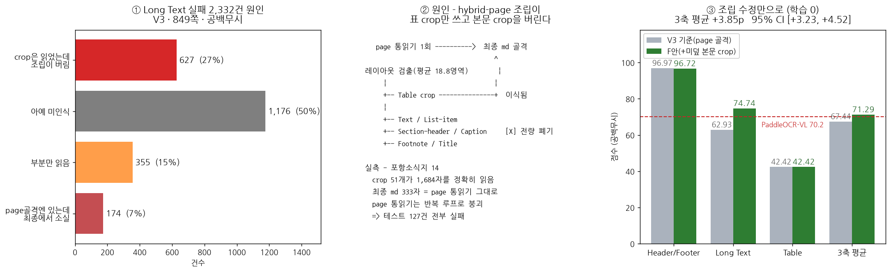

| 채점 | Header/Footer | Long Text | Table | 3축 |
|---|---:|---:|---:|---:|
| 공백무시 · V3 | 96.97 | 62.93 | 42.42 | 67.44 |
| **공백무시 · body_fill** | 96.72 | **74.74 (+11.81)** | 42.42 | **71.29 (+3.85)** |
| 정식 · body_fill | 97.47 | 70.45 (+11.59) | 26.65 | 64.86 |

같은 장치를 V3.5 가중치에 걸면 67.56 → **71.86**(+4.30p)이다 — 모델이 바뀌어도
효과 크기가 거의 그대로다(§8).

페이지 부트스트랩 2,000회 95% CI **[+3.23, +4.52]**. 표는 완전 불변 — 본문 crop 만
붙이므로 표 채점 경로를 안 건드린다.

함정 셋(실측): `Page-header/Footer` 를 함께 붙이면 HF **−28.03p** · c2f 골격으로
갈아타면 본문 **−5.42p** · 중복 검사를 빼면 점수는 같고 길이만 는다.
**이득의 원천은 page ∪ crop 합집합이지 crop 이 더 나아서가 아니다.**

⚠ **대가** — 뒤에 붙이므로 읽기순서가 흐트러진다(md 평균 ×1.09). KDoc 3축은 위치를
채점하지 않아 손해가 없을 뿐, **사람이 읽는 산출물 품질은 이전이 낫다.** 그래서 기본 off 다.

### ★ 밴드 재검출 — 본문 +1.87p, 학습 0

발단은 성능 실험이 아니라 데모였다. 2단 조판 논문을 파싱하다 **오른쪽 단이 통째로
사라지는 것**을 발견했다.

레이아웃 패스가 우단 상단을 **아예 생성하지 않았다.** 걸러낸 게 아니다.

| 실험 | 결과 |
|---|---|
| 같은 조건 2회 | 완전히 동일 — 그리디라 우연이 아니다 |
| **그 영역만 잘라서 입력** | **정확히 검출** |
| 레이아웃 해상도 2MP | 검출되나 문단이 줄 단위로 쪼개지고 표를 놓침 |

★ 모델은 그 글을 못 읽는 게 아니라 **읽기순서에서 건너뛴다.** 토큰 확률로도 확인했다 —
우단 시작 y 자리에서 실제로 낸 값 0.399 vs 놓친 자리 0.217 로 **2등이었을 뿐 후보에는
있었다.** 강제로 넣으면 두 문단을 정확히 완성한다.

부수 발견: **bf16 에서는 KV 캐시 유무로 출력이 갈리고 fp32 에서는 완전히 일치한다.**
캐시 구현은 옳고, 0.4 대 0.22 같은 얇은 결정이 반올림 잡음에 뒤집힌다는 뜻이다.
**정밀도 상향은 처방이 아니다** — fp32 도 이 페이지를 놓친다(대신 표를 놓친다).

처방: [column_uncovered_bands](../../tools/hybrid_merge.py#L476-L520) 로 **단을 먼저 나눠**
빈 구간을 찾고, [relayout_bands()](../../infer/infer_pierrotocrvlm.py#L149-L215) 가 그
구간만 crop 해 레이아웃을 한 번 더 돌린 뒤 좌표를 되돌려 **읽기순서 제자리에 끼운다**.

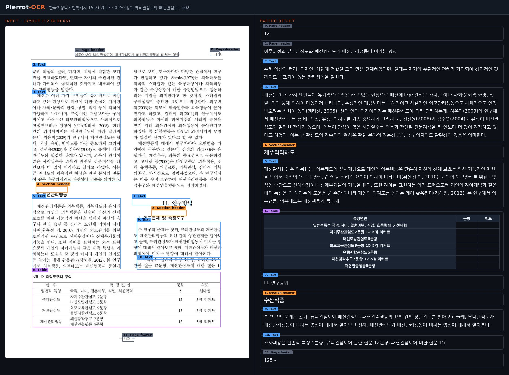

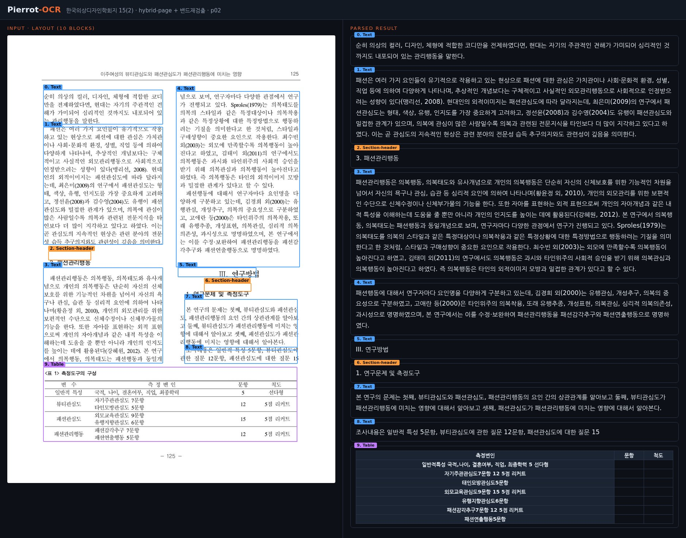

함정 둘(실측):
- 재검출 박스를 그대로 쓰면 **줄 끝 어절이 통째로 잘린다** — crop 안에서 다시 검출하면
  가장자리가 야박해진다. 글줄은 **같은 단 이웃의 폭**을 따르게 했다.
- 그 폭 계산에 머리말·꼬리말을 넣으면 쪽번호가 섞여 단 경계가 벌어진다 → 제외.

★ **모드를 잘못 고르면 효과가 0 이다.** 첫 A/B 를 `hybrid-page` **단독**으로 돌렸더니
밴드가 47개·236블록을 찾고도 점수가 **소수점까지 동일**했다. 그 모드는 통읽기를 뼈대로
쓰므로 새로 찾은 본문이 흘러갈 통로가 없다. `coarse-to-fine` 골격이거나 `body_fill` 과
함께일 때만 값어치가 나온다.

---

## 5. 학습 방법

**왜 한 번에 다 학습하지 않나.** 사전학습 부품(ViT·디코더) 사이에 완전 랜덤인
PatchMerger 가 끼어 있다. 처음부터 전부 풀어 두면 랜덤 층이 뿜는 잡음 gradient 가
검증된 부품까지 거슬러 올라가 망친다 — 눈과 뇌를 동시에 흔드는 셈이다.

그래서 **랜덤 부분부터 순서대로 깨운다.** 다만 완전 직렬화(한 태스크를 끝내고 다음으로)도
금지다 — 앞서 배운 것을 잊는다(catastrophic forgetting). 태스크를 **겹쳐 가며** 넘어간다.

| 단계 | 학습 대상 | 데이터 | 목적 |
|---|---|---|---|
| **Stage 0** | **PatchMerger 4개만** (ViT·LM 동결) | 정렬 58만 (범용 캡션 30만 + OCR 정렬 28만) | 랜덤 PatchMerger 정렬 |
| **Stage 1A** | 전체 해제 (모듈별 LR: PatchMerger 기준, ViT/LM ×0.1) | 인식 213만 ×2ep | 텍스트·수식·표 인식 |
| **Stage 1B** | 전체 | 인식 70~80% + **레이아웃 20~30% 조기 혼합** | 레이아웃 조기 도입 — 늦으면 forgetting |
| **Stage 2** | 전체 | 레이아웃 확대 + 인식 replay | coarse-to-fine 1단계 완성 |
| **Stage 3** | 전체 | hard-case SFT | 자주 틀리는 유형 보정 |

읽는 법 — **Stage 0 만 동결이 있고**(ViT·LM 고정, 머저 4개 83.9M 만 학습), Stage 1A
부터는 전부 푼다. 대신 **모듈별로 LR 을 달리** 준다: 랜덤에서 시작한 머저는 기준 LR,
사전학습 부품(ViT·LM)은 그 **×0.1** 이다. 이미 잘 맞춰진 부품을 크게 흔들지 않겠다는 뜻.

**Stage 0 에 범용 캡션을 넣는 이유**: projector 가 문서 화면 두 종류에만 맞으면
간판·손글씨·영수증이 들어올 때 시작점이 불리하다.

**Stage 1B 에서 레이아웃을 "조기" 혼합하는 이유**: 인식만 오래 하다 뒤늦게 레이아웃을
넣으면 그 사이 좌표 감각이 사라진다. 20~30% 씩 미리 섞어 잊을 틈을 안 준다.

### 배합은 레코드가 아니라 토큰으로 맞춘다

가장 자주 틀린 지점이다. **레코드 비중과 정답 글자 비중은 완전히 다르다.**

| 태스크 | 레코드 비중 | **정답 글자 비중** |
|---|---:|---:|
| 표 | 20.5% | **47.4%** |
| 페이지 통읽기 | 17.1% | 33.8% |
| 레이아웃 | 19.7% | 14.9% |
| crop 인식 | 37.6% | **2.8%** |

loss 는 **토큰 평균**이다. 레코드를 몇 개 넣었느냐가 아니라 **정답 글자를 몇 개
흘려보냈느냐**가 모델이 받는 몫이다. 그래서 표의 실제 몫은 20.5% 가 아니라 **47.4%** 다.

**계산은 이렇게 한다.** 태스크의 토큰 몫 ∝ `레코드 수 × 정답 평균 길이`. 위 표를 거꾸로
나누면 정답 길이의 상대비가 나온다(전체 평균 = 1).

| 태스크 | 레코드 % | 글자 % | 정답 길이 배율 (글자%÷레코드%) |
|---|---:|---:|---:|
| 표 | 20.5 | 47.4 | **2.31** |
| 페이지 통읽기 | 17.1 | 33.8 | 1.98 |
| 레이아웃 | 19.7 | 14.9 | 0.76 |
| crop 인식 | 37.6 | 2.8 | **0.07** |

표 레코드 하나가 crop 레코드 하나보다 **약 31배**(2.31 ÷ 0.07) 긴 정답을 갖는다. 표는
OTSL 셀이 수백 개인데 crop 은 한 줄이니 당연하다.

여기서 나오는 결론이 실무에서 제일 자주 어긋난 지점이다 — **crop 은 레코드를 3배 늘려도
글자 몫이 2.8% → 5.5% 에 그친다.** "crop 을 늘렸는데 표가 안 움직인다"의 정체가 이것이고,
반대로 표를 조금만 늘려도 배합 전체가 뒤집힌다. 배합표에는 반드시 두 축을 함께 적는다.

### 체크포인트는 eval loss 로 고르지 않는다

장문 표가 토큰의 절반을 먹으므로, 표가 좋아지면서 본문·레이아웃이 퇴행해도 총 eval loss 는
내려간다. **외부 지표로 고른다.**

V3.4t 실측이 결정적이다 — 모든 축이 `V3 < s1000 < s1500` 으로 단조 증가하다 **마지막
120 스텝에서 꺾인다.** eval loss 는 끝까지 내려갔는데(0.1122 → 0.1080) 벤치 정점은 s1500 이다.

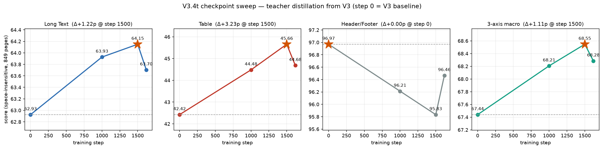

★ **eval loss 최저점 ≠ 벤치 최고점.** `final` 만 재고 끝내면 안 된다.

---

## 6. 데이터

목적은 문서 파싱만이 아니라 **모든 이미지의 문자 인식**(문서 + 야외 · 손글씨 · 제품 ·
다국어)이다. 전량 **공개 데이터**로 구성했다 — 재현성이 우리 쪽 강점이다.

보유 약 **3,059만 건** 중 v2 단계까지 투입 **약 552만 건**(18%). 데이터가 부족한 게
아니라 학습 일정이 짧았다.

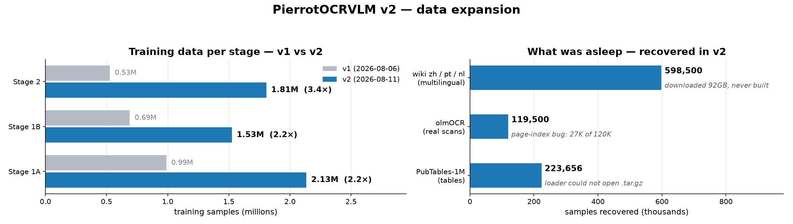

| 축 | 주요 원천 |
|---|---|
| 레이아웃 | ccpdf(영문 PDF) · DocLayNet · DocSynth300K · 한국어 합성 · AI-Hub 게이트 통과분 |
| 표 | AI-Hub 실표 10.4만 · PubTabNet · FinTabNet · 한국어 합성 통계표 · 티처 증류 1.7만 |
| 텍스트 crop | ccpdf 파생 · AI-Hub 공공문서 줄 crop(보유 700만+) |
| 페이지 통읽기 | 위키 렌더(한·영·중·일) · olmOCR 실스캔 · 합성 페이지 |
| 수식 | UniMER-1M |
| 정렬 | LLaVA-Pretrain 캡션 |

### MinerU2.5 와의 데이터 격차 (초기 시점)

| 태스크 | MinerU2.5 | 우리 | 격차 |
|---|---|---|---|
| 텍스트 인식 | 2,700K | 665K | 4.1× |
| 수식 | 1,247K | 985K 보유 | 1.3× |
| **표** | 1,240K | **24.5K** | **51×** ⚠ |
| **레이아웃** | 2,343K | **18.2K** gold | **129×** ⚠ |

**9× 격차는 평균이 아니라 응집이다** — 표·레이아웃 두 급소에 몰려 있고 텍스트·수식은
이미 승부 가능한 자릿수였다. 증량 후 표 51×→4.8×, 레이아웃 129×→27× 로 좁혔다.

### 데이터에서 배운 것

**① 새 데이터셋은 GT 표본을 눈으로 확인한 뒤 넣는다.**
SynthDoG-ko 39GB 를 14.9만 건 빌드해 놓고 **배합에서 뺐다.** GT 가 세로쓰기 컬럼을
한 글자씩 줄바꿈한 뒤 공백으로 이어붙인 형태라("3 위 에 올 랐 다"), 단일문자 토큰 비율
중앙값이 23% 였다. 그대로 학습하면 **한국어를 음절마다 띄어쓰도록 배운다.** 수량만 보면 안 된다.

**② 부분 라벨은 "건너뛰기"를 가르친다.**
AI-Hub 줄 GT 로 페이지 은(silver) 정답을 만들려다 잉크 덮음률을 재 보니 소스별로
81% / 68% / 29% / 15% / 5% / 3% 였다. 대부분 부분 라벨링이라 그대로 쓰면 "페이지의
95% 를 건너뛰어라"를 가르친다 → 상위 2종만 쓰고 페이지마다 덮음률 70% 문턱을 걸었다
(통과율 25%). 같은 이유로 덮음률 중앙 66.5% 짜리 레이아웃 소스를 통째로 빼고
**게이트 ≥90% 통과분(실측 98.2%)** 으로 교체했다.

**③ 어절 라벨은 줄로 병합해야 쓸 수 있다.**
원본 라벨이 어절 단위면 정답이 3자 안팎이고 검출이 페이지당 48~80박스가 된다.
그런 타깃을 대량으로 섞으면 **조기 EOS 를 배워 긴 문단에서 문장을 끊는다.**

**④ 사고 3건 — 다음에 또 만날 것들.**

| 사고 | 원인 → 조치 |
|---|---|
| 디스크가 차서 학습까지 죽음(3h 손실) | PDF→PNG 가 장당 1.1MB → **JPEG 로 7배 절약** + 잔여용량 안전장치 |
| 22만 건이 **에러 없이** 사라짐 | 이미지가 `tar.gz` 안에 있어 로더가 못 열고 **조용히 옆 샘플로 대체** → `zip` 재포장. **새 데이터가 tar.gz 로 오면 먼저 zip 으로 바꾼다** |
| 손상 PNG 1장이 분산 학습 전체를 죽임 | 로더가 이미지 실패 시 이웃 샘플로 폴백 + 전수 디코드 검사 + 체크포인트 주기 단축 |

---

## 7. 실험 기록

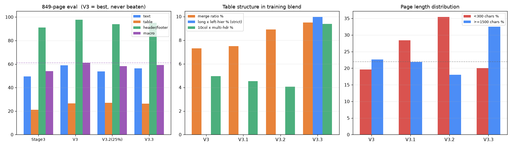

### v1 — 첫 완주 (2026-08-06)

Stage 0→3 무인 완주(9시간). 정렬 1시간 · 인식 11시간 · 레이아웃 7.4시간 · SFT 21분.

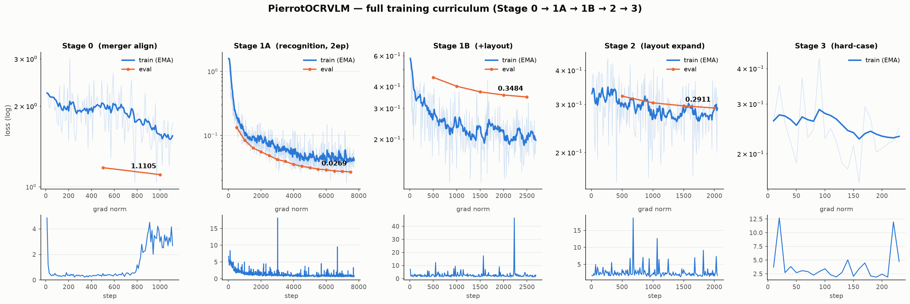

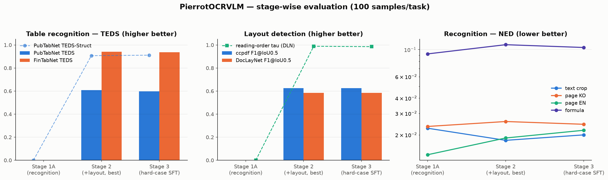

| 태스크 | 지표 | Stage 1A | **Stage 2** | Stage 3 |
|---|---|---|---|---|
| 표 PubTabNet | TEDS ↑ | 0.000 | **0.609** | 0.598 |
| 표 FinTabNet | TEDS ↑ | 0.000 | **0.942** | 0.936 |
| 레이아웃 ccpdf | F1@0.5 ↑ | 0.000 | 0.625 | **0.626** |
| 레이아웃 DocLayNet | 읽기순서 tau ↑ | — | **0.989** | 0.985 |
| 텍스트 crop | NED ↓ | 0.0227 | **0.0180** | 0.0200 |
| 수식 | NED ↓ | **0.092** | 0.110 | 0.104 |

판독 넷:

1. **커리큘럼이 설계대로 작동했다.** 1A 시점에는 레이아웃 F1 0.000·표 TEDS 0.000 —
   인식만 배운 모델은 좌표·표 구조 생성 능력이 전무했고, 1B 에서 도입하자 올라왔다.
2. **증량 데이터가 결정적이었다.** 실문서 표를 1B 에 조기 투입한 것이 표 성능의 전부를 만들었다.
3. ⚠ **최고 모델은 Stage 3 가 아니라 Stage 2 다.** hard-case SFT 가 대부분을 소폭 후퇴시켰다.
   마이닝 로그의 "loss 중앙값 0.037 = hard 하한 0.037" — 이미 잘 푸는 샘플 중 상위 절반을
   뽑았을 뿐 **진짜 어려운 케이스가 아니었다.**
4. ⚠ **PubTabNet 은 구조는 맞는데 셀 내용이 틀린다**(TEDS 0.609 vs Struct 0.907).

**★ 시각 검수 결론: F1 0.6 은 "검출 실패"가 아니다.**

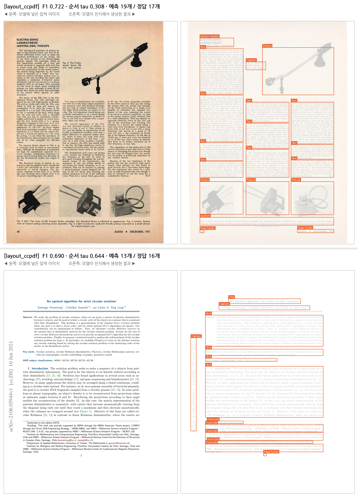

| 조건 | F1 | 차이 |
|---|---|---|
| 클래스 일치 요구, IoU 0.5 (공식) | 0.584 | — |
| 클래스 무시, IoU 0.5 | 0.667 | +0.083 ← 클래스 오분류 몫 |
| 클래스 무시, IoU 0.3 | 0.779 | +0.112 ← 박스 정밀도 몫 |

박스는 대체로 정확히 겹친다. 낮은 점수의 실제 원인은 ① 단락 분할 입도 불일치
② 클래스 정의 차이 ③ 정답에 없는 요소 검출 — 전부 **모델 능력보다 라벨 규약** 문제다.
→ 레이아웃 개선은 모델 확장이 아니라 **클래스 정의 통일과 라벨 입도 정합**이 먼저다.

표 오류를 문자 단위로 대조하니 최빈 치환이 `e→f`(32) `l→e`(28) `0→O`(7) `–→-`(21) —
**글자 모양이 비슷해 생기는 오독**, 작은 글씨 다운샘플의 전형이다. FinTabNet(글자 큼)이
TEDS 0.94 로 정상인 것이 대조 증거다.

### v2 — 데이터 3배 (2026-08-11)

잠자던 데이터를 깨웠다: 실스캔 olmOCR 11.9만 · PubTables 22.4만(한 장도 안 읽히고
있었다) · 다국어 위키 3개 언어.

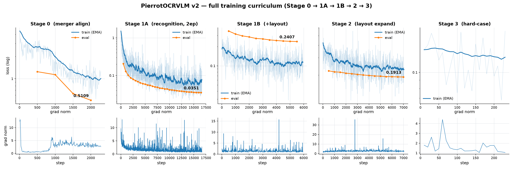

**61번 평가해서 한 번도 안 올라갔다.** 전 구간 단조 하강.
같은 입력에 v1/v2 를 각각 돌린 11개 태스크 비교에서도 **전부 v2 가 앞섰다**
(표 TEDS 0.43→0.63, 레이아웃 F1 0.57→0.70).

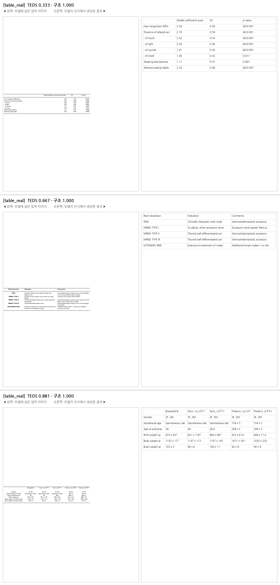

**그런데 이게 함정이었다.**

### ★ 전환점 — 자체 val 은 일반화를 재지 않았다

외부 벤치를 처음 재자 그림이 뒤집혔다.

| | 자체 val | 외부 벤치 | 배율 |
|---|---:|---:|---:|
| 텍스트 | page_ko NED **0.0195** | OmniDocBench text NED **0.260** | **13배 악화** |
| 표 | table_real TEDS 0.850 | ODB table TEDS 0.671 | — |

**"한국어라서 낮은 게 아니다"** — 같은 붕괴가 영문 ODB 에서도 일어난다.
val 이 학습 배합에서 나왔기 때문에 **61회 단조 하강은 일반화를 한 번도 재지 않은 것**이었다.
그리고 Stage 3 는 v1 에 이어 v2 에서도 일반화를 깎았다(ODB text 0.260 → 0.365).

KDoc 51쪽 첫 측정: text 60.3% / tables 26.9% / header_footer 89.8%.
텍스트 실패를 채점 완화로 분해하니 **25% 는 대충 읽었지만 글자가 틀림, 15% 는 출력에
아예 없음**이었다. 못 읽으면 **지어낸다** — 0.6B 디코더가 언어모델 prior 로 그럴듯한
한국어를 만든다(NED 평균에는 안 보이고 present 테스트에서만 드러난다).

근본 원인도 특정됐다: **한국어 레이아웃 실데이터가 없다.** 인식(crop)은 한국어가 49%
인데 `fine` 규약 레이아웃 소스는 영문 + 합성 2만뿐 — **검출만 비어 있는 비대칭**이
c2f 1단계를 무너뜨린다.

그리고 해상도는 **이 벤치의 병목이 아니었다.** 2MP→4MP 에서 51개 중 49개가 바이트 단위
동일했다. 조밀한 표일수록 crop 자체가 작기 때문이다 — 초기 계획이 1순위로 뒀던
"인식 해상도 상향"은 최소한 KDoc 에서는 근거가 없다.

### v3 — 한국어 표·레이아웃 집중 (2026-08-13)

전체 재학습 84시간 대신 `stage1b/final` 에서 다시 출발해 **13.5시간**. 배합 158만 건.

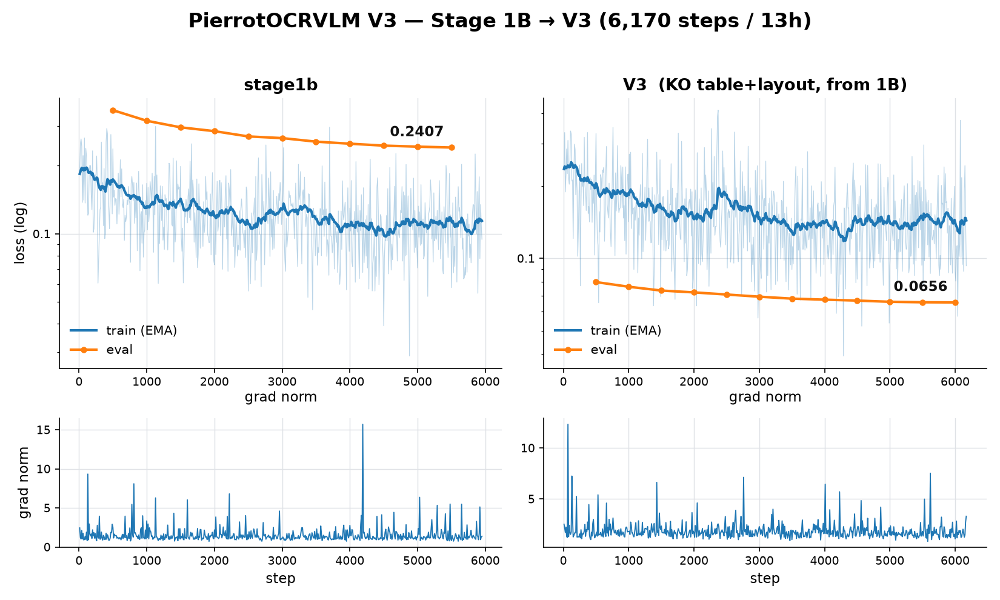

바꾼 것 넷: ① 한국어 표 비중 17%→68% ② **표 길이 버킷을 채움**(KDoc 표 56개 중 11개가
2,048토큰에서 잘렸는데 학습 데이터에 그 길이가 **하나도 없었다**) ③ 한국어 fine 레이아웃
의사 라벨 3.5만 쪽 ④ `<ched>` 없는 소스 제외.

결과: **표 26.7 → 35.3 (+8.6)** — v1·v2 내내 27% 에 갇혀 있던 지표가 처음 움직였다.
머리말 89.8 → 95.9 로 상용 모델과 동급. 대신 **긴 텍스트 −4.2**(표에 토큰을 몰아준 대가).

### V3.1 · V3.2 · V3.3 — 세 번 연속 실패 (42시간+)

| | 본문 | 표 | 머리말 | **macro** |
|---|---|---|---|---|
| **V3** | **58.86** | 26.65 | **97.60** | **61.04** |
| V3.1 | — | — | — | 849쪽 평가 없음 |
| V3.2 (25% 중단) | 53.75 | **27.02** | 93.94 | 58.24 |
| V3.3 | 56.28 | 26.42 | 95.20 | 59.30 |

- **V3.1**(페이지 +69%) — 완주했는데 졌다. 짧은 silver 로 페이지 수만 늘리고 장문 감독을
  희석했다. 300자 미만이 19.6% → 28.4%.
- **V3.2**(표 구조 증량) — 다국어 장문 replay 를 **전량 삭제**해 본문 −5.10p, 합성 페이지가
  머리말/꼬리말을 0건 넣고 74.9% 를 `#` 로 시작시켜 머리말 −3.66p. 게다가 이미 수렴한
  `v3/final` 에서 출발했고 26% 만 돌았다.
- **V3.3**(결합 topology) — **데이터 게이트 12개를 전부 통과했는데 졌다.**

V3.3 이 가장 뼈아프다. OOD val(학습에 없는 어휘)에서 좌측 헤더 깊이 ≥2 복원이
**0.0% → 100.0%** 다. 데이터는 성공했고 모델도 배웠다. 그런데 KDoc left_heading 은
53.7 → 54.7(**+1.0p**)뿐이었다.

**★ 목표가 틀렸다.** 근거였던 *"KDoc 이 요구하는 것이 left_heading 78%"* 는
left_heading 이 **테스트되는 비율**이지 **표가 2단 계층을 갖는 비율**이 아니었다.
KDoc 의 실제 좌측 헤더 상위는 `계·합계·2020·제주` 로 전부 **1단 행머리글**이고 V3 는
이미 53.7% 맞히고 있었다. 구조를 550배 넣어 얻은 것이 +1.0p 다.

> **교훈: 벤치의 "테스트 비율"을 "구조 출현율"로 오독하면 사이클 하나를 통째로 버린다.**

#### 반복된 실패 패턴

세 버전 모두 같은 순서를 밟았다.

```
실패 결과 → 눈에 띄는 통계 하나 발견 → 그것을 원인으로 단정
→ 그 특성의 합성 데이터 대량 생성 → 여러 분포를 동시에 변경
→ 14시간 전면 학습 → 총점으로만 판단
```

필요했던 순서.

```
실패 페이지 → 단계별 분해(검출/읽기/변환/조립/위치/헤더)
→ 병목 확정 → 그 병목과 같은 데이터 소량 → 짧은 보정
→ 예측한 실패가 실제로 통과했는지 확인
```

구체적 잘못 넷: ① 한 번에 5~7개를 바꿨다(져도 원인을 못 가린다) ② 오염된 계측으로
가설을 세웠다 ③ 값싼 사전 검증 없이 14시간에 걸었다 ④ **레코드 수로 배합을 맞췄다.**

### V3.4t — 티처 증류 (2026-08-20)

배합 조정을 접고 방향을 바꿨다. **표가 리더보드 최하위(최고의 46%)라 배합으로 메울
크기가 아니었다.**

먼저 **하지 말아야 할 것**을 걸렀다. AI-Hub 실표에 티처를 돌리다 **중단했다** —
셀 텍스트는 원천 HTML 이 100% 인데 티처는 89.7% 이고, 정작 원하던 헤더는 `<th>` 0/1,325 로
안 나왔다. GPU 8장 × 54시간을 써서 **정답의 열화 복사본**을 만드는 셈이었다.

> **티처는 GT 가 없는 데이터에만 의미가 있다.**

올바른 대상은 이미 보유하고 있었다 — 한국어 공공문서 실스캔 44만 장(표 정답 없음,
KDoc 과 겹침 없음). 규칙대로 **값싸게** 갔다: 레이아웃으로 표 보유 페이지 선별 →
2~3천 장 티처 → **V3 에서 1,000스텝 보정** → 849쪽 판정.

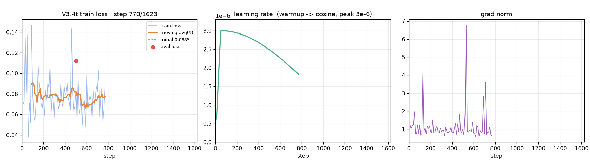

채택 배합은 표 65,468(47.3%) 중 **티처 수도라벨 17,556(26.8%)**, lr 3.0e-6, 3에폭.
표 중 한국어 실데이터 비율이 32.2% → **72.5%** 로 올라갔다.

결과: **표 +3.23p · 본문 +1.22p · macro +1.11p** — V3.1~V3.4 중 **표와 본문이 처음으로
동시에 오른 버전**이다. 유일한 회귀는 머리말 −1.14p(792건 중 9건)인데 스텝 비례 단조
하락이라 우연이 아니다(티처 데이터에 머리말이 없어 잊는 것으로 본다).

50쪽 동일 표본에서 티처와 축별로 비교하면 방향이 분명하다.

| 축 | 티처(PaddleOCR-VL) | V3.4t | V3 |
|---|---:|---:|---:|
| 셀 읽기 | 94.0% | **71.9%** | 67.3% |
| top_heading | 52.8% | **66.1%** | 69.1% |
| left_heading | 64.9% | 63.8% | 64.0% |

**구조·헤더는 이미 티처보다 앞선다. 남은 격차는 셀 읽기 하나**이고 증류가 그 축만 올렸다.

### V3.5 · V3.6 — 배합 재정의와 규모 축

**결과부터: V3.5 가 V3.0 을 처음 넘었고, 그 뒤 V3.6 이 다시 넘었다**(현재 최고는 V3.6,
아래 참조). V3.5 는 밴드 + body_fill 조립과 함께 3축 **71.86**, 본문 **78.04 로 리더보드
전체 1위**(BizOnAI 77.90). 표도 42.70 → **44.10** 으로 올랐고, 대가는 머리말
96.09 → **93.43**(−2.66p)이다. 다만 **조립을 끄면 67.56 으로 V3.0(67.44)과 사실상
같다**(+0.12p) — 배합의 이득이 조립과 맞물려서만 드러난다(§8).

V3.5 는 전면 재학습을 하지 않는다. 시작점을 V3/V3.4t 중간 체크포인트로 두고
500/1000/1500 스텝을 비교하며 lr 1e-6~3e-6 으로 짧게 돈다. 확정 배합(188.9만, +19.4%)의
증분은 셋뿐이다 — 표 증류 +22,556 · 한국어 crop +160,000 · 레이아웃 정제·증량 +125,000.
**줄인 태스크는 없다.**

crop 을 늘린 근거: body_fill 이후에도 남는 본문 실패 1,589건 중 근접 실패가 588건이고
그 **61.6% 가 `max_diffs` 0**(한 글자만 틀려도 탈락)이다. 틀리는 것은 구조가 아니라
고유명사·기관명·전화번호의 한두 글자다(`산딸기랑→산발기랑`, `419-4048→469-404`).
같은 도메인 줄 crop 이 700만 건 있는데 **1.1% 만 쓰고 있었다.**
★ 길이로 뽑지 않는다 — 긴 구간은 여러 줄이 한 박스로 뭉쳐 어절 순서가 뒤섞인 불량 라벨이
절반이다. 무작위 증량이 정답이다.

V3.6 은 **구성은 V3.5 와 같고 규모만 1.76배**(194만 → 342만)로, 한 번도 재보지 않은
**규모 축을 단독으로 확인**하는 판이다. 새 소스를 하나도 들이지 않고 **검증된 소스의
미사용분만** 쓴다 — 보유 2,293만 중 V3.5 가 쓰는 것은 8% 뿐이다.

V3.1~V3.3 이 진 이유는 "데이터를 늘려서"가 아니라 **불량·부적합한 새 소스를 넣어서**였다.
그 교훈을 **깨끗한 데이터의 증량**에까지 적용한 것은 과잉 일반화였고, V3.6 은 그 둘을 분리한다.

**그리고 그 가설이 맞았다.** V3.6 이 3축 **73.41** 로 현재 최고 모델이다(V3.5 71.86 대비
**+1.55p**). 무엇보다 **세 축이 처음으로 동시에 올랐다** — 표 44.10 → **46.60**(+2.50p) ·
머리말 93.43 → **95.08**(+1.65p) · 본문 78.04 → **78.54**(+0.50p). 검증된 소스를 그대로
늘리는 것은 안전하다는 뜻이고, V3.1~V3.3 의 실패는 **증량 자체가 아니라 무엇을 넣었는가**
였다는 것이 이걸로 분리됐다.

### V3.7 — 티처 농도를 9배로, 표 48.01 (2026-08-28)

바꾼 것 둘 — ① 레이아웃 라벨 교정 ② **티처 농도 0.51% → 4.9%**. 배합 3,707,100건,
14,481스텝 31시간.

**표 46.60 → 48.01(+1.41p)** 로 DeepSeek(46.60)을 넘고 PaddleOCR-VL(48.90)에 0.89p 까지
붙었다. 3축 73.41 → 73.48. 대신 본문 −1.31p · 머리말 −0.89p 로 두 축을 내줬다.

★ **`final` 은 과적합이다.** 마지막 481스텝에서 표가 **−3.02p**(48.01 → 44.99) 무너진다.
eval loss 도 step 13,500 이 최저(0.0573)이고 14,000 에서 반등했다. V3.4t 에 이어
두 번째다 — **체크포인트를 여러 지점 재는 것은 선택이 아니라 필수다.**

### V3.8 — 티처 농도 12.83%, 표 48.84 (2026-09-01)

V3.7 이 통했으므로 농도만 더 올렸다. 표 **48.84**(+0.83p) · 머리말 **95.96**(+0.76p) ·
3축 **73.74**(+0.26p), 본문 −0.82p. 채택은 `checkpoint-10500`.

★ **티처 농도는 수확체감이다.**

| | 티처 농도 | Table | 직전 대비 |
|---|---:|---:|---:|
| V3.6 | 0.51% | 46.60 | — |
| V3.7 | 4.9% | 48.01 | **+1.41** |
| V3.8 | **12.83%** | **48.84** | **+0.83** |

농도를 2.6배 올렸는데 이득은 절반이고, **티처 자신(PaddleOCR-VL 48.90)에 0.06p 까지
붙었다** — 모방으로 갈 수 있는 한계선이다. **표를 58 로 가져가려면 다른 공급원이 필요하다.**

★ **본문 −0.82p 는 회귀가 아니라 교체(churn)다.** 테스트 단위로 대조하니 505건을 잃고
453건을 얻어 **순손실 52건(0.83%)** 이고, 뒤바뀐 것이 958건(15.2%)이다. "표 비중이 본문을
깎았다" 면 손실이 크고 이득이 작아야 하는데 그렇지 않다. 그리고 잃은 505건은 **100%가
"아예 읽지 못함"** 이었다 — 조립·crop 에서 잃은 건 0건이다.

### V3.9 — 게이트 미달, 그런데 잡음과 구분되지 않는다 (2026-09-03)

V3.8 + crop 복원(64.7만 → 149.8만) + Relation QA 484,040 신규. 4,072,244건 · 15,907스텝.
5개 체크포인트 전부 표 게이트(≥48.01)를 못 넘겼고 `final` 이 또 최악이었다(**6연속**).

★ **그런데 그 차이가 잡음과 구분되지 않는다.** 쪽 단위 부트스트랩 2,000회에서 세 축의
95% CI 가 **전부 0 을 포함**한다(표 −1.27p [−3.51, +0.79] · 본문 +0.32p [−0.86, +1.51] ·
머리말 −0.38p [−1.26, +0.51]). 쪽별 표 점수는 전부/전무로 뒤집히고 — 악화 140쪽 ·
**개선 162쪽** · 동일 458쪽 — 같은 학습 안에서도 체크포인트끼리 1.44p 흔들린다.

> ⚠ **지금까지 보고한 V3.6 → V3.7 → V3.8 의 0.5~1.3p 차이들도 같은 크기의 잡음 안에
> 있었을 가능성이 크다.** 849쪽 단일 점추정으로는 1p 안팎을 판정할 수 없다.
> V4.0 부터 판정은 **점추정 + 부트스트랩 CI 하한 > 0** 을 함께 본다.

**Relation QA 가 효과 없던 이유**: 표 직렬화(OTSL) 노출량이 V3.8 과 **한 건도 다르지
않았다**. 정답이 `row=2 col=8` 같은 5토큰짜리라 **표를 통째로 그리는 능력을 훈련하지
않는데**, 채점은 그것만 본다. 데이터 품질 자체는 정상이었다(좌표 정확도 100%).
"관련 데이터를 넣었다" 와 "채점되는 능력을 훈련했다" 는 다른 명제다.

---

## 8. 성능

### KDoc-OCRBench-V2 (849쪽 전량) — 공식 리더보드와 같은 표

| 순위 | 모델 | Header/Footer | Long Text | Table | 3축 평균 | 채점 |
|---:|---|---:|---:|---:|---:|---|
| **1** | **V3.8 s10500 + 회전 + edge60** ★채택 | **95.96** | 76.41 | **58.32** | **76.90** | 공백+머리글규약 무시 |
| 1 | BizOnAI-OCR | 94.70 | 77.90 | 58.10 | **76.90** | 정식 |
| 3 | V3.8 final | 95.83 | 76.30 | 58.29 | 76.81 | 공백+머리글규약 무시 |
| 4 | V3.7 s14000 | 95.20 | 77.23 | 57.97 | 76.80 | 공백+머리글규약 무시 |
| 5 | V3.9 s15000 | 95.58 | 76.72 | 57.36 | 76.55 | 공백+머리글규약 무시 |
| 6 | V3.9 s13000 | 95.83 | 75.64 | 58.13 | 76.54 | 공백+머리글규약 무시 |
| 7 | V3.7 s13000 | 95.45 | 76.65 | 57.13 | 76.41 | 공백+머리글규약 무시 |
| 8 | V3.8 s10500 + 회전 + edge60 | 95.96 | 76.41 | 48.84 | 73.74 | 공백무시 |
| 9 | V3.8 final | 95.83 | 76.30 | 48.51 | 73.55 | 공백무시 |
| 10 | V3.7 s14000 | 95.20 | 77.23 | 48.01 | 73.48 | 공백무시 |
| 11 | V3.6 + 회전 + edge60 | 95.08 | 78.54 | 46.60 | 73.41 | 공백무시 |
| 12 | V3.9 s15000 | 95.58 | 76.72 | 47.57 | 73.29 | 공백무시 |
| 13 | V3.7 s13000 | 95.45 | 76.65 | 47.34 | 73.15 | 공백무시 |
| 13 | V3.9 s13000 | 95.83 | 75.64 | 47.98 | 73.15 | 공백무시 |
| 15 | V3.8 s10000 | 95.71 | 75.60 | 47.03 | 72.78 | 공백무시 |
| 16 | V3.9 s14500 | 94.82 | 76.74 | 46.54 | 72.70 | 공백무시 |
| 17 | V3.9 final | 95.96 | 73.24 | 47.77 | 72.32 | 공백무시 |
| 18 | V3.6 + edge60 | 94.95 | 79.33 | 45.12 | 73.13 | 공백무시 |
| 19 | V3.6 + bb | 93.69 | **79.98** | 45.12 | 72.93 | 공백무시 |
| 20 | V3.5 + bb | 93.43 | 78.04 | 44.10 | 71.86 | 공백무시 |
| 21 | V3.0 + bb | 96.09 | 76.61 | 42.70 | 71.80 | 공백무시 |
| 22 | PaddleOCR-VL | 95.60 | 66.20 | 48.90 | 70.20 | 정식 |
| 23 | DeepSeek OCR | 95.80 | 64.50 | 46.60 | 69.00 | 정식 |
| 24 | olmOCR v0.2.0 | 95.20 | 65.00 | 44.90 | 68.40 | 정식 |
| 25 | GLM-4.1V-OCR | **97.40** | 52.90 | 30.00 | 60.10 | 정식 |

`bb` = 밴드 재검출 + body_fill · `회전` = 평가셋 회전 보정 · `edge60` = 가장자리 장식 제외.
채점 기준이 둘 섞여 있으므로 **같은 채점끼리만 비교한다**(기준 설명은 아래 절).

⚠ **직접 비교가 아니다.** 우리 값은 **공백무시**, 외부는 **정식** 채점이라 우리 쪽이
유리한 자다(50쪽 실측: PaddleOCR-VL 정식 53.71 → 공백무시 59.11).
정식 기준으로도 3축 61.04 → **65.95**(V3.8 final: 본문 70.43 · 표 30.71 · 머리말 96.72)로 올랐다.

★ **한 모델이 세 축을 동시에 못 낸다.** 축별 최고값은 이미 전부 BizOnAI 를 넘는다 —
머리말 **95.96**(+1.26) · 본문 **78.54**(+0.64, V3.6) · 표 **58.32**(+0.22, V3.8).
그런데 그것을 낸 모델이 서로 다르다. **어느 축을 대표로 보느냐에 따라 최고 모델이
갈린다**(3축이면 V3.8, 본문이면 V3.6). 판마다의 교환 내역은 §7.

★ **조립이 학습만큼 크다.** 같은 가중치에서 밴드 재검출 + body_fill 을 켜고 끈 차이가
V3.0 은 67.44 → 71.80(**+4.36p**), V3.5 는 67.56 → 71.86(**+4.30p**)이다. 반대로
V3.0 → V3.5 재학습이 조립 없는 상태에서 낸 차이는 67.44 → 67.56(**+0.12p**)에 그친다 —
배합의 이득은 대부분 **조립과 맞물렸을 때** 나온다.

### 공백 무시 채점

표 테스트는 완전일치(`max_diffs: 0`)라 **공백 하나가 곧 실패**다. 그런데 우리가 내는
공백은 **학습 정답이 이미 잃어버린 것**이라 모델이 고칠 수 없다.

**같은 셀을 채점기가 어떻게 보나** — 사람 눈에는 차이가 없다.

<table>
<tr><th align="left">정답 (KDoc)</th><th align="left">우리 출력</th><th>정식</th><th>공백무시</th></tr>
<tr><td>데이터 제공량(GB)</td><td>데이터제공량 (GB)</td><td align="center">✗</td><td align="center">✓</td></tr>
<tr><td>태풍 빈발 시기 우리나라에 영향을…</td><td>태풍 빈발 시기우리나라에영향을…</td><td align="center">✗</td><td align="center">✓</td></tr>
</table>

**원인은 모델이 아니라 학습 정답 자체다.** 같은 병이 GT 에 그대로 있다 — 아래는 한국어
실표 학습셋에서 그대로 뽑은 셀이다.

<table>
<tr><th align="left">공백을 잃은 셀 (학습 GT)</th><th align="left">정상 셀 (같은 파일)</th></tr>
<tr><td valign="top">
사업이해및실무(7)<br>
질병관리청만성질환예방과<br>
식품알레르기와아나필락시스<br>
한국천식알레르기협회추천<br>
측정방법(또는측정산식)<br>
부산아토피천식교육정보센터(팀장)<br>
교육내용및 교과목특이사항<br>
소속및 직위
</td><td valign="top">
-602동1~11라인 1403호,1302호,1105호<br>
-603동1~8라인 10층1본,9층1본,2층1본
</td></tr>
</table>

**12자 이상인데 공백이 하나도 없는 셀이 6.8%** 다. `<br>` 을 텍스트 없는 태그로
흘려버린 변환의 흔적이고, 원천 HTML 에는 그 자리에 무엇이 있었는지가 **남아 있지
않다** — 복원은 근거가 없어 **불가능**하다. 전부 깨진 것도 아니어서(오른쪽 열)
규칙으로 되돌릴 수도 없다.

⚠ **정규화로 덮는 것도 복원이 아니다.** `의 료 기 관 → 의료기관` 같은 삽입 공백 제거에는
맞지만 **정상 띄어쓰기까지 붙여 버린다.** 그래서 정규화본은 전량 투입하지 않고 소량
A/B 물량으로만 썼다.

이 결함이 표 점수에서 **15~17p** 를 먹는다. 그래서 우리끼리의 판단 기준은 공백무시로 둔다.

### 머리글 규약 무시 채점 (2026-09-03)

위 표는 **공백무시**다. 여기에 **머리글(`<th>`) 표기 규약 차이**까지 무시하면 표가
48.84 → **58.32**, 3축이 73.74 → **76.90** 이 된다. 공백 결함(§8 위)과 **성격이 같다** —
라벨 규약 차이지 읽기 능력이 아니다.

**보정 방법**: 각 행의 **선두 연속 비숫자 셀**만 `<th>` 로 승격한다. 예측 텍스트·칸
위치·칸 수는 한 글자도 바뀌지 않고 **태그만** 바뀐다.

#### 왜 이 보정이 정당한가 — 근거 셋

**① 모델은 머리글을 "덜 찍지" 않는다.** 정답 OTSL 이 있는 학습 도메인(AI-Hub 실표 val
500장)에서 태그를 직접 대조하면 `<ched>` 예측/정답이 **101.0%** 다(4,846 / 4,800).
2행 이후 첫 열이 머리글인 표도 정답 68.0% vs 예측 70.0%. **자기가 배운 규약은 정확히
재현한다** — KDoc 에서 깎이는 이유는 **KDoc 의 규약이 더 넓기** 때문이다.

같은 val 셋을 **눈으로** 확인한 것이 아래다 — 원본 이미지, 정답 표, 우리 출력을
나란히 놓았다. 숫자는 태그별 `정답 / 예측` 개수다.

**사례 1 — 태그 절대차 65 (빈 칸·세로 병합 누락)**

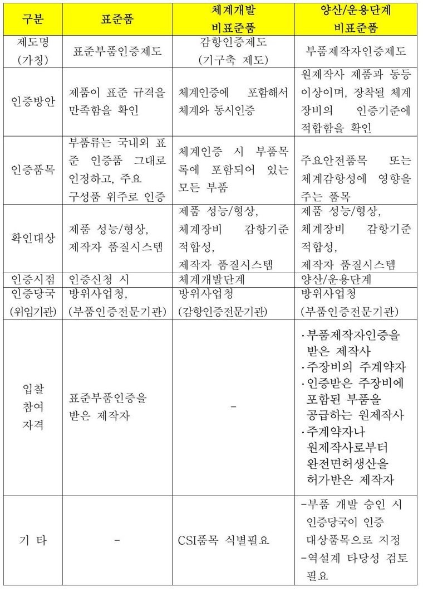

<table>
<tr><th align="left">정답 (GT)</th><th align="left">우리 출력 (V3.8 s10500)</th></tr>
<tr><td valign="top">

<table><tr><th rowspan="2">구분</th><th rowspan="2">표준품</th><th rowspan="2">체계개발비표준품</th><th>양산/운용단계</th></tr><tr><td>비표준품</td></tr><tr><th>제도명(가칭)</th><td>표준부품인증제도</td><td>감항인증제도(기구축제도)</td><td>부품제작자인증제도</td></tr><tr><th>인증방안</th><td>제품이표준 규격을 만족함을확인</td><td>체계인증에포함해서 체계와동시인증</td><td>원제작사제품과 동등 이상이며,장착될 체계 장비의인증기준에 적합함을 확인</td></tr><tr><th>인증품목</th><td>부품류는국내외 표 준인증품 그대로 인정하고,주요 구성품위주로 인증</td><td>체계인증시 부품목 록에포함되어 있는 모든 부품</td><td>주요안전품목또는 체계감항성에영향을 주는품목</td></tr><tr><th rowspan="3">확인대상</th><td rowspan="3">제품 성능/형상,제작자품질시스템</td><td>제품성능/형상,</td><td>제품성능/형상,</td></tr><tr><td>체계장비감항기준 적합성,</td><td rowspan="2">체계장비감항기준 적합성,제작자품질시스템</td></tr><tr><td>제작자품질시스템</td></tr><tr><th>인증시점</th><td>인증신청 시</td><td>체계개발단계</td><td>양산/운용단계</td></tr><tr><th>인증당국</th><td rowspan="2">방위사업청,(부품인증전문기관)</td><td>방위사업청</td><td>방위사업청</td></tr><tr><th>(위임기관)</th><td>(감항인증전문기관)</td><td>(부품인증전문기관)</td></tr><tr><th rowspan="9">입찰참여자격</th><td rowspan="9">표준부품인증을받은제작자</td><td></td><td>·부품제작자인증을</td></tr><tr><td></td><td>받은제작사</td></tr><tr><td></td><td>·주장비의주계약자</td></tr><tr><td></td><td>·인증받은 주장비에</td></tr><tr><td></td><td>포함된부품을</td></tr><tr><td></td><td>공급하는원제작사</td></tr><tr><td></td><td>·주계약자나</td></tr><tr><td></td><td>원제작사로부터</td></tr><tr><td></td><td>완전면허생산을허가받은제작자</td></tr><tr><th rowspan="2">기타</th><td rowspan="2"></td><td></td><td>-부품개발 승인 시 인증당국이인증</td></tr><tr><td>CSI품목식별필요</td><td>대상품목으로지정 -역설계타당성 검토 필요</td></tr></table>

</td><td valign="top">

<table><tr><th>구분</th><th>표준품</th><th>체계개발비표준품</th><th>양산/운용단계비표준품</th></tr><tr><th>제도명(가칭)</th><td>표준부품인증제도</td><td>감항인증제도(기구축 제도)</td><td>부품제작자인증제도</td></tr><tr><th>인증방안</th><td>제품이표준 규격을 만족함을확인</td><td>체계인증에포함해서 체계와동시인증</td><td>원제작사제품과 동등 이상이며,장착될 체계 장비의인증기준에 적합함을확인</td></tr><tr><th>인증품목</th><td>부품류는국내외 표 준인증품 그대로 인정하고,주요 구성품위주로 인증</td><td>체계인증시 부품목 록에포함되어 있는 모든부품</td><td>주요안전품목또는 체계감항성에영향을 주는품목</td></tr><tr><th>확인대상</th><td>제품성능/형상, 제작자품질시스템</td><td>제품성능/형상, 체계장비감항기준 적합성,제작자품질시스템</td><td>제품성능/형상, 체계장비감항기준 적합성,제작자품질시스템</td></tr><tr><th>인증시점</th><td>인증신청 시</td><td>체계개발단계</td><td>양산/운용단계</td></tr><tr><th>인증당국(위임기관)</th><td>방위사업청,(부품인증전문기관)</td><td>방위사업청(감항인증전문기관)</td><td>방위사업청(부품인증전문기관)</td></tr><tr><th>입찰참여자격</th><td>표준부품인증을받은제작자</td><td></td><td>·부품제작자인증을받은제작사 ·주장비의주계약자 ·인증받은주장비에 포함된부품을 공급하는원제작사 ·주계약자나원제작사로부터완전면허생산을허가받은제작자</td></tr><tr><th>기타</th><td></td><td>CSI품목식별필요</td><td>-부품개발 승인 시 인증당국이인증 대상품목으로지정 -역설계타당성 검토 필요</td></tr></table>

</td></tr>
</table>

`<ched> 정답 13 / 예측 12  |  <fcel> 정답 37 / 예측 22  |  <ecel> 정답 11 / 예측 2  |  <lcel> 정답 0 / 예측 0  |  <ucel> 정답 27 / 예측 0  |  <xcel> 정답 0 / 예측 0  |  <nl> 정답 22 / 예측 9`

**사례 2 — 태그 절대차 44 (빈 칸 누락 + 가로 병합 오출력)**

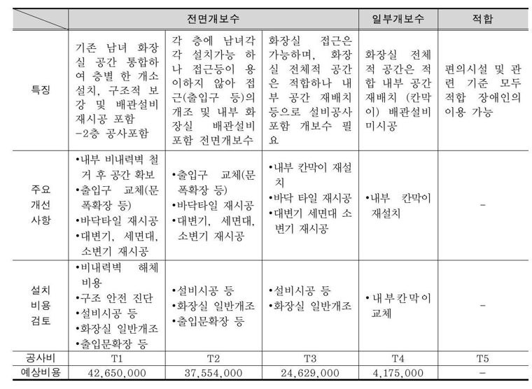

<table>
<tr><th align="left">정답 (GT)</th><th align="left">우리 출력 (V3.8 s10500)</th></tr>
<tr><td valign="top">

<table><tr><td></td><th colspan="3">전면개보수</th><th>일부개보수</th><th>적합</th></tr><tr><td></td><th>기존남녀 화장</th><th>각 층에남녀각</th><th>화장실접근은</th><td></td><td></td></tr><tr><td></td><td></td><td>각설치가능 하</td><td>가능하며,화장</td><td>화장실전체</td><td></td></tr><tr><td></td><td>실공간 통합하 여층별 한 개소</td><td>나접근등이 용</td><td>실전체적 공간</td><td>적공간은 적</td><td>편의시설 및 관</td></tr><tr><th>특징</th><td>구조적 보</td><td>이하지않아 접</td><td>은적합하나 내</td><td>합내부 공간</td><td>련기준 모두</td></tr><tr><td></td><td>설치,강및 배관설비 재시공포함 -2층공사포함</td><td>근(출입구등)의 개조및 내부 화 장실배관설비 포함전면개보수</td><td>부공간 재배치 등으로설비공사 포함개보수 필 요</td><td>재배치(칸막 이)배관설비 미시공</td><td>적합장애인의 이용가능</td></tr><tr><td></td><td>·내부비내력벽 철 거후 공간 확보</td><td>·출입구교체(문</td><td>·내부칸막이 재설 치</td><td></td><td></td></tr><tr><th>주요개선사항</th><td>·출입구 교체(문 폭확장 등)·바닥타일 재시공 ·대변기, 세면대, 소변기재시공</td><td>폭확장 등)·바닥타일재시공 ·대변기,세면대, 소변기재시공</td><td>·바닥타일 재시공 ·대변기세면대 소 변기재시공</td><td>·내부칸막이 재설치</td><td></td></tr><tr><th>설치비용검토</th><td>·비내력벽 해체 비용·구조 안전 진단 ·설비시공 등 ·화장실 일반개조 ·출입문확장 등</td><td>·설비시공 등 ·화장실일반개조 ·출입문확장 등</td><td>·설비시공 등·화장실일반개조</td><td>·내부칸막이교체</td><td></td></tr><tr><th>공사비</th><td>T1</td><td>T2</td><td>T3</td><td>T4</td><td>T5</td></tr><tr><th>예상비용</th><td>42,650,000</td><td>37.554.000</td><td>24,629,000</td><td>4,175,000</td><td></td></tr></table>

</td><td valign="top">

<table><tr><td></td><th colspan="3">전면개보수</th><th>일부개보수</th><th>적합</th><td></td></tr><tr><th>특징</th><th colspan="2">기존남녀 화장 실공간 통합하 여층별 한 개소 설치,구조적 보 강 및 배관설비재시공포함 -2층공사포함</th><th>각층에 남녀각 각설치가능 하 나접근등이 용 이하지않아 접 근(출입구등)의 개조및 내부 화 장실배관설비 포함 전면개보수</th><th>화장실접근은 가능하며,화장 실전체적 공간 은적합하나 내 부공간 재배치 등으로설비공사 포함개보수 필 요</th><th>화장실전체 적공간은 적 합내부 공간 재배치(칸막 이)배관설비 미시공</th><th>편의시설 및 관련기준 모두 적합장애인의 이용가능</th></tr><tr><th>주요개선사항</th><td colspan="2">·내부 비내력벽 철 거후 공간 확보 ·출입구교체(문 폭확장 등)·바닥타일재시공 ·대변기,세면대, 소변기재시공</td><td>·출입구교체(문 폭확장등) ·바닥타일재시공 ·대변기,세면대, 소변기재시공</td><td>·내부칸막이 재설 치·바닥타일 재시공 ·대변기세면대 소 변기재시공</td><td>·내부칸막이 재설치</td><td></td></tr><tr><th>설치비용검토</th><td colspan="2">·비내력벽해체 비용·구조안전 진단 ·설비시공 등 ·화장실일반개조 ·출입문확장 등</td><td>·설비시공 등·화장실일반개조 ·출입문확장 등</td><td>·설비시공 등·화장실일반개조</td><td>·내부칸막이 교체</td><td></td></tr><tr><th>공사비</th><td colspan="2">T1</td><td>T2</td><td>T3</td><td>T4</td><td>T5</td></tr><tr><th>예상비용</th><td colspan="2">42,650,000</td><td>37,554,000</td><td>24,629,000</td><td>4,175,000</td><td></td></tr></table>

</td></tr>
</table>

`<ched> 정답 11 / 예측 13  |  <fcel> 정답 38 / 예측 17  |  <ecel> 정답 15 / 예측 4  |  <lcel> 정답 2 / 예측 7  |  <ucel> 정답 0 / 예측 0  |  <xcel> 정답 0 / 예측 0  |  <nl> 정답 11 / 예측 6`

**사례 3 — 태그 절대차 0 (완전 일치)**

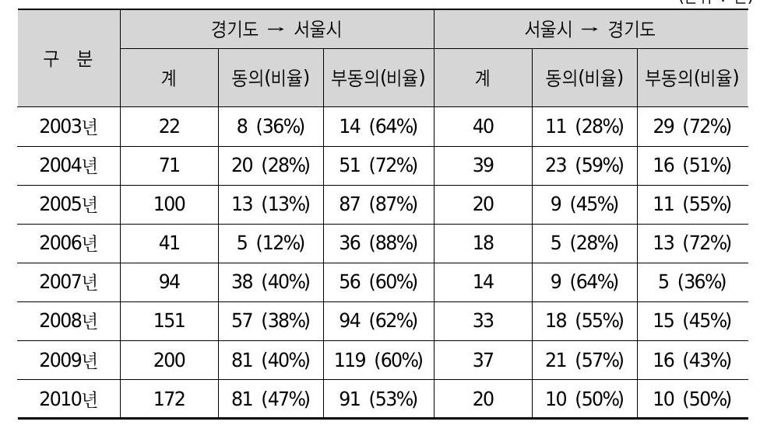

<table>
<tr><th align="left">정답 (GT)</th><th align="left">우리 출력 (V3.8 s10500)</th></tr>
<tr><td valign="top">

<table><tr><th rowspan="2">구 분</th><th colspan="3">경기도→ 서울시</th><th colspan="3">서울시→ 경기도</th></tr><tr><th>계</th><th>동의(비율)</th><th>부동의(비율)</th><th>계</th><th>동의(비율)</th><th>부동의(비율)</th></tr><tr><th>2003년</th><td>22</td><td>8 (36%)</td><td>14(64%)</td><td>40</td><td>11(28%)</td><td>29(72%)</td></tr><tr><th>2004년</th><td>71</td><td>20(28%)</td><td>51(72%)</td><td>39</td><td>23(59%)</td><td>16(51%)</td></tr><tr><th>2005년</th><td>100</td><td>13(13%)</td><td>87(87%)</td><td>20</td><td>9(45%)</td><td>11(55%)</td></tr><tr><th>2006년</th><td>41</td><td>5(12%)</td><td>36(88%)</td><td>18</td><td>5(28%)</td><td>13(72%)</td></tr><tr><th>2007년</th><td>94</td><td>38(40%)</td><td>56(60%)</td><td>14</td><td>9(64%)</td><td>5(36%)</td></tr><tr><th>2008년</th><td>151</td><td>57(38%)</td><td>94(62%)</td><td>33</td><td>18(55%)</td><td>15(45%)</td></tr><tr><th>2009년</th><td>200</td><td>81(40%)</td><td>119(60%)</td><td>37</td><td>21(57%)</td><td>16(43%)</td></tr><tr><th>2010년</th><td>172</td><td>81(47%)</td><td>91(53%)</td><td>20</td><td>10(50%)</td><td>10(50%)</td></tr></table>

</td><td valign="top">

<table><tr><th rowspan="2">구 분</th><th colspan="3">경기도 서울시</th><th colspan="3">서울시경기도</th></tr><tr><th>계</th><th>동의(비율)</th><th>부동의(비율)</th><th>계</th><th>동의(비율)</th><th>부동의(비율)</th></tr><tr><th>2003년</th><td>22</td><td>8(36%)</td><td>14(64%)</td><td>40</td><td>11(28%)</td><td>29(72%)</td></tr><tr><th>2004년</th><td>71</td><td>20(28%)</td><td>51(72%)</td><td>39</td><td>23(59%)</td><td>16(51%)</td></tr><tr><th>2005년</th><td>100</td><td>13(13%)</td><td>87(87%)</td><td>20</td><td>9(45%)</td><td>11(55%)</td></tr><tr><th>2006년</th><td>41</td><td>5(12%)</td><td>36(88%)</td><td>18</td><td>5(28%)</td><td>13(72%)</td></tr><tr><th>2007년</th><td>94</td><td>38(40%)</td><td>56(60%)</td><td>14</td><td>9(64%)</td><td>5(36%)</td></tr><tr><th>2008년</th><td>151</td><td>57(38%)</td><td>94(62%)</td><td>33</td><td>18(55%)</td><td>15(45%)</td></tr><tr><th>2009년</th><td>200</td><td>81(40%)</td><td>119(60%)</td><td>37</td><td>21(57%)</td><td>16(43%)</td></tr><tr><th>2010년</th><td>172</td><td>81(47%)</td><td>91(53%)</td><td>20</td><td>10(50%)</td><td>10(50%)</td></tr></table>

</td></tr>
</table>

`<ched> 정답 17 / 예측 17  |  <fcel> 정답 48 / 예측 48  |  <ecel> 정답 0 / 예측 0  |  <lcel> 정답 4 / 예측 4  |  <ucel> 정답 1 / 예측 1  |  <xcel> 정답 0 / 예측 0  |  <nl> 정답 10 / 예측 10`

★ **글자를 못 읽어서가 아니다. 빈 칸과 병합을 덜 낸다.** 사례 1 은 `<ucel>`(세로 병합)이
27 → **0**, `<ecel>`(빈 칸)이 11 → **2**, `<nl>`(행 끝)이 22 → **9** 다. 사례 2 도 빈 칸이
15 → 4 로 모자라고 `<lcel>`(가로 병합)은 2 → 7 로 과하다.
**빈 칸 하나를 빠뜨리면 그 뒤 칸이 전부 한 칸씩 밀린다** — 셀 내용은 맞는데 좌표가
어긋나는 "관계 불일치 35.24%" 와 "열 밀림 48.1%" 의 실체가 이것이다.

★ **사례 3 은 태그가 완전히 일치한다.** 능력이 없는 게 아니라 **빈 칸이 많고 세로 병합이
깊은 표**에서 무너진다. 다음 목표는 그 구조다.


**② 학습셋의 행 머리글 비율이 요구의 절반이다.** 표 학습셋 가중평균 **38.3%** vs
KDoc 이 `left_heading` 을 요구하는 비율 **78.4%**(38,520 / 49,115). 특히 가장 큰 단일
소스인 **티처 증류(36%)가 첫 열을 한 번도 머리글로 표시하지 않는다** — "표를 잘 읽는
처방" 이라며 가장 많이 넣은 데이터가 벤치가 78% 요구하는 규약을 반대로 가르치고 있었다.

**③ 보정이 규약 차이만 고친다(핵심 검증).** `left_heading` 32,227건을 정답 머리글
글자의 **위치**로 분해했다.

| | 보정 전 | 보정 후 |
|---|---:|---:|
| 통과 | 16,631 (51.6%) | **21,020 (65.2%)** |
| 선두 비숫자 칸에 있는데 **태그만 없음** | 4,333 (13.4%) | **0** ← 전부 해소 |
| 그 밖의 위치 (채점기 관대함) | 924 (2.9%) | 924 (2.9%) ← **하나도 통과 안 함** |
| 정답 글자가 왼쪽에 아예 없음 (진짜 실패) | 9,960 (30.9%) | 9,910 (30.8%) |

★ **채점기 관대함으로 통과한 건 0건**이다. 보정이 없는 점수를 만들어 내지 않았다.

#### 대조군 — 반드시 구분해야 하는 것

| 변환 | Table | 3축 | 판정 |
|---|---:|---:|---|
| 없음 | 48.84 | 73.74 | 기준 |
| 첫 열만 `<th>` | 50.76 | 74.38 | 부분 보정 |
| **선두 비숫자 칸(채택)** | **58.32** | **76.90** | **정당** |
| 전 셀 `<th>` | 60.99 | 77.79 | **게이밍 — 금지** |

전 셀 `<th>` 는 의미 없는 문자 치환인데 BizOnAI 를 넘는다. 채점기가 왼쪽으로 걸어가며
머리글 셀을 모아 **하나라도 맞으면 통과**시키기 때문에 뿌릴수록 후보가 는다.
**이 대조군이 없었으면 "후처리로 BizOnAI 추월" 이라고 잘못 보고할 뻔했다.**
사람 눈으로도 갈린다 — 채택본은 행 이름만 굵어져 실제 공문서 표와 같은 모양이고,
전 셀 `<th>` 는 숫자까지 굵어져 어디가 이름이고 어디가 값인지 사라진다.

#### 순위를 바꾸지 않는다

여섯 체크포인트에서 보정 폭이 **+3.16 ~ +3.38p** 로 균일하다(V3.8 s10500 +3.16 ·
V3.7 s14000 +3.32 · V3.9 s13000 +3.38 …). **특정 모델을 유리하게 만들지 않는다** —
공백무시와 같다. 우리끼리의 판단 근거는 두 기준 중 어느 것을 써도 동일하다.

#### ⚠ 한계 — 외부 모델과 같은 조건이 아니다

**BizOnAI·PaddleOCR-VL 등의 KDoc 예측물을 보유하지 않아 같은 보정을 걸 수 없다.**
그쪽은 공표된 정식 점수뿐이고, 같은 보정을 적용하면 그쪽도 오른다.
따라서 **"BizOnAI 와 동률" 은 같은 조건에서의 동률이 아니다.** 공백무시 때와 동일한
제약이므로 표기도 같게 간다 — **채점 기준을 항상 열에 명시한다.**

#### 남은 진짜 손실

보정 후에도 `left_heading` 의 **30.8%(9,910건)** 는 정답 글자가 그 행 왼쪽에 **아예
없다**. 이건 규약이 아니라 인식·구조 실패다 — 열 밀림 48.1% · 인식 실패 20.1% ·
셀 병합/분할 6.6%. **여기가 다음 목표다.**

### 대표 점수 하나로 읽지 말 것

**61.04(정식 macro)는 대표 점수로 쓰면 안 된다.** 세 축의 단순 평균인데 header/footer
792건은 전부 "그 문자열이 없어야 통과"라 **머리말을 지우기만 해도 97.6%** 가 나온다.
문서군 기준으로 다시 집계하면 실제 수준은 이렇다.

| 문서군 | 테스트 | V3 |
|---|---|---|
| Notices (112쪽) | 6,849 | **22.21%** ← 가장 약함 |
| Reports (238쪽) | 14,510 | 33.63% |
| Statistics (283쪽) | 26,370 | 31.98% |
| Manuals (216쪽) | 8,468 | 32.27% |
| **4종 평균** | | **30.02%** |

즉 V3 는 "61점짜리 모델"이 아니라 **문서군 기준 30% 대**다.

### 예측 예시

| 레이아웃 | 표(OTSL→HTML) |
|---|---|
| 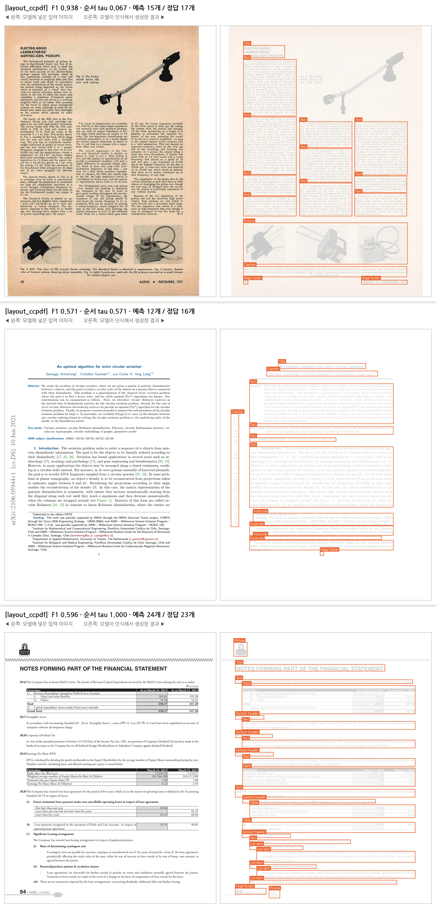 |  |

| 페이지 통읽기(한국어) | 야외 텍스트 |
|---|---|
| 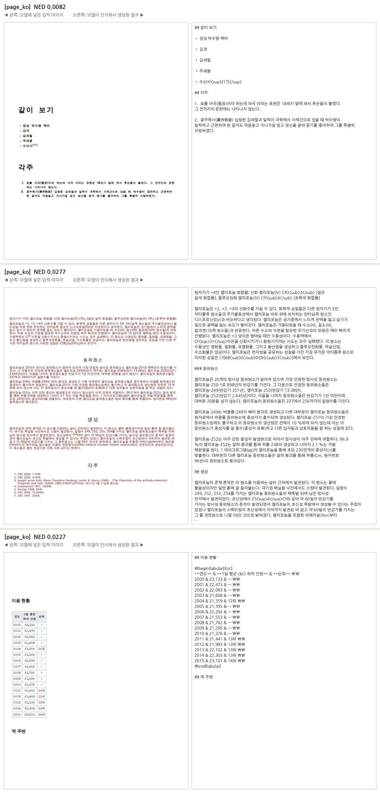 | 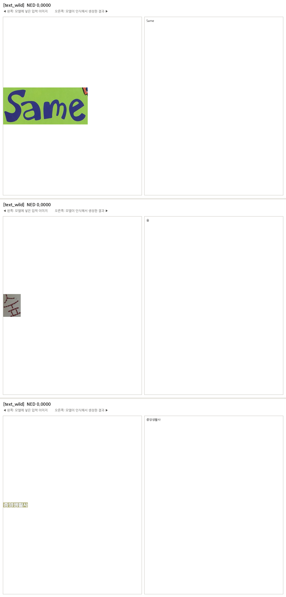 |

### 구현 검증 게이트

| 항목 | 결과 |
|---|---|
| 텍스트 로짓 동등성 (공식 HF Qwen3-0.6B) | max abs diff **1.06e-04** — M-RoPE 교체가 언어능력 보존 |
| 비전 타워 동등성 (공식 HF Qwen3-VL ViT) | **0.00e+00 (비트 단위 일치)** |
| KV-cache decode == full forward | 통과 (소형 랜덤 + 실가중치 멀티모달) |

---

## 9. 기각된 가설

**다시 시도하지 말 것.** 전부 실측으로 반증됐다.

| 가설 | 반증 |
|---|---|
| 표 topology(계층·다단)를 늘리면 표가 오른다 | 550배 넣어 OOD **100%**, KDoc **+1.0p**. 포화 |
| 행 헤더 GT 가 공개 데이터에 없다 | **틀렸다.** FinTabNet 이 원천 `<th>` 로 **82.6%** 보유 |
| 좌측 행헤더를 늘리면 left_heading 이 오른다 | V3 가 FinTabNet val 300표에서 이미 **F1 97.7%**. 학습 도메인은 정복됨 |
| TATR 수도 라벨로 한국어 헤더를 만든다 | TATR `projected row header` 는 표 가로 전체를 가르는 **구획 제목 행**. KDoc 이 묻는 **왼쪽 세로 열**과 다른 개념 |
| PubTables-1M 을 넣으면 표가 오른다 | 높이 중앙 266px(우리 476, 문제 표 1,421) · spanning 0.8%(목표 도메인 19.5%) · 한글 0/5,000. 격차를 **벌린다** |
| 학습 토큰 상한이 실표를 걸러낸다 | 실표 2,900 초과 **0.6%**. 올려도 합성 장문만 들어온다 |
| 추론 토큰 예산이 부족하다 | 4,096→6,144 로 늘려도 상한 도달 98.8% 그대로, 표 **+0.01p** |
| 세로로 큰 표라서 `<nl>` 을 못 낸다 | 재현율 **36%** — 배치를 바꾸면 64% 가 정상. 입력 속성이 아니다 |
| 헤더 GT 가 휴리스틱이라 점수가 낮다 | 모델이 이미 거의 모든 표에 `<th>` 를 출력한다 |
| 반복 차단(cycle)을 되살리면 점수가 오른다 | 폭주 33.5→3.4% 인데 표 **−0.01p**. 토큰 −36% **비용 레버일 뿐** |
| hybrid 조립을 append 로 바꾸면 본문을 회수한다 | 본문 +0.62p 인데 **표 −6.56p**, 중복표 10→143 |
| 레이아웃이 한국어 표를 못 찾는다 | Table box 없는 쪽 22/849, 단계 생존 **99.2%** |
| OTSL→HTML 변환이 셀을 잃는다 | 변환 성공률 **100%**, 소실 0.5% |
| 인식 해상도를 올리면 표가 오른다 | 2MP→4MP 에서 51개 중 **49개가 바이트 단위 동일** |
| 한국어 실문서 블록을 읽는 법을 배운 적 없다 | 실제 산출물이 1,224자 블록을 오탈자 없이 읽는다. `Page Recognition` 으로 배워 전이됐다 |

★ 마지막 줄이 특히 중요하다 — **"학습 데이터가 없다"와 "능력이 없다"는 다른 명제다.**
뒤를 주장하려면 배합표가 아니라 **산출물을 먼저 본다.**

---

## 10. 계측 결함 14건

**새 수치가 나오면 먼저 계측기를 의심한다.** 아래는 전부 실제로 겪은 것이다.

| # | 결함 | 잘못 나온 값 → 실제 |
|---|---|---|
| 1 | 미시평균을 공식 지표로 착각 | 38.9 → **62.4** (공식은 **카테고리 평균**) |
| 2 | 다른 하네스의 숫자를 같은 표에 나열 | 있지도 않은 "+6.9%p 점프"를 보고 |
| 3 | 표본(51쪽)과 전량(849쪽)을 섞음 | 51쪽은 표에서 ±7p 흔들린다 |
| 4 | `<ucel>` 존재만으로 좌측계층 판정 | 8.58% → **1.63%** |
| 5 | 단계마다 후보를 새로 선택 | left_heading 54.7% → **25.8%** (동일 후보 체인) |
| 6 | 예측 출현율을 GT 출현율로 오독 | "KDoc 2단 계층 1% 뿐" → **GT 는 알 수 없음** |
| 7 | crop 원시 출력 2,000자 저장 절단 | "읽기 소실 38.7%" → **29.2%** |
| 8 | `eos_token_id` 로 종료 판정 | "표에서 EOS 못 냄" → **계측 버그**(짧은 crop 도 0) |
| 9 | 재추론 시 배치 구성 미통제 | "붕괴는 입력 속성" → **배치 의존 불안정** |
| 10 | 수도 라벨 F1 을 **무엇을 재는지 확인 전에** 채택 | F1 90.7% 가 다른 개념의 지표였다 |
| 11 | 채점기를 섞음 | "표 +18.03p" → 같은 기준에서 **+2.26p**. `compact` 는 모델이 아니라 **채점기**다 |
| 12 | 통과율(rate)과 질량(mass) 혼동 | 최악 구간(29.6%)을 주력으로 잡았는데 전체의 1.6% 라 상한 **+0.79p**. 질량은 다른 데 있었다 |
| 13 | **파이프라인을 고정 상수로 두고 데이터만 의심** | 조립이 본문 crop 을 전량 버리고 있었다 → 고치니 **+11.81p** |
| 14 | **849쪽 점추정으로 1p 차이를 판정** | V3.9 부트스트랩에서 세 축 CI 가 전부 0 을 포함 — **V3.6~V3.8 의 0.5~1.3p 차이들도 잡음 안에 있었을 수 있다** |

가장 비싼 것은 13번이다. 세 사이클 동안 조립은 건드리지 않고 배합만 바꿨는데, 실제로는
crop 인식이 아무리 좋아져도 **점수에 나타날 수 없는 구조**였다.

### 여기서 굳어진 작업 규칙

1. **한 번에 하나만 바꾼다.** 데이터 소스·비중·출발점·스케줄을 동시에 바꾸지 않는다.
2. **값싼 순서로 간다.** 추론 설정 → 후처리 → 짧은 보정(1,000스텝) → 전면 재학습.
3. **만들기 전에 잰다.** 목표 구조를 넣기 전에 평가셋에서 **그 구조의 출현율**과
   **가용 상한**(`구간 테스트 수 × 개선 여지`)을 먼저 계산한다. 상한이 1~2%p 면 안 한다.
4. **판정은 849쪽 전량 + 페이지 단위 부트스트랩.** 부분집합은 후보 선별에만.
5. **대표 지표를 벡터로 쓴다.** 단일 macro 는 보조.
6. **합격 기준을 결과 보기 전에 고정한다.** 사전 고정한 중복표 게이트가 잘못된 채택을 막았다.
7. **OOD val 로 "배웠나 / 전이됐나"를 가른다.** 학습 성공과 벤치 개선은 다른 문제다.
8. **배합은 레코드가 아니라 토큰으로 맞춘다.**
9. **높은 점수를 보면 "무엇을 재는 점수인가"부터 확인한다.**
10. **없다고 단정하기 전에 보유 데이터를 뒤진다.**
11. **게이트 통과 ≠ 성능 향상.** V3.3 은 12개를 전부 통과하고도 졌다. 게이트는
    **과거 실수 재발 방지**이지 성능 보증이 아니다.
12. **학습 시작은 사람이 한다.** 게이트를 통과해도 자동으로 띄우지 않는다.

---

## 11. 남은 병목

표 파이프라인을 단계별로 분해한 결과다(V3 기준, 49,115 테스트, 동일 후보 체인).

| 단계 | 생존 | 그 단계 소실 |
|---|---|---|
| S1 Table box 검출 | 99.17% | 0.5% |
| **S2 raw OTSL 셀값** | 69.84% | **29.2%** ← 최대 |
| S2b OTSL→HTML | 69.29% | 0.5% |
| S3 최종 조립 | 66.17% | 3.2% |
| **S4 위치** | 47.70% | **19.6%** |
| S5 top_heading(조건부) | 39.23% | 8.6% |
| S6 left_heading(조건부) | 25.81% | 12.7% |

**읽기(29.2%)와 배치(19.6%)가 절반이고, 세 사이클 동안 여기는 한 번도 안 건드렸다** —
전부 topology·헤더만 만졌다.

V3.8 기준으로 다시 분해하면 이렇다(49,115건).

| 유형 | 건수 | 비율 |
|---|---:|---:|
| 통과 | 23,988 | 48.84% |
| **셀은 읽었으나 관계 불일치** | **17,309** | **35.24%** |
| 대상 셀 자체를 못 읽음 | 6,661 | 13.56% |
| 표 파싱 0개 | 1,157 | 2.36% |

**이제 최대 항목은 읽기가 아니라 "읽고도 관계를 못 맞추는" 35.24%** 다.

#### 무엇이 어긋나는가 — 실제 예제

원본 이미지·정답 표·우리 출력을 나란히 놓은 사례 3건은 §8 [머리글 규약 무시
채점](#머리글-규약-무시-채점-2026-09-03) 에 있다. 요약하면 **글자를 못 읽어서가 아니라
빈 칸(`<ecel>`)과 세로 병합(`<ucel>`)을 덜 내서 뒤 칸이 한 칸씩 밀린다.**

### 아직 검증하지 않은 것

- **DeepStack ablation**(A/B/C/D) — "작아진 ViT 를 중간층으로 보완한다"는 가설 자체가
  아직 미검증이다.
- **레이아웃 고정 정사각 A/B** — 저데이터 구간에서 가변 격자가 불리한지.
- **격자 붕괴의 재현 조건**(배치 1 / 8 / 동일 배치 2회).
- **독립 실문서 validation** — KDoc 은 개발 중 반복 관찰했으므로 더 이상 holdout 이 아니다.
