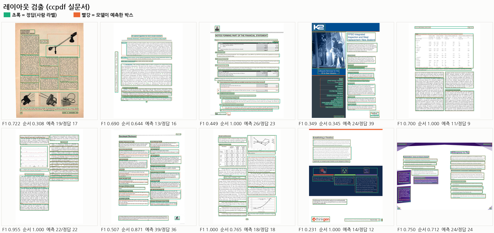
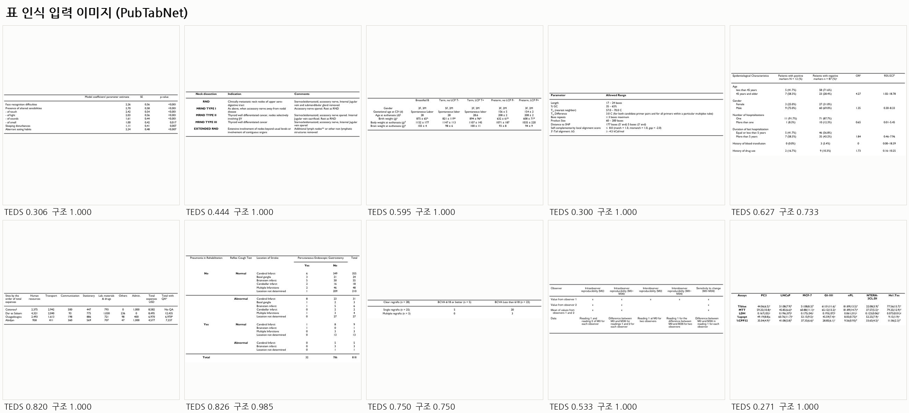

# PierrotOCRVLM — 구현 계획 (설계 확정본)

> 상태: **v3 학습 완료 + 평가** (2026-08-13). 최고 모델 `pierrotocrvlm_v3/final`. 모델명 **PierrotOCRVLM**,
> 레지스트리 키 `pierrotocrvlm`.
>
> | 판 | 기간 | 무엇을 했나 | 산출물 | 외부 지표(KDoc 51쪽) |
> |---|---|---|---|---|
> | **v1** | 08-05 ~ 08-06 | 첫 완주 Stage 0→3 · 989K/690K/527K | `pierrotocrvlm_stage2/final` | 미측정 |
> | **v2** | 08-08 ~ 08-11 | 데이터 2~3배 · 잠자던 데이터 복구 | `pierrotocrvlm_stage3/final` | 58.9 (표 26.7) |
> | **v3** | 08-12 ~ 08-13 | **Stage 2 만 재학습** · 한국어 표·레이아웃 집중 | `pierrotocrvlm_v3/final` | **62.4** (표 35.3) |
>
> v3 는 Stage 0/1A/1B 를 재사용하고 **`stage1b/final` 에서 다시 출발**한다(84h → 13.5h).
> 기존 `stage2`·`stage3` 는 덮지 않는다 — A/B 비교용으로 보존.
> GLM-OCR·MinerU2.5-Pro·PaddleOCR-VL-1.6 3종 조사 + 외부 리뷰 반영을 거친 최종안이다.

## M0 결과 (2026-08-04)

구현: [pierrot/models/pierrotocrvlm/](../../pierrot/models/pierrotocrvlm/) ·
[args/pierrotocrvlm.py](../../args/pierrotocrvlm.py) ·
[training/train_pierrotocrvlm.py](../../training/train_pierrotocrvlm.py) ·
[tests/test_pierrotocrvlm.py](../../tests/test_pierrotocrvlm.py)

- **실측 파라미터 0.986B** = ViT 306.2M(이식) + 머저 4개 83.9M(신규) + 디코더 596.0M(이식, embed 155.6M·lm_head tie)
- 하이브리드 이식: 비전 291개 + 언어 310개 텐서 로드, 신규 머저 텐서 24개(DeepStack 출력층 zero-init)
- **게이트 3종 통과** (`python tests/test_pierrotocrvlm.py --full`, fp32/CPU):
  1. 결합 forward + loss/backward(머저까지 gradient) ✓
  2. 텍스트 로짓 동등성 — 공식 HF Qwen3-0.6B 대비 **max abs diff 1.06e-04** (M-RoPE 교체가 사전학습 언어능력을 보존). 단일 축 위치의 M-RoPE = 1D RoPE 수치 일치(interleaved/chunked 모두) ✓
  3. KV-cache decode == full forward (소형 랜덤 + 실가중치 멀티모달) ✓
- 전체 회귀(tests/run_all.py): 기존 5개 모델 포함 161개 테스트 전부 통과 — 기존 학습에 무영향.

### M0 코드 리뷰 반영 (2026-08-04, 외부 리뷰 7건 전부 수용)

1. **JSONL byte-offset**: `pierrot/data/jsonl.py` 를 오프셋 인덱스 + lazy 파싱으로 교체(전 모델 공유,
   API 동일). 워커별 지연 파일 오픈으로 fork 안전. preflight 도 islice 200줄 표본 검사.
2. **정밀도 기본값**: `dtype='float32'` + `mixed_precision='bf16'`(FP32 master + AMP).
   순수 bf16 은 주석에 "의도적 실험 모드"로 명시.
3. **모듈별 LR**: `optimizer_param_groups()` 훅 구현 — 머저=기준 LR, text/vision=×0.1 기본,
   `model_extra` 의 lr_merger/lr_text/lr_vision 으로 절대값 오버라이드. 동결 모듈은 자동 제외.
4. **ViT 이식 동등성 테스트**: 같은 공식 가중치를 로짓 검증 계보가 있는 qwen3vl 비전 타워와
   양쪽에 싣고 머저 직전 + DeepStack(5/11/17) hidden 을 3개 종횡비로 대조 —
   **max abs diff 0.00e+00 (비트 단위 일치)**.
5. **load_hybrid 메모리**: safetensors 키 필터로 필요한 텐서만 읽고(Qwen3-VL 의 언어부 ~1.7B 는
   메모리 미적재) 합성 사본 즉시 해제.
6. **preflight 강화**: dataset_format 화이트리스트 + eval split 동일 검사.
7. **특수 토큰 검증**: 프로토콜 토큰 5종 전부 "단일 토큰 인코딩 + 왕복" 검사.

반영 후: pierrotocrvlm 13/13(light 11 + full 2), 전체 회귀 163개 통과.

### M0 재리뷰 반영 (2026-08-04, 잔여 3건 해소)

1. **공식 HF ViT 직접 대조** (`test_full_vit_official_equivalence`): transformers 공식
   `Qwen3VLForConditionalGeneration` 의 비전 타워와 블록(5/11/17/23) hidden 을 3개 종횡비로
   직접 비교 — **max abs diff 0.00e+00 (비트 단위 일치)**. 계보(qwen3vl) 대조와 별개의 최종 기준.
   flux2(transformers 4.56)에서는 명시적 SKIP 을 출력하며, 인증 실행은 overlay venv 로:
   `python -m venv --system-site-packages <dir> && <dir>/bin/pip install 'transformers>=4.57,<5'`
   후 해당 python 으로 테스트 실행(4.57.6 에서 인증 완료).
2. **dtype 오타 방어**: spec.build 가 미지원 dtype 에 즉시 예외(조용한 bf16 폴백 제거).
   preflight 에 mixed_precision 화이트리스트('no'/'fp16'/'bf16') 추가.
3. **오프셋 인덱스 8B 보장**: JsonlDataset 오프셋을 `array('Q')` 로 교체(레코드당 정확히 8B —
   65.5M 레코드 ≈ 524MB 상한). args 의 낡은 "엔진 단일 LR" 주석도 현재 훅 구현에 맞게 수정.

반영 후: pierrotocrvlm 14/14(light 11 + full 3), 전체 회귀 통과. **M0 게이트 최종 완료** —
텍스트(공식 Qwen3-0.6B 로짓 1.06e-04)·비전(공식 Qwen3-VL ViT hidden 0.0) 양쪽 모두
공식 구현 직접 대조로 인증됨.

### M0 3차 리뷰 반영 (2026-08-04, 검증 신뢰성 3건)

1. **SKIP ≠ 성공**: 러너가 skip 을 별도 집계하고, `--full` 인증 모드에서 공식 대조가
   불가능하면 **실패로 처리**한다. 구버전 transformers 환경에서 의도적으로 넘어갈 때만
   `--allow-skip-official` 을 명시(상위 env 인증과 병행하는 용도). flux2 에서
   `--full` 단독 실행 시 13/14 FAIL 로 정직하게 보고됨을 확인.
2. **오프라인 우선 로딩**: `resolve_model_dir` 가 캐시 스냅샷을 `local_files_only` 로
   먼저 시도(캐시 있으면 네트워크 무접속), 없을 때만 다운로드. full 테스트의 HF 로딩도
   전부 로컬 스냅샷 경로 + `local_files_only=True` 로 교체 — DNS 차단 환경에서도 검증 가능.
3. **난수 재현성**: 테스트 입력 생성을 `np.random.default_rng(0)` 으로 고정(실패 입력 재현).

재인증: venv(transformers 4.57.6)에서 공식 HF ViT 대조 오프라인 경로로 재실행 —
max abs diff 0.00e+00 유지. 전체 회귀 통과.

## M1 결과 + Stage 0 개시 (2026-08-04 밤)

빌더: [tools/pierrotocr_common.py](../../tools/pierrotocr_common.py)(태스크 프롬프트 단일 소스) ·
[tools/otsl.py](../../tools/otsl.py)(HTML↔OTSL, 왕복 검증) ·
[tools/build_nemotron_jsonl.py](../../tools/build_nemotron_jsonl.py)(page/table_otsl, tar 스트림 추출) ·
[tools/build_ccpdf_jsonl.py](../../tools/build_ccpdf_jsonl.py)(레이아웃 + crop 파생) ·
[tools/build_unimer_jsonl.py](../../tools/build_unimer_jsonl.py)(수식) ·
[tools/blend_jsonl.py](../../tools/blend_jsonl.py)(스테이지 배합, `--max-suffix-tokens` 길이 필터)

| 산출(data/pierrotocr/) | 수량 | 비고 |
|---|---|---|
| ccpdf crop 인식 쌍 | 267,206 | 레이아웃 gold 의 요소 텍스트에서 무료 파생 |
| ccpdf 레이아웃 gold | 18,219 페이지 | 렌더 실패 4장 제외(PDF 손상), 좌표는 라벨 기준 0~999 |
| wiki_ko / wiki_en 페이지 | 각 199,000 | GT=읽기순서 markdown+LaTeX 표 |
| sparsetables OTSL | ~37K | 원천 100K 중 HTML GT(≈절반)에서 왕복 검증 통과분만 |
| **stage0_align 배합** | **284,475 / 700(val)** | crop 200K + wiki_ko 60K + 표 24.5K, suffix ≤2,900토큰 필터 |
| UniMER 수식 | (해제 마무리 중) | Stage 1A 배합에 투입 예정 |

주의사항(재발 방지):
- **표 GT는 최대 11.5K 토큰** — 배합 시 `--max-suffix-tokens` 필터 없으면 collate 의
  max_length 안전장치가 학습을 중단시킨다(의도된 동작).
- sparsetables 는 HTML/LaTeX GT 혼합 — `table_otsl` 모드는 HTML 만 취한다.
- UniMER-1M unzip 은 Lustre 소파일(98.6만 개) 특성상 ~7시간 소요. 진행률은 파일명
  순번 이진탐색으로 측정 가능.

**smoke run 검증(단일 GPU, 194스텝)**: preflight→하이브리드 조립→학습 정상.
grad norm 69→0.8(머저 정렬 개시 신호), VRAM 51GB(batch 8, fp32+bf16 AMP), ~2.5s/step.

**Stage 0 본 학습 개시**: `accelerate launch training/train_pierrotocrvlm.py` (다중 GPU,
per-device 8 × grad_accum 4 × 8 = 유효 배치 256, 전 GPU 활용률 100%).

**Stage 0 학습 결과 (1 epoch, 1,111 스텝 완주)**:

Stage 0 곡선은 아래 [v1-stages-loss.png](../../docs/images/pierrotocrvlm/v1-stages-loss.png)
첫 열에 들어 있다(별도였던 `stage0-loss.png` 는 중복이라 정리했다).
수치: train loss EMA 2.24→1.55, eval 1.178→1.110, grad norm 안정, cosine LR.

- train loss(EMA) 2.24 → 1.55, **eval 1.178(step 500) → 1.110(step 1,000)** — 종료 시점까지 하강 중
- grad norm: 첫 스텝 69 → 0.3대 안착 → 후반 LR 감쇠 구간 2~4대(머저 특화) — 발산 없음
- 인터랙티브 리포트: [results/stage0_loss.html](../../results/stage0_loss.html) (호버 크로스헤어·전체 기록 표)

**곡선 분석 판정: 문제 없음.** 읽는 법:
- 원시 loss 진폭(1.0~3.0)은 태스크 혼합(쉬운 crop vs 어려운 표·페이지)의 구조적 결과 — 추세는 EMA 로.
- **후반 gnorm 상승(800~, 2~4.5)은 발산이 아니라 "졸업 신호"다.** 같은 구간에서 loss 하강이
  가장 빨랐고 eval 도 개선됐다. 원인 4겹: ① 평탄 분지→날카로운 협곡 진입(특징이 유용해질수록
  동결 디코더가 민감해짐 — 협곡 벽면 기울기는 큼) ② LR 감쇠가 좁은 최소점 진입을 허락
  ③ 잔여 오류가 소수 hard 토큰에 응집(gradient 상쇄 감소) ④ **동결 병목** — 머저 혼자
  쥐어짜는 한계. ④의 증거: Stage 1A 에서 백본을 풀자 loss 1.55→0.2대로 급락(일이 분산됨).
  병적 상승과의 구분: loss 동반 상승/스파이크/NaN 이 없고 상승이 유계이며 클리핑(1.0)이
  업데이트를 제한 — 모두 건강한 쪽.
- 특이점: **eval(1.11) < train EMA(1.55)** — 이상이 아니라 집계 차이. eval 은 토큰 수 가중이라
  쉬운 긴 산문(위키)이 지배하고, val 배합(위키 43%)이 train(21%)보다 쉬운 쪽으로 기움.
  개선 아이디어: 다음 단계부터 태스크별 eval loss 분리 기록.

**자동 릴레이 파이프라인 가동**: [scripts/run_stage_pipeline.sh](../../scripts/run_stage_pipeline.sh)
(nohup, 세션 독립)가 Stage 0 종료를 감지해 **1A→1B→2→3 을 자동 진행**한다.
- 스테이지 선택: `PIERROT_STAGE` 환경변수 → args/pierrotocrvlm.py 의 `STAGES` 오버라이드
  (pretrained 릴레이·동결·LR·에폭·배합 경로가 단계별로 정의됨, 오타는 즉시 예외)
- 각 단계: 배합 생성(blend_jsonl) → 학습 → `final/` 검증(실패 시 즉시 중단, 연쇄 방지)
  → 다음 단계. 이미 final 있는 단계는 스킵(재실행 안전)
- Stage 1A 진입 전 UniMER unzip 완료 대기 → 수식 JSONL 빌드 자동 수행
- Stage 3 데이터는 [tools/mine_hard_cases.py](../../tools/mine_hard_cases.py) 가 자동 생성 —
  stage2 모델로 표본 30K 의 샘플별 loss 를 재서 상위 15K(hard)를 뽑고 replay 15K 와 배합
- 진행 로그: `pipeline.log`, 단계별 학습 로그: `train_pierrotocrvlm_<stage>.log`

### Stage 1A 중단 사고와 복구 (2026-08-05)

**사고**: 첫 Stage 1A 런이 2,447스텝(32%)에서 중단 — UniMER 손상 PNG 1장
(`0551713.png`, unzip 중단·재개 과정의 truncated 파일)이 DataLoader 워커 예외
→ rank 사망 → NCCL abort 연쇄. 체크포인트 주기(당시 4,000) 전이라 3.5h 손실.
죽기 전까지 loss 0.02~0.09, eval 0.053 으로 학습 자체는 건강했다.

**복구 조치(세 겹 취약점 모두 수정)**:
1. **로더 강건화**: `pierrot/data/jsonl.py` 가 이미지 로드 실패 시 예외 대신
   **이웃 샘플로 대체**(결정적 폴백, 경고 출력) — 파일 1장이 분산 런을 못 죽인다.
2. **전수 검사**: UniMER 98.6만 장 완전 디코드 검사(16프로세스) — 손상은 그 1장뿐.
   해당 레코드를 모든 JSONL 에서 스크럽.
3. **체크포인트 단축**: stage1a save_every 4,000→**1,000**(최대 손실 ~1.4h).

**데이터셋 위치 이동**: 원천 데이터셋이 `<DATA_ROOT>/` 로 이동됨
(Nemotron v1/v2, UniMER). 모든 JSONL 절대경로 sed 재배선 + 파이프라인 스크립트
경로 수정 + 표본 오픈 검증 완료. 빌드 산출물(`data/pierrotocr/`)은 리포에 유지.

**재가동**: 파이프라인 재시작(스테이지 final 스킵 로직으로 stage1a 부터),
step 181 에서 loss 0.18~0.36 — Stage 0 대비 1/5 수준으로 출발(머저 정렬 효과 입증).

**재가동 후 경과(08-05 오후)**: 3,015/7,728 스텝(39%) — **이전 크래시 지점(2,447)을
무사 통과, 복구 조치 검증 완료.** eval 0.0553(2K) → 0.0485(2.5K) → **0.0419(3K)** 로
꾸준히 하강, gnorm 1~2 안정, 체크포인트 1,000 간격 정상 저장(1000/2000/3000 확인).

## v1 — 첫 완주 + M3 평가 (2026-08-06)

파이프라인이 무인으로 Stage 0→1A→1B→2→3 을 완주했다(08-05 21:00 ~ 08-06 05:59).

| 단계 | 소요 | 배합 | eval loss | 비고 |
|---|---|---|---|---|
| Stage 0 | ~1h | 284K | 1.1105 | 머저 정렬 |
| Stage 1A | ~11h | 989K ×2ep | **0.0269** | 백본 해제, 인식 |
| Stage 1B | 4.1h | 690K | 0.3484 ↓ | 레이아웃 도입 + **증량분 첫 투입** |
| Stage 2 | 3.3h | 527K | **0.2911** ↓ | 레이아웃 확대 |
| Stage 3 | 21분 | 30K ×2ep | — | hard-case SFT(230스텝) |

### M3 평가 결과 — 태스크당 100샘플, 다중 GPU 병렬(30분)

도구: [eval/metrics_ocr.py](../../eval/metrics_ocr.py)(NED·TEDS/TEDS-Struct·레이아웃 IoU F1·
읽기순서 Kendall tau, stdlib 만으로 구현) ·
[eval/eval_pierrotocrvlm.py](../../eval/eval_pierrotocrvlm.py)(태스크별 실제 generate) ·
[eval/run_eval_all.sh](../../eval/run_eval_all.sh)(체크포인트×태스크군을 8 GPU 에 배분).
원시 결과: `results/eval_stages.json`.

| 태스크 | 지표 | Stage 1A | **Stage 2** | Stage 3 |
|---|---|---|---|---|
| 표 PubTabNet | TEDS ↑ | 0.000 | **0.609** | 0.598 |
| 표 PubTabNet | TEDS-Struct ↑ | 0.000 | 0.907 | 0.911 |
| 표 FinTabNet | TEDS ↑ | 0.000 | **0.942** | 0.936 |
| 레이아웃 ccpdf | F1@IoU0.5 ↑ | 0.000 | 0.625 | **0.626** |
| 레이아웃 DocLayNet | F1@IoU0.5 ↑ | 0.000 | **0.585** | 0.585 |
| 레이아웃 DocLayNet | 읽기순서 tau ↑ | — | **0.989** | 0.985 |
| 텍스트 crop | NED ↓ | 0.0227 | **0.0180** | 0.0200 |
| 한국어 페이지 | NED ↓ | **0.0234** | 0.0257 | 0.0244 |
| 영어 페이지 | NED ↓ | **0.0137** | 0.0188 | 0.0218 |
| 수식 | NED ↓ / exact ↑ | **0.092 / 0.62** | 0.110 / 0.58 | 0.104 / 0.59 |

**판독 4가지:**
1. **커리큘럼이 설계대로 작동했다.** Stage 1A 는 레이아웃 F1 0.000·페이지당 예측 요소
   0.03개(정답 22.5개), 표 TEDS 0.000 — 인식만 배운 시점에는 좌표·표 구조 생성 능력이
   전무했고, 1B 에서 도입하자 F1 0.63 / TEDS 0.61·0.94 로 올라왔다.
2. **증량 데이터가 결정적이었다.** 실문서 표(PubTabNet 80K+FinTabNet 20K)를 1B 에
   조기 투입한 것이 표 성능의 전부를 만들었다(0.000 → 0.94). 증량 판단이 지표로 정당화됨.
3. **⚠ 최고 모델은 Stage 3 가 아니라 Stage 2 다.** hard-case SFT 는 8개 태스크 대부분에서
   동률이거나 소폭 후퇴시켰다. 원인 단서: 마이닝 로그의 "loss 중앙값 0.037 = hard 하한
   0.037" — 이미 잘 푸는 샘플들 사이에서 상위 절반을 뽑았을 뿐 **진짜 어려운 케이스가
   아니었다.** 개선안: 마이닝 표본을 30K→100K 로 넓히고 태스크별 상위 분위수로 뽑기,
   또는 loss 대신 실제 지표(TEDS/F1) 기준으로 채굴.
4. **⚠ PubTabNet 은 "구조는 맞는데 셀 내용이 틀린다"** — TEDS 0.609 vs Struct 0.907.
   5샘플 스모크의 가설이 100샘플에서 재현됐다. 논문 표의 작은 숫자·기호가 다운샘플에
   눌리는 것으로 보이며, **인식 패스 max_pixels 상향**(현재 1024토큰 → 2048~4096)이
   1순위 처방. FinTabNet(TEDS 0.94)은 셀 글자가 커서 이 문제가 없다 — 해상도 가설과 정합.

### 예측 예제로 본 실패 원인 (2026-08-06)

생성 도구 2종:
- [tools/make_prediction_viewer.py](../../tools/make_prediction_viewer.py) →
  **인터랙티브 뷰어(80건, 이미지 인라인, 예측 전문·표 렌더링)**: `results/predictions_stage2.html`
- [tools/make_side_by_side.py](../../tools/make_side_by_side.py) →
  **입력 ↔ 인식결과 비교 이미지**: `docs/images/pierrotocrvlm/predictions/v1/sbs_*.png`
  (좌=모델 입력, 우=모델 생성 결과. 레이아웃은 원본을 옅게 깔고 예측 박스를 **왼쪽과
  동일 크기·동일 위치**로 겹쳐 그려 좌우 대응을 보장한다)
- 태스크별 10건 그리드(한글 범례): `docs/images/pierrotocrvlm/predictions/v1/<task>.png`

**용어**: NED/TEDS/F1 은 *점수*(정답과의 차이·일치도)이지 인식 결과가 아니다.
실제 인식 결과는 위 sbs 이미지의 **오른쪽 패널**과 뷰어의 예측 텍스트다.

**레이아웃 F1 0.584 의 손실 분해**(50건 실측):

| 조건 | F1 | 차이 |
|---|---|---|
| 클래스 일치 요구, IoU 0.5 (공식) | 0.584 | — |
| 클래스 무시, IoU 0.5 | 0.667 | +0.083 ← 클래스 오분류 몫 |
| 클래스 무시, IoU 0.3 | 0.779 | +0.112 ← 박스 정밀도 몫 |

- 박스는 대체로 겹친다(위치는 잘 잡는다). **클래스 오분류 13.1%**이고 내용이 전부
  의미적 인접 클래스다: `Caption→Text 13`, `Section-header→Text 12`, `Title→Section-header 6`.
  ccpdf/DocLayNet 라벨 정의 차이가 학습을 흔들었을 가능성이 크다.
- 반면 읽기순서 tau 는 F1 이 낮은 페이지에서도 1.000 인 경우가 많다 — **순서는 강점**.

**★ 시각 검수 결론(중요): F1 0.6 은 "검출 실패"가 아니다.**
예측 박스를 원본 위에 겹쳐 보면(아래 이미지) 초록(정답) 위에 빨강(예측)이 거의 정확히
올라간다. 낮은 점수의 실제 원인은 세 가지이며 전부 **모델 능력보다 라벨 규약 문제**다:
1. **단락 분할 입도 불일치** — 모델은 본문을 덩어리로 묶는데 정답은 잘게 쪼개거나 그 반대
   (예: F1 0.349 페이지는 예측 24 vs 정답 39 — 어느 쪽이 "옳은지" 애매).
2. **클래스 정의 차이** — Caption/Text/Section-header 경계가 데이터셋마다 다름.
3. **정답에 없는 요소 검출** — 예: arXiv 세로 스탬프를 Caption 으로 잡음.
   IoU 0.3 으로 완화하면 F1 0.779, 클래스를 무시하면 0.667 로 오르는 수치와 정확히 정합.
→ **레이아웃 개선은 모델 확장이 아니라 ① 클래스 정의 통일 ② 라벨 입도 정합이 먼저다.**

**표**: `Struct 1.000 + TEDS 0.27~0.31` 케이스는 이미지로 보면 전부 **깨알같이 작고 조밀한
셀**(화학 데이터·위첨자 통계표). 뼈대는 완벽 재현, 셀 내용만 실패.
FinTabNet(글자 큼)은 TEDS 0.94 로 정상 — 대조 증거.

**표 오류 원인 정량 분석(20건)** — 예측/정답 OTSL 을 문자 단위로 대조:

| 최빈 1글자 치환 오류 | 횟수 |
|---|---|
| `e → f` | 32 |
| `l → e` | 28 |
| `, → .` (소수점 표기) | 25 |
| `– → -` (en-dash) | 21 |
| `0 → O` | 7 |

`e/f`, `l/e`, `0/O`, `–/-` 는 **글자 모양이 비슷해 생기는 오독**으로, 작은 글씨 다운샘플의
전형적 증상이다 → **해상도 가설 확정**. 소수점 표기(유럽식 `2,26` → 영미식 `2.26`)는
부차적 요인: 표본 20건 중 유럽식 정답은 2건뿐이고, 표기를 통일해 재측정해도
TEDS 0.563 → 0.593(**+0.03**)에 그친다.

**평가 기준의 엄격함도 함께 확인됐다**: 표 뼈대를 완벽히 재현하고 셀 글자 한두 개만
틀려도 TEDS 가 0.3 대로 떨어진다(실사용 관점에선 "거의 맞게 읽은" 결과). 향후 리포트에는
TEDS 와 함께 **셀 단위 NED** 같은 완화 지표를 병기해야 실태가 정확히 전달된다.

**텍스트**: crop 10건 중 8건이 NED 0.0000 완전일치, 1건이 0.71 로 튄다 — 평균 0.018 은
"거의 완벽 + 드문 완전 실패"의 평균이다. 개선 대상은 전반 품질이 아니라 **특정 실패 케이스**.

### 다음 개선 우선순위 (근거 기반, 비용 포함)

| # | 개선안 | 코드 수정 | 재학습 | 비용 | 기대 |
|---|---|---|---|---|---|
| ④ | **hard-case 마이닝 기준 교체**(loss → 실제 지표, 표본 30K→100K) | 필요 | Stage 3 만 | **~1h** | 현재 0 → 플러스 |
| ② | **레이아웃 라벨 규약 정리** — 클래스 정의 통일(Caption/Text/Section-header) + **단락 분할 입도 정합**(시각 검수에서 확인된 주원인) | 빌더 2개 + 데이터 재빌드 | 1B 부터 | ~8h | F1 +0.05~0.08 |
| ③ | 복잡 레이아웃 데이터 보강(잡지·슬라이드형) | 소량 | 1B 부터 | ~10h | 실패 구간 개선 |
| ① | **인식 해상도 상향** — ★단순 max_pixels 상향이 아니라 **태스크별 예산 분리** 필요 (인식 2048~4096 / 레이아웃 1024 유지). processor 가 prefix 로 예산 선택 + sidecar 2값 기록 | 필요 | **1A 부터** | ~35h | 표 TEDS ↑↑ (근거 최강) |

권장 순서 **④ → ② → ①**: 싼 것부터 돌려 파이프라인 신뢰도를 확인한 뒤 35시간짜리 ①에 들어간다.
(③은 데이터 원천 확보가 선행.) 그 외 상시 후보: 열화 증강(Augraphy), OmniDocBench 독립 평가.

**⚠ 정정**: ②의 "+0.083"은 **클래스를 완전히 무시했을 때의 상한**이지 매핑 교체만으로
공짜로 얻는 값이 아니다 — 데이터 재빌드 + 재학습이 필요하다(모델 출력 후처리로 뭉개는
방법은 지표 화장이라 배제).

## v2 재학습 — 데이터 3배 증량 (2026-08-08 ~ 08-11)

v1(위 2026-08-06 결과)은 데이터가 얇았다. **잠자던 데이터를 깨워** 다시 돌린 기록이다.

### 무엇이 늘었나

| | v1 | v2 |
|---|---|---|
| Stage 1A | 989K | **2,133,997** |
| Stage 1B | 690K | **1,525,260** |
| Stage 2 | 527K | **1,806,802** |

늘어난 곳은 세 군데다.

1. **olmOCR 11.9만** — 실제로 스캔된 관공서·책 문서. 우리 페이지 데이터는 위키를 화면에
   렌더한 것뿐이라 "진짜 스캔본"이 없었다.
2. **PubTables-1M 22.4만** — 논문 표. 파일은 처음부터 있었지만 **한 장도 안 읽히고 있었다**
   (아래 사고 ② 참고).
3. **다국어 위키 3개 언어 추가** — 중국어·포르투갈어·네덜란드어. 특히 중국어는 한자를
   한국어·일본어와 공유해서 CJK 인식에 직접 도움이 된다. 92GB 를 받아만 놓고 안 쓰고 있었다.

받아둔 데이터 전수 점검도 함께 했다. **쓸 수 있는 건 전부 투입했고**, 못 쓰는 7건은
이유를 [Datasets.md](Datasets.md) 에 남겼다(중복·이미지 없음·과제 불일치·표기법 충돌).

### 겪은 사고 3건 (다음에 또 만날 것들)

**① 디스크가 꽉 차서 학습이 죽었다.** PDF 를 PNG 로 저장했더니 한 장에 1.1MB 였다.
26만 장이면 280GB 인데 디스크는 63GB. 게다가 `/tmp` 가 같은 디스크라 임시파일을 못 만들어
**학습 프로세스까지 같이 죽었다**(3시간 손실). → JPEG 로 바꾸니 한 장 150KB, **7배 절약**.
빌더에 "12GB 남으면 멈춤" 안전장치를 넣었다.

**② 22만 건이 에러 없이 사라지고 있었다.** PubTables 이미지가 `tar.gz` 압축 안에 있었는데,
학습 로더는 `zip` 만 연다(`tar.gz` 는 한 장 꺼낼 때마다 처음부터 다시 풀어야 해서 막아둠).
**문제는 로더가 못 여는 이미지를 옆 샘플로 조용히 바꿔치기한다는 것** — 에러가 안 나서
아무도 몰랐다. → `zip` 으로 다시 포장하는 도구를 만들었다
([repack_pubtables_zip.py](../../tools/repack_pubtables_zip.py)).
**교훈: 새 데이터가 `tar.gz` 로 오면 먼저 `zip` 으로 바꿔라.**

**③ olmOCR 이 12만 요청에 2.7만만 나왔다.** olmOCR 의 PDF 는 페이지별로 잘려 있는데
(`문서-4.pdf` = 원본 4쪽), 코드가 원본 페이지 번호 4로 찾으려다 "1쪽짜리 문서에 4쪽은 없다"며
버렸다. → 1쪽짜리면 그 쪽을 쓰도록 고쳐서 **12만 전량 확보**.

### 학습 결과 (2026-08-08 12:00 ~ 08-11 09:03, 약 45시간)

| 단계 | 소요 | 데이터 | eval loss | 평가 횟수 |
|---|---|---|---|---|
| Stage 0 정렬 | 3.6h | 584K | 1.2450 → **0.5109** | 4 |
| Stage 1A 인식 | 33.5h | 2.13M ×2ep | 0.2055 → **0.0351** | 32 |
| Stage 1B 표·레이아웃 | 12.4h | 1.53M ×1ep | 0.3519 → **0.2407** | 11 |
| Stage 2 레이아웃 확대 | 16.5h | 1.81M ×1ep | 0.2210 → **0.1913** | 14 |
| Stage 3 hard-case | 진행 중 | 30K | — | — |

**61번 평가해서 한 번도 안 올라갔다.** 전 구간 단조 하강.

위 = loss(로그 축, 옅은 선 원본 + 진한 선 EMA + 주황 eval), 아래 = grad norm.
생성: [tools/plot_stages_loss.py](../../tools/plot_stages_loss.py).
v1 그림([v1-stages-loss.png](../../docs/images/pierrotocrvlm/v1-stages-loss.png))과 같은 형식이라
나란히 놓고 비교할 수 있다.

| 단계 | v1 eval | v2 eval |
|---|---|---|
| Stage 0 정렬 | 1.1105 | **0.5109** |
| Stage 1A 인식 | **0.0269** | 0.0351 |
| Stage 1B 표·레이아웃 | 0.3484 | **0.2407** |
| Stage 2 레이아웃 확대 | 0.2911 | **0.1913** |

1A 만 올라간 것은 val 구성이 달라져서다 — v2 1A val 에는 야외·손글씨·중국어가
새로 들어갔다. 실제 성능은 아래 태스크별 평가가 보여준다.

**단계 사이 숫자는 그냥 비교하면 안 된다.** 단계마다 시험 문제(val)가 다르다.
1A 끝 0.0351 → 1B 시작 0.3519 로 10배 뛴 건 실력이 떨어진 게 아니라, 1B 부터 **처음 보는
표·레이아웃 문제**가 시험에 들어왔기 때문이다.

반대로 1B 끝 0.2407 → **2 시작 0.2210 은 오히려 내려갔다.** 레이아웃 비중이 10%→29% 로
세 배가 됐는데도 시작점이 좋아졌다 — 1B 에서 미리 맛보게 한 커리큘럼 설계가 통했다는 증거다.

### 예측 예제 — v1 ↔ v2 (2026-08-11)

숫자만으로는 무엇이 좋아졌는지 안 보여서, **같은 입력 이미지에 두 체크포인트를 각각
돌린 결과**를 남겼다. 이미지는 태스크별로 한 장이고 왼쪽이 입력, 오른쪽이 모델이 생성한
결과다([tools/make_side_by_side.py](../../tools/make_side_by_side.py)).

| | 체크포인트 | 결과 |
|---|---|---|
| v1 | `outputs_v1/pierrotocrvlm_stage3/final` (08-06) | [predictions/v1/](../../docs/images/pierrotocrvlm/predictions/v1/) — 08-06 당시 생성분 |
| v2 | `outputs/pierrotocrvlm_stage3/final` (08-11) | [predictions/v2/](../../docs/images/pierrotocrvlm/predictions/v2/) |

v2 에는 v1 에 없던 태스크 3종(`text_wild`·`layout_wild`·`text_hw`)이 추가로 들어 있다 —
v1 val 구성에는 야외 문자·손글씨가 아예 없었다.

**`text_wild` 는 검출이 아니라 인식 태스크다.** val 레코드에 `bbox` 가 있어서 **정답 박스로
자른 crop 이 모델 입력**이고(간판 하나·책 제목 하나), 검출은 `layout_wild` 가 따로 잰다.
검출→인식을 이어 붙인 파이프라인 결과가 아니므로 그렇게 읽으면 안 된다.

> ⚠ 이 구분 때문에 그림이 한 번 틀렸었다. 시각화 도구가 왼쪽 패널에 **crop 이 아닌 원본
> 전체**를 그려서, "책 표지를 통째로 넣었는데 단어 하나만 뱉었다"로 보였다. 지표는 원래
> crop 으로 계산돼 영향이 없었고 **그림만 틀렸다.** 입력 로딩을
> [load_input_image()](../../eval/eval_pierrotocrvlm.py#L88-L93) 하나로 모아 평가·시각화가 같은
> 이미지를 쓰도록 고쳤다(2026-08-11). 교훈: **"모델에 넣는 것"과 "그림에 그리는 것"이
> 서로 다른 코드면 언젠가 어긋난다.**

**한 화면 비교 뷰어**: [tools/make_v1v2_viewer.py](../../tools/make_v1v2_viewer.py) 는 같은
샘플에 두 모델을 번갈아 생성시켜 v1/v2/정답을 카드 하나에 넣는다(문자 diff 강조, 표는 렌더,
레이아웃은 박스 오버레이). 결과: `results/predictions_v1_v2.html` (이미지 인라인, 파일 하나).

태스크당 3건만 본 **훑어보기용** 수치다(정식 지표는 위 100샘플 평가 표):

| 태스크 | 지표 | v1 | v2 |
|---|---|---|---|
| text_crop | NED ↓ | 0.0027 | **0.0000** |
| page_ko | NED ↓ | 0.0202 | **0.0195** |
| page_en | NED ↓ | 0.0040 | **0.0036** |
| formula | NED ↓ | 0.2958 | **0.2006** |
| table_real | TEDS ↑ | 0.4276 | **0.6270** |
| table_fin | TEDS ↑ | 0.8757 | **0.8836** |
| layout_ccpdf | F1 ↑ | 0.5673 | **0.7016** |
| layout_dln | F1 ↑ | 0.8389 | **0.9067** |
| text_wild | NED ↓ | 0.3333 | **0.0000** |
| layout_wild | F1 ↑ | 0.0000 | **0.2990** |
| text_hw | NED ↓ | 0.9754 | **0.0000** |

11개 태스크 전부 v2 가 앞선다. 다만 뒤쪽 3개(`text_wild`·`layout_wild`·`text_hw`)의 격차는
**실력 차가 아니라 학습 여부 차**다 — v1 은 이 데이터를 한 번도 못 봤다. 진짜 개선을
보려면 앞 8개를 봐야 하고, 그중 `table_real`(+0.199)과 `layout_ccpdf`(+0.134)가 크다.
v1 의 약점으로 지목했던 **작고 조밀한 표**와 **레이아웃 좌표**가 실제로 움직였다.

### 미해결 — SOTA 를 노리려면 학습이 더 필요하다

| 단계 | epoch |
|---|---|
| 1A | 2 |
| 1B | **1** |
| 2 | **1** |

**Stage 2 의 핵심인 검출·레이아웃(배합의 29%)을 모델이 딱 한 번 봤다.** 그마저도 학습률이
1e-05 → 1e-06 으로 꺼지는 일정이라 뒤쪽 절반은 사실상 공회전이다.

주의할 점: **지금 상태에서 스텝만 이어붙이면 소용없다.** 학습률이 이미 바닥이라
거의 안 움직인다. 진짜 더 배우게 하려면 **학습률을 다시 올린 새 일정**으로 돌려야 한다.

여유는 많다 — 보유 3,059만 건 중 **552만(18%)만 썼다.** 데이터가 부족한 게 아니라
학습 일정이 짧은 것이다.

**다만 순서가 중요하다.** 지금 SOTA 대비 어디쯤인지 **숫자가 하나도 없다.** 어느 과제가
약한지 모르는 채로 30시간짜리 추가 학습을 거는 건 방향 없이 뛰는 것이다.
→ Stage 3 채굴이 끝나면 ① 과제별 loss 분포 ② NED/TEDS 실측을 뽑아
SOTA 논문 수치와 나란히 놓고 본 뒤, 약한 과제를 집중 보강한다.

### → 그 숫자를 냈다: [성능업데이트.md](성능업데이트.md) (2026-08-11)

한국어 벤치(KDoc-OCRBench-V2 51쪽)와 OmniDocBench 을 직접 재고 원인을 분해했다.
**핵심은 "한국어가 약하다"가 아니라 "자체 val 밖에서 무너진다"** 였다 —
page_ko NED 0.0195 인 모델이 ODB text NED 0.260(13배)이다. **val 이 학습 배합에서
나왔기 때문에 일반화를 한 번도 재지 않았다**(61회 단조 하강의 실체).

| KDoc 51쪽 | 통과율 | 분해 |
|---|---:|---|
| text_present | 60.3% | 25% 오독 + 15% 출력에 아예 없음 |
| tables | 26.9% | **+16.7pt 가 우리 출력 규약 결함**(헤더 표시 없음 65% + 셀 줄바꿈) |
| header_footer | 89.8% | — |

조치는 성능업데이트.md §7 에 적용 내역까지 정리했다(표 규약 `<ched>` 도입 + GT 갱신,
표 토큰 상한, 한국어 합성 v2 투입, 단계마다 외부 벤치 자동 채점).
**Stage 3 는 v1 에 이어 v2 에서도 일반화를 깎았다**(ODB text 0.260 → 0.365).

---

## v3 — Stage 2 만 재학습, 한국어 표·레이아웃 집중 (2026-08-12 ~)

**왜 Stage 2 만 다시 도는가.** 전체 재학습은 84시간이지만 Stage 0/1A/1B 를 재사용하면
**13.5시간**이다. 그리고 baseline 을 실측해 보니 출발점으로 `stage1b/final` 이 맞았다.

### 학습 전 baseline (처음으로 외부 지표를 세 체크포인트 모두 측정)

| 체크포인트 | KDoc 전체 | KDoc 표 | KDoc 문장 | 머리말·꼬리말 | CC-OCR ko NED↓ |
|---|---|---|---|---|---|
| **Stage 1B** ← v3 출발점 | 29.6% | **27.7%** | 33.7% | **95.9%** | **0.4989** |
| Stage 2 | 31.4% | 26.6% | 56.7% | 87.8% | 0.5634 |
| Stage 3 | **31.9%** | 26.7% | **60.3%** | 89.8% | 0.5261 |

**표와 CC-OCR 은 Stage 1B 가 최고다.** Stage 2 는 본문을 크게 키웠지만(+23.0%p)
표(−1.1%p)·머리말(−8.1%p)·장면 OCR(−13%)을 깎았다. 자체 val 로는 전 항목 개선으로
보였던 구간이다 — **외부 축이 없어 이 트레이드오프가 보이지 않았다.**

⚠ 다만 "Stage 2 구성이 틀렸다" 는 결론은 이르다. 같은 구간에서 자체 표 TEDS 는
0.694 → 0.859 로 크게 올랐다(영문 논문·금융 표 기준). 도메인 차이일 수 있고, 표본이
51쪽·150문항이라 −1.1%p 는 변동 범위와 겹친다.

### v3 배합 — 42소스 · **1,579,477건**(실측) · 정답 토큰 ≈522M

| 분류 | 레코드 | 레코드 비중 | **토큰 비중** |
|---|---|---|---|
| ① 표 | 326,758 | 20.6% | **58.6%** |
| ② 레이아웃·검출 | 311,671 | 19.7% | 15.4% |
| ③ 문서 밖 | 145,987 | 9.2% | 0.4% |
| ④ 페이지 | 179,500 | 11.3% | 16.2% |
| ⑤ 한국어 crop | 370,000 | 23.4% | 0.8% |
| ⑥ 영문 replay | 250,000 | 15.8% | 8.6% |

★ **레코드 비중과 토큰 비중은 다르다.** 표는 레코드 20.6% 인데 정답 토큰의 58.6% 를
먹는다(장문 표 한 건이 crop 수백 건과 맞먹는다). 반대로 crop 계열은 레코드 32.6% 인데
토큰 1.2% 라 gradient 에 거의 안 잡힌다 — **crop 을 늘려도 표 성능은 안 움직인다**는
근거가 여기 있다. 배합표에는 반드시 두 축을 함께 적을 것.

**핵심 변경 4가지**

1. **한국어 표 17% → 68%.** 71709 실표 104,287 전량 + 합성 통계표. 생성기를 KDoc 형으로
   바꿨다(다단 병합 머리글·천단위 숫자·단위 표기·결측 기호).
2. **표 길이 버킷을 채웠다.** KDoc 표 56개 중 11개가 2,048토큰 상한에서 잘렸는데
   학습 데이터에 그 길이가 **하나도 없었다**(합성 표 91%가 512토큰 미만). 긴 표 6만 +
   초장문 2.8만을 새로 만들어 넣었다.
3. **한국어 fine layout 의사 라벨 35,000쪽**(§3.6.1 Datasets.md). "표 미검출 9.6% →
   통과율 0%" 의 직접 처방. 클래스 정확도가 미측정이라 전량 61,864 대신 절반만 넣었다.
4. **표 규약 통일.** `<ched>` 가 없는 ocr_9·구 synth_ko 를 **제외**했다. ocr_9 는 0% 가
   정당한지 확인해 보니 아니었다 — 표본의 99.8% 가 머리글인데 `<fcel>` 로 적혀 있다.

### 이번 학습의 한계 — 명시해 둔다

배합기 상한이 **2,900 토큰**이다. 추론에서 표에 4,096 을 줘도 모델은 2,900~4,096 구간을
학습하지 않는다. 목표는 정확히 **"2,048 에서 잘리던 표를 2,900 까지 완주"** 이지
"4K 표 학습" 이 아니다. 진짜 4K 가 필요하면 `max_length` 를 8,192+ 로 올리거나
행 밴드 분할이 필요하다.

### 체크포인트 선택 규칙

**통합 val loss 로 고르지 않는다.** 장문 표가 토큰의 58.6% 라, 표가 좋아지면서 본문·
야외·레이아웃이 퇴행해도 총 eval loss 는 내려갈 수 있다. 25%·50%·75% 지점에서
KDoc·CC-OCR 을 재고 **외부 지표로** 고른다. 장문 표는 TEDS 외에 EOS 정상 종료율·
2,900 상한 도달률·반복률·전반부 대 후반부 셀 정확도를 따로 본다.

---

### v3 결과 (2026-08-13)

학습 6,170스텝 / 13시간. eval loss 0.0797 → 0.0656(반등 0회).

**KDoc-OCRBench-V2 (표본 51쪽) — 공식 지표는 카테고리 평균이다**

| 모델 | 전체 | 표 | 긴 텍스트 | 머리말·꼬리말 |
|---|---|---|---|---|
| BizOnAI-OCR | 82.3 | 58.1 | 77.9 | 94.7 |
| PaddleOCR-VL | 77.7 | 48.9 | 66.2 | 95.6 |
| DeepSeek OCR | 76.7 | 46.6 | 64.5 | 95.8 |
| olmOCR v0.2.0 | 76.3 | 44.9 | 65.0 | 95.2 |
| GLM OCR | 61.7 | 30.0 | 20.0 | **97.4** |
| Stage 3 (v2 최종) | 58.9 | 26.7 | 60.3 | 89.8 |
| **v3 final** | **62.4** | **35.3** | 56.1 | 95.9 |
| **v3 + hybrid 파서** | **63.5** | 35.2 | **59.5** | 95.9 |

체크포인트 추이(micro 기준): ck1000 30.2 → ck2000 30.6 → ck3000 33.4 →
ck4000 35.8 → ck5000 34.2 → ck6000 37.5 → **final 38.9**. 끝까지 오르고 반등이 없다.

**표 26.7 → 35.3 (+8.6)** 가 이번 학습의 성과다 — v1·v2 내내 27% 언저리에 갇혀 있던
지표가 처음 움직였다. 머리말도 89.8 → 95.9 로 회복해 상용 모델과 동급이 됐다.
대신 **긴 텍스트가 60.3 → 56.1 로 −4.2** 밀렸다(표에 정답 토큰 58.6% 를 몰아준 대가).
hybrid 파서가 재학습 없이 59.5 까지 되돌린다.

### ⚠ 측정에서 세 번 틀렸다 — 기록해 둔다

1. **micro 와 공식 지표를 혼동했다.** 공식은 **JSONL(=카테고리) 단위 평균**이다
   (olmOCR bench: `sum(jsonl_pass_rates) / len(jsonl_pass_rates)`). 표 테스트가 87.4%
   인데 머리말 792건(1.4%)과 **같은 무게**를 받는다. 같은 모델이 micro 38.9 /
   공식 62.4 로 갈렸고, micro 를 리더보드에 올려 **18%p 를 잘못 깎아** 보고했다.
2. **다른 하네스의 숫자를 같은 표에 올렸다.** `run_pages.py` 기본값으로 잰 final 44.4 를
   `bench_generalization.sh` 로 잰 ck 들과 나란히 놓아 "170스텝에 +6.9%p 점프" 라는
   있지도 않은 현상을 보고했다. 같은 하네스로는 ck6000 37.5 → final 38.9 다.
3. **표본과 전량을 섞었다.** 우리는 51쪽(6%), 리더보드는 849쪽 전량이다.

→ 외부 비교표에는 **공식 계산식(카테고리 평균)** 만, **같은 하네스**로, 표본 규모를
명시해 적는다. [score.py](../../benchmark/KDoc-OCRBench-V2/score.py) 가 이제 공식
지표를 기본으로 출력한다(micro 는 참고값으로 병기).

### 남은 격차

olmOCR(76.3)까지 12.8. 전부 **표(35.3 vs 44.9)와 긴 텍스트(59.5 vs 65.0)** 에 있다.
머리말은 이미 동급이다. GLM-OCR 과 총점이 1.8 차이지만 프로필은 완전히 다르다 —
저쪽은 긴 텍스트가 20.0 으로 본문을 사실상 못 읽는데 머리말 97.4 로 총점을 떠받친다.

---

## 0. 한 줄 요약

**기본 알고리즘 = MinerU2.5.** 아키텍처 골격(단일 체크포인트 + 프롬프트 전환식 coarse-to-fine 2단계),
태스크 설계(Layout Detection / Text·Formula·Table Recognition, 표=OTSL, detection-as-text),
학습 레시피(정렬→파싱 프리트레인→SFT 단계 구성)를 모두 MinerU2.5를 기준으로 따른다.

MinerU2.5 대비 변경점은 두 가지뿐:
1. **부품 교체**: NaViT(Qwen2-VL ViT)+Qwen2-0.5B → **Qwen3-VL-2B ViT(+DeepStack)+Qwen3-0.6B** (사전학습 가중치, M-RoPE 교체, 32배수 그리드)
2. **데이터 엔진 보강**: PaddleOCR-VL식 렌더 검증·hard-case 마이닝·한국어 teacher 활용 (MinerU Pro의 CMCV를 A~D 등급화로 변형)

- 학습 방법론 표현: "스크래치 학습"이 아니라 **modular initialization**(사전학습 부품 초기화) + **결합부·문서 파싱 능력의 from-scratch 정렬 학습**. (모델링 *코드*는 리포 관례대로 HF 클래스 없이 직접 작성)
- 1모델 우선, 레이아웃 품질이 목표 미달일 때만 전용 검출기를 추가해 2모델로 전환(인식 모델은 그대로 재사용 — 매몰비용 없음).
- 3논문에서 버리는 것: GLM-OCR의 MTP(스펙·ablation 비공개), 외부 PP-DocLayout 의존, 초기 단계 RL.

## 1. 아키텍처 (≈1.0B)

| 구성 | 내용 | 초기화 |
|---|---|---|
| 비전 인코더 | Qwen3-VL-2B ViT (hidden 1024, 24층, patch 16, merge 2, DeepStack idx [5,11,17]) ≈0.4B | Qwen3-VL-2B `visual.*` 로드 |
| 머저 4개 | main merger + DeepStack merger ×3, 출력 `out_hidden_size=1024` | **전부 랜덤** (shape가 2048→1024로 바뀌므로 재사용 불가). DeepStack 머저 3개는 출력층(`linear_fc2`) **zero-init** → 주입이 no-op에서 시작 |
| 디코더 | Qwen3-0.6B (hidden 1024, head_dim 128, GQA, QK-Norm) | Qwen3-0.6B 로드 + 1D RoPE → **interleaved M-RoPE 교체** (head_dim 128 동일 → 기존 qwen3vl 코드의 sections 그대로 사용 가능) |

핵심 리스크 경계: **랜덤 초기화되는 것은 머저 4개 전체**다. 이 경계의 안정화(zero-init + Stage 0 정렬)가 초기 학습의 최대 과제.

해상도 규약: Qwen3는 patch 16×merge 2=**32 배수** 그리드. MinerU의 1036(28 배수, =28×37 → 37²=1,369토큰 고정) 복사 금지.
- 레이아웃 패스: `max_pixels ≈ 1024×1024`(비주얼 토큰 ~1024개) 예산, 종횡비 유지 + 32배수 반올림은 기존 `smart_resize`가 처리.
- 인식 패스: crop 원본 해상도, `max_pixels ≈ 2048×32×32` 급 (VRAM 보고 조정).

**⚠ 미해결 트레이드오프 — 고정 정사각 vs 종횡비 유지 (레이아웃 패스):**
MinerU 는 M-RoPE 를 쓰면서도 레이아웃만 1036² **고정 정사각**을 택했다 — 격자가 항상
37×37 이면 "격자 위치↔좌표" 대응을 한 번만 배우면 되므로 **저데이터에서 유리**한
보수적 선택이다(좌표 예측 안정 + 배칭 효율). 우리는 가변 격자를 유지하는데 근거는
① M-RoPE 가 토큰별 (h,w) 좌표를 명시 인코딩 ② Qwen-VL 계열 grounding 이 동적 해상도로
SOTA 를 낸 선례(이식 ViT 가 그 사전학습분) ③ 타깃 좌표가 원본 기준 0~999 라 격자와 독립
④ 문서 페이지 종횡비 분산이 작음 ⑤ 왜곡 회피. 단 **레이아웃 gold 18K(MinerU 의 1/128)라
리스크가 우리 약점과 겹친다.** 검증·대응: Stage 1B/2 종료 시 좌표 IoU·읽기순서를 직접
측정하고, 나쁘면 **pad-to-square**(정사각 패딩 후 1024² 고정 — 고정 좌표계 + 무왜곡 절충)
A/B. 레이아웃 스테이지 재학습 ~3h 라 A/B 비용 저렴. 토큰 수 손잡이: MinerU 와 동수(1,369)로
맞추려면 max_pixels=1369×32×32≈1.4M (단계 경계에서만 변경).

### 1.1 MinerU2.5-Pro와 구조·학습 비교

> **출처 구분:** MinerU2.5/Pro 자체는 DeepStack을 사용하지 않는다. MinerU2.5-Pro는
> Qwen2-VL 기반 MinerU2.5의 1.2B 아키텍처를 고정한 채 데이터 엔진과 학습 전략만
> 개선했다. PierrotOCRVLM의 DeepStack은 MinerU에서 가져온 것이 아니라
> **Qwen3-VL-2B의 비전 부품을 채택하면서 추가한 변경점**이다.

| 구분 | PierrotOCRVLM (우리 모델) | MinerU2.5-Pro |
|---|---|---|
| 현재 상태 | M0 구현·동등성 검증 완료, 전체 학습 전 | 학습·평가·공개된 완성 모델 |
| 전체 파라미터 | **0.986B** | 1.2B |
| 기본 골격 | MinerU식 단일 VLM coarse-to-fine | 단일 VLM coarse-to-fine |
| 체크포인트/레이아웃 | 체크포인트 1개, 같은 VLM이 프롬프트로 수행 | 체크포인트 1개, 같은 VLM이 프롬프트로 수행 |
| 레이아웃 입력 | 종횡비 유지, 최대 1024² 픽셀 예산 | 1036×1036 고정 축소 이미지 |
| 인식 입력 | 원본 종횡비 crop, 동적 해상도 | 원본 해상도 기반 crop, 동적 해상도 |
| 패치 / spatial merge | 16×16 / 2×2 (유효 32픽셀 단위) | 14×14 / 2×2 (유효 28픽셀 단위) |
| 비전 인코더 | Qwen3-VL-2B ViT | Qwen2-VL NaViT |
| ViT 규모 | 실측 306.2M, hidden 1024, 24층 | 약 675M, hidden 1280, 32층 |
| ViT 위치 표현 | 학습형 위치 임베딩 보간 + 2D RoPE | 2D RoPE |
| ViT feature 사용 | 최종층 + 중간층 5/11/17 | 최종층만 |
| **DeepStack** | **사용 — Qwen3-VL에서 도입** | **사용하지 않음** |
| 비전-언어 결합 | main merger 1 + DeepStack merger 3 | 단일 PatchMerger |
| connector 출력 | hidden 1024 | hidden 896 |
| 언어 디코더 | Qwen3-0.6B, hidden 1024, 28층 | Qwen2-0.5B, hidden 896, 24층 |
| 위치 인코딩 | Qwen3식 interleaved M-RoPE | Qwen2식 sectioned M-RoPE |
| visual feature 주입 | main visual token을 입력에 삽입 + 초기 3개 decoder 층에 residual 주입 | 입력 image placeholder 위치에 한 번 삽입 |
| 프롬프트 | Layout / Text / Formula / Table Recognition | 동일한 4종 프롬프트 |
| 출력 | bbox·class·rotation·reading order / 텍스트 / LaTeX / OTSL | 동일 |
| 추론 | 페이지 layout → 원본 crop → 병렬 recognition → 조립 | 페이지 layout → 원본 crop → recognition → 조립 |
| 초기화 | Qwen3-VL ViT + Qwen3-0.6B 이식, merger 4개 신규 | Qwen2-VL ViT + Qwen2-0.5B 이식 |
| Stage 0 | ViT·LM 동결, merger 4개 정렬 | connector 정렬 후 VQA 기반 정렬 |
| 후속 학습 | 인식 우선 → layout 혼합/replay → hard-case SFT → 선택적 GRPO | 대규모 parsing pretrain → hard-sample FT → GRPO |
| 데이터 전략 | 공개셋 + CMCV 변형 + 한국어 pseudo-label·검증 계획 | 65.5M Data Engine + CMCV + Judge-and-Refine |
| MTP | 없음 | 없음 |
| 공개 성능 | 아직 없음 | OmniDocBench v1.6 95.69 |
| 가장 큰 장점 | 더 작은 전체 모델, Qwen3 언어능력, 멀티레벨 feature, 한국어 지향 | 검증된 데이터 규모·학습 레시피·완성 성능 |
| 가장 큰 위험 | 신규 merger 4개 정렬, DeepStack 효과 미검증, 데이터 미완성 | 대규모 데이터·학습 비용 |

기술 계보는 다음과 같다. **뿌리가 넷이다** — 뼈대(LLaVA 계열), 문서를 볼 수 있게 하는
장치(Qwen-VL 계열), 문서 파싱 태스크 설계(MinerU), 데이터·보상(나머지).

| 뿌리 | 시기 | 물려받은 것 | 우리 쪽 확인 지점 |
|---|---|---|---|
| BLIP-2 / Flamingo | 2022 | **커넥터로 눈·뇌를 잇는다**는 발상 자체 | 머저 4개 |
| **LLaVA** | 2023 | ViT + 커넥터 + LLM 구성 / **백본 동결하고 커넥터만 정렬 → 전체 해제** 2단계 레시피 / 정렬 데이터도 실제 사용(LLaVA-Pretrain 30만, [Datasets.md](Datasets.md)) | Stage 0 |
| **Qwen2-VL → Qwen3-VL** | 2024–25 | 동적 해상도(NaViT) · M-RoPE · PatchMerger(2×2) · DeepStack · 32배수 격자 | [args](../../args/pierrotocrvlm.py#L34-L42) `vision_init`/`text_init`, [processor](../../pierrot/models/pierrotocrvlm/processor.py#L221-L232) |
| **MinerU2.5 / Pro** | 2025 | **프롬프트로 태스크 전환** · coarse-to-fine 2단계 추론 · **좌표를 텍스트로**(detection-as-text) · 표=OTSL · 정렬→파싱→hard-case SFT 커리큘럼 | [프롬프트 상수](../../tools/pierrotocr_common.py#L20-L42), [STAGES](../../args/pierrotocrvlm.py#L140-L203) |
| PaddleOCR-VL | 2025 | hard-case 분류 · 렌더 검증 · 한국어 pseudo-label teacher | [mine_hard_cases.py](../../tools/mine_hard_cases.py) |
| GLM-OCR | 2025 | crop 병렬 추론 (MTP 는 스펙 비공개라 제외) | M3 추론 루프 |
| continual learning (rehearsal) | — | replay 배합(MinerU2.5-Pro 는 1:1~1:50 태스크 replay) | Stage 1B/2 배합 |
| DeepSeekMath | 2024 | GRPO | Stage 4(선택) |

**한 줄 요약: LLaVA = 뼈대, Qwen-VL = 문서를 볼 수 있게 하는 장치, MinerU = 문서 파싱 태스크 설계.**

여기에 **우리가 새로 넣은 것**은 다음과 같다(어느 뿌리에도 없다).

| 우리 추가 | 왜 |
|---|---|
| 머저 4개 구성(DeepStack 3개 출력층 zero-init) | 압축 2.0배 부담 대응 + 작아진 ViT 보완(§1.1.2) |
| 레이아웃 규약 3분리(fine/coarse/wild) | 데이터셋별 라벨 규약 충돌로 오분류 13.1% 발생(v1) |
| 태스크별 해상도 예산(인식 2048 / 레이아웃 1024 토큰) | 작은 글자 오독이 다운샘플 증상으로 확인됨(v1) |
| `Page Recognition:` 태스크 | 페이지 통읽기 데이터가 압도적으로 많음 |
| 한국어 중심 배합 + 전량 공개 데이터 | 재현성 + 우리 차별점 |
| 모델링 코드 직접 작성(HF 클래스 미사용) | 리포 관례 — 공식 구현과 수치 대조로 검증(§M0) |

**주의: MinerU 레시피 수치(558K/665K 정렬, 6.9M 파싱 2ep, 630K SFT 3ep)는 정답이 아니라
기준선이다** — 데이터 규모·하드웨어에 맞춰 축소 조정한다.

### 1.1.1 MinerU2.5 네트워크 상세 (config 실측, 2026-08-11)

위 표는 요약이다. 여기는 **공개 config 를 직접 받아 확인한 값**이다 —
출처: `huggingface.co/opendatalab/MinerU2.5-2509-1.2B/raw/main/config.json`.
`architectures` 가 `Qwen2VLForConditionalGeneration` 이다. 즉 **구조를 새로 짠 게 아니라
Qwen2-VL 을 더 작은 언어부로 바꿔 쓴 것**이다(우리는 모델링 코드를 직접 작성 — §M0).

| 비전 인코더 | 값 | 언어 디코더 | 값 |
|---|---|---|---|
| 레이어 | **32층** | 레이어 | **24층** |
| hidden(embed_dim) | 1280 | hidden | 896 |
| 어텐션 헤드 | 16 (head_dim 80) | 어텐션 헤드 | 14 (head_dim 64) |
| MLP | 5120 (ratio 4) | KV 헤드 | **2** (GQA 7:1) |
| 패치 | 14×14 | MLP | 4864 |
| spatial merge | 2×2 → **유효 28px** | 활성함수 | SiLU |
| temporal patch | 2 | vocab | 151,936 |
| 위치 표현 | 2D RoPE | 임베딩 tie | 예 |
| 중간층 사용 | **없음(최종층만)** | M-RoPE 분할 | **[8,12,12]** (합 32=head_dim/2) |
| | | 최대 길이 / rope_theta | 16,384 / 1e6 |

커넥터(PatchMerger 1개): 입력 1280×4=**5120** → Linear(5120→5120) → GELU →
Linear(5120→**896**). 파라미터 ~31M.

파라미터 분해(위 config 로 산출한 값, 통칭 "ViT 675M"은 merger 포함 수치):

| 부분 | 산출 |
|---|---|
| ViT 블록 32층 + patch embed | ~631M |
| PatchMerger | ~31M |
| 디코더(embed 136M tie 포함) | ~494M |
| **합계** | **≈1.16B** (공식 표기 1.2B) |

**1036 의 정체**: 1036 ÷ 28(=patch 14 × merge 2) = **37** → 37×37 = **비주얼 토큰 1,369개 고정**.
28 의 배수여야 격자가 딱 떨어져서 나온 숫자다. 우리는 32 배수라 이 값을 그대로 쓸 수 없다(§1 해상도 규약).

### 1.1.2 눈과 뇌는 "원래 짝"이 아니다 — 양쪽 모두

이식이라고 하면 한 모델을 통째로 가져온 것처럼 들리지만, **MinerU 도 우리도 눈과 뇌를
서로 다른 모델에서 떼어 왔다.** ViT 가 원래 맞춰져 있던 언어 공간과 실제로 붙인 디코더의
hidden 이 다르므로 **커넥터는 재사용이 불가능하고 랜덤에서 다시 배워야 한다.**
(HF config 확인: Qwen2-VL-2B LM hidden 1536 / Qwen3-VL-2B LM hidden 2048)

| | ViT 가 원래 맞춰진 hidden | 실제로 붙인 디코더 hidden | 압축 | 새로 배우는 커넥터 |
|---|---|---|---|---|
| MinerU2.5 | 1536 (Qwen2-VL-2B) | 896 (Qwen2-0.5B) | 1.7배 | PatchMerger 1개 ~31M |
| **PierrotOCRVLM** | **2048** (Qwen3-VL-2B) | **1024** (Qwen3-0.6B) | **2.0배** | **머저 4개 83.9M** |

판독 두 가지:
1. **Stage 0(눈·뇌 동결 + 커넥터만 정렬)이 양쪽 모두에 존재하는 이유가 이것이다.**
   구조적 필연이지 선택이 아니다.
2. **우리 압축이 더 세다**(2.0배 vs 1.7배). 커넥터를 1개→4개(파라미터 2.7배)로 키우고
   DeepStack 을 넣은 것이 이 부담과 정합한다 — 동시에 §4 의 "머저 4개 랜덤 초기화"가
   우리 최대 리스크인 이유이기도 하다.

단, ViT 가 **완전 생짜는 아니다** — Qwen2-VL/Qwen3-VL 안에서 이미 멀티모달 정렬을 거쳤다.
CLIP 류 순수 시각 ViT 를 붙일 때보다 유리하며, Stage 0 이 1,111스텝(~1h)만에 정렬되고
Stage 1A 가 loss 0.2대에서 출발한 것이 그 증거다.

### 1.1.3 부품 세대·크기 배분 (우리 vs MinerU)

| 부위 | MinerU2.5 | PierrotOCRVLM | 판정 |
|---|---|---|---|
| 부품 세대 | Qwen2 (2024) | **Qwen3 (2025)** | 우리가 한 세대 최신 |
| 눈 | 631M / 32층 / h1280 | **306M / 24층 / h1024** | 우리가 **절반 이하** |
| 뇌 | 494M / 24층 / h896 | **596M / 28층 / h1024** | 우리가 **더 큼** |
| 전체 | 1.16B | **0.986B** | 우리가 조금 작음 |

**눈을 줄이고 뇌를 키운 배분**이다. 눈이 절반인데도 밀리지 않을 것이라는 근거는
Qwen3-VL ViT 가 더 최신 학습을 거쳤다는 것뿐이며 **아직 우리가 검증하지 않았다** —
§1.2 의 DeepStack ablation(A/B/C/D)이 이 가설을 재는 실험이다.

### 1.1.4 계보별 구조 비교 — LLaVA 에서 우리까지

위 계보 표가 "누구에게서 무엇을 받았나"라면, 여기는 **같은 항목이 계보를 따라 어떻게
변했나**다. 바뀐 것은 대부분 **"문서를 읽기 위해" 필요해서 추가된 것**이며,
순수 LLaVA 구성으로는 문서 OCR 이 성립하지 않는다.

| 항목 | LLaVA (2023) | Qwen2-VL → Qwen3-VL | MinerU2.5 | **PierrotOCRVLM** |
|---|---|---|---|---|
| 비전 인코더 | CLIP ViT-L/14 (대조학습) | NaViT 32층 h1280 → **24층 h1024** | Qwen2-VL NaViT 32층 h1280 | **Qwen3-VL 24층 h1024** |
| 패치 / 유효단위 | 14 / 14px | 14 → **16** / 28 → **32px** | 14 / 28px | **16 / 32px** |
| 입력 해상도 | **336² 고정 정사각** | 동적, 종횡비 유지 | 레이아웃 **1036² 고정** + 인식 동적 | **전부 동적** |
| 이미지 토큰 수 | **576개 고정** | 가변 | 레이아웃 **1,369개 고정** | 가변(레이아웃 1024 / 인식 2048 예산) |
| 커넥터 | MLP 2층 | PatchMerger 1개 → **main + DeepStack 3** | PatchMerger **1개** | **머저 4개** |
| 토큰 병합 | 없음 | 2×2 (1/4) | 2×2 | 2×2 |
| 위치 인코딩 | 1D RoPE | sectioned → **interleaved M-RoPE** | sectioned M-RoPE [8,12,12] | **interleaved M-RoPE** |
| 중간층 feature | 안 씀 | 안 씀 → **DeepStack 5/11/17** | **안 씀** | **DeepStack 5/11/17** |
| 주입 방식 | 입력에 1회 | 입력 1회 → **+디코더 0/1/2 residual** | 입력에 1회 | 입력 + residual |
| 언어 디코더 | Vicuna 7B/13B | Qwen2 1.5B~72B → Qwen3 | Qwen2-0.5B h896 24층 | **Qwen3-0.6B h1024 28층** |
| 태스크 지정 | 자유 대화 | 자유 대화 | **프롬프트 4종 전환** | **프롬프트 7종 전환** |
| 출력 형식 | 자연어 문장 | 자연어 문장 | 좌표 · OTSL · LaTeX · 텍스트 | 〃 + **markdown 페이지** |
| 추론 | 1회 forward | 1회 forward | **coarse-to-fine 2단계** | 2단계 + **crop 병렬** |
| 증강 | 없음 | — | 공간·배경·색상·열화 | **v2 부터 도입**(태스크별 강도) |
| 대화 | 멀티턴 | 멀티턴 | 단일 턴 | **단일 턴** (VQA 를 붙이려면 여기가 제약) |
| 규모 | 7B / 13B | 2B~72B | 1.16B | **0.986B** |
| **스크래치 부분** | MLP projector | (사전학습 완제품) | PatchMerger 31M = **2.7%** | 머저 4개 83.9M = **8.5%** |

**핵심 3개만 꼽으면 ① 동적 해상도 ② M-RoPE ③ 2×2 토큰 병합**이다(전부 Qwen-VL 계열 기여).
이 셋이 없으면 "페이지를 넣고 좌표와 글자를 받는다"가 물리적으로 안 된다.
**MinerU 가 얹은 것은 태스크 설계**(프롬프트 전환·coarse-to-fine·OTSL)이고,
**우리가 얹은 것은 DeepStack·규약 3분리·태스크별 해상도 예산**이다.

### 1.2 왜 DeepStack을 추가했는가

DeepStack은 MinerU 재현의 필수 요소가 아니라 다음 가설을 검증하기 위한
**제거 가능한 아키텍처 변수**다.

1. **작아진 ViT 보완:** MinerU의 약 675M·32층 ViT를 306.2M·24층 ViT로 줄였으므로,
   마지막층 feature만 쓸 때 작은 글자·획·표 경계·수식 기호 정보가 약해질 위험을
   중간층 feature로 보완한다.
2. **Qwen3-VL 부품 활용:** 이식하는 Qwen3-VL ViT가 원래 DeepStack과 함께 설계됐으므로,
   최종층뿐 아니라 5/11/17층의 멀티레벨 feature도 활용한다. 단, 1024차원 merger와
   Qwen3-0.6B 결합은 신규 학습이므로 원본 Qwen3-VL 정렬이 그대로 보존되는 것은 아니다.
3. **문서 OCR 적합성 가설:** 작은 문자, 한글 자모, 첨자, 얇은 표선처럼 저·중수준
   시각 정보에 민감한 문서 태스크에서 중간층 우회 경로가 유리할 가능성이 있다.
4. **context 증가 없음:** visual token 수를 늘리지 않고 기존 이미지 토큰 위치에
   residual로 더하므로 LLM context length는 증가하지 않는다. DeepStack merger의
   출력층을 zero-init해 학습 시작 시 주입을 정확히 no-op으로 만든다.

반대로 adapter 정렬 난이도, 작은 decoder에 대한 과도한 시각 신호, 학습량 증가는
위험이다. 따라서 전체 모델의 우수성을 주장하기 전에 동일 데이터·학습량으로 다음을
비교한다.

| Ablation | 구성 | 확인 목적 |
|---|---|---|
| A — MinerU형 기준선 | main merger만 사용 | DeepStack 없는 최소 기준선 |
| B — 단일 DeepStack | layer 17 feature 하나만 주입 | 가장 작은 추가 경로의 효과 |
| C — 현재 구성 | layer 5/11/17 → decoder 0/1/2 | 멀티레벨 feature 전체 효과 |
| D — Gated DeepStack | C + 학습 가능한 주입 gate | 유해한 feature를 모델이 억제할 수 있는지 |

평가는 TextEdit·Formula CDM·Table TEDS·한국어 CER뿐 아니라 작은 글자 slice,
학습 안정성, GPU 메모리, 처리량을 함께 본다. **DeepStack ON이 OFF를 재현성 있게
이기지 못하면 제거한다.**

### 1.3 학습셋 비교 (MinerU2.5 vs PierrotOCRVLM, 2026-08-05)

| 태스크 | MinerU2.5 (논문) | PierrotOCRVLM | 격차(배) | 격차 대응 |
|---|---|---|---|---|
| 정렬(캡션·VQA) | 558K+665K=1.22M (범용) | 없음 — OCR 데이터로 직접 정렬(284K) | — | 의도적 생략(문서 전용) |
| 텍스트 인식 | 2,700K | 665K (ccpdf crop 267K + 위키 한/영 398K) | **4.1×** | 예비: V1 ocr_1~5 440K |
| 수식 인식 | 1,247K | 985K 보유 / 300K 투입 | **1.3×**(보유 기준) | — |
| 표 인식 | 1,240K (실문서 포함) | **24.5K** (합성만, OTSL 왕복검증 통과분) | **51×** ⚠ | V1 표 306K + pseudo-label 카드 |
| 레이아웃 | 2,343K | **18.2K** gold (×8~12 오버샘플) | **129×** ⚠ | pseudo-label 증량 — 1036 논점 리스크와 중첩 |
| hard-case | IMIC+전문가 검수(Pro 192K) | loss 자동 마이닝 30K→15K | 축소판 | 사람 검수 없음 |
| **고유 샘플 합계** | **≈8,750K** | **≈1,010K** (투입 기준) | **≈9×** | 미투입 보유분 +2.8M(위키 7개 언어 1.4M·V1 440K·UniMER 잔여 685K·V1 표 306K) 투입 시 ~3.8M → **2.3×** 까지 축소 가능(수집 없이) |
| 총 노출(에폭 반영) | **16.9M** (1.22+13.8+1.89) | **3.36M** (0.28+1.98+0.59+0.51) | **5.0×** | 부족 시 데이터 증량(에폭 아님) |

**핵심 판독: 9× 격차는 평균이 아니라 응집이다** — 표(51×)·레이아웃(129×) 두 급소에
몰려 있고 텍스트(4×)·수식(1.3×)은 이미 승부 가능한 자릿수. 증량 카드도 총량이 아니라
이 두 급소부터 채운다(순서는 Stage 1A/2 태스크별 val 성능이 결정).

성격 차이: 언어(중/영 ↔ **한국어 200K 명시**+영), 어노테이션(자체 데이터 엔진·전문가 ↔
**전량 공개 데이터** — 재현성 우위), 텍스트 원천(실스캔 중심 ↔ 실문서 crop+렌더 혼합),
표(실문서 포함 ↔ 합성만), **증강(공간·색상·열화 有 ↔ 無 ⚠)**, 수식 증강(ADR ↔ 無).

### 1.4 증량 데이터셋 확보 (2026-08-05)

`<DATA_ROOT>/` 에 8종 병렬 다운로드 완료(~185GB). 빌더도 확장:
[build_doclaynet_jsonl.py](../../tools/build_doclaynet_jsonl.py)(COCO→레이아웃),
[build_parquet_jsonl.py](../../tools/build_parquet_jsonl.py)(HF parquet→표/텍스트).

| 데이터셋 | 확보 | 빌드 결과 | 급소 |
|---|---|---|---|
| DocLayNet core | 28GB, 80.8K 페이지 | **레이아웃 69,103 / val 6,480** — 클래스를 ccpdf 어휘로 정규화 | 레이아웃 129× → **87K(4.8배)** |
| PubTabNet(OTSL+apoidea 이미지) | 8.3+11GB | **표 199,500** (OTSL 왕복 실패 28건뿐 — 실문서 표는 합성표보다 구조가 정상) | 표 51× → **224K(9.1배)** |
| FinTabNet(OTSL+이미지) | 2.9+13GB | **표 61,301** (en 서브셋) | 표(금융 복잡 병합) |
| PubTables-1M 검출 이미지 | 56GB | V1 ocr_9 라벨의 원본 — 후속 | 표 |
| TabRecSet | 6.8GB | V1 ocr_7 라벨의 원본 — 후속 | 표(촬영 실물) |
| olmOCR-mix-1025 | 72GB(pdf_tarballs) | PDF 렌더 빌더 필요 — 후순위 | 실스캔 도메인 |
| SynthDoG-ko | 39GB | 149,500 빌드했으나 **배합 제외**(아래) | (한국어) |
| Augraphy | 설치 | 열화 증강 — 미적용 | 열화 갭 |

**증량 후 급소 격차(MinerU2.5 대비)**: 표 **51× → 4.8×**(24.5K→285K), 레이아웃
**129× → 27×**(18.2K→87K). 고유 샘플 합계 ≈1.0M → **≈1.35M**(9× → 6.5×).

**투입 시점(재학습 없이 앞당김)**: Stage 1A 는 그대로 완주하고(7h·65% 투자 보존,
eval 개선 중), 증량분은 **Stage 1B 부터 조기 투입**하도록 배합을 수정했다 —
1B 에 실문서 표 100K(PubTabNet 80K+FinTabNet 20K) 추가, 레이아웃은 DocLayNet 69K 를
넣고 ccpdf 오버샘플을 ×8→×4 로 낮춤(같은 물량을 반복 대신 실데이터로). val 에도
실문서 표·DocLayNet 포함(평가가 학습 분포를 대표하도록).

**⚠ SynthDoG-ko 배합 제외 결정**: GT(`text_sequence`)가 **세로쓰기 컬럼을 한 글자씩
줄바꿈한 것을 공백으로 이어붙인** 형태다 — "3 위 에 올 랐 다.타 이 완 의…"처럼 음절
사이에 공백이 들어간다(단일문자 토큰 비율 중앙값 **23%**, <0.1 엄격 필터 통과 3.8%뿐).
이미지 표본 확인 결과 사진 배경 위 종이 + 세로/가로 혼합 컬럼이라 실문서 파싱 분포와도
멀다. 그대로 학습하면 **한국어를 음절마다 띄어쓰도록 배우게 되어 오히려 해롭다.**
한국어는 wiki_ko 199K(깨끗한 markdown GT)가 담당하고, 실사 한국어는 AI-Hub 승인 필요.
교훈: **새 데이터셋은 GT 표본을 눈으로 확인한 뒤 배합에 넣는다**(수량만 보지 말 것).

시사점: ① 급소는 표(1/45)·레이아웃(1/128) — Stage 1A/2 평가로 어느 쪽이 먼저 아픈지
측정 후 보강 카드 순서 결정. ② **열화(degradation) 증강 부재**는 실질 갭 — 스캔
노이즈·기울기 강건성 미확보. crop 빌더에 blur·noise·기울기 증강 추가는 저비용이라
Stage 2 전 투입 후보. ③ 우리 강점은 전량 공개 데이터 + 한국어 지향.

## 2. 태스크 설계 (단일 모델, 프롬프트 전환)

| 프롬프트 | 입력 | 출력 |
|---|---|---|
| `Layout Detection:` | 페이지 축소본(≤1024² 예산) | bbox + 클래스 + 회전 + **읽기 순서** 시퀀스 |
| `Text Recognition:` | 영역 crop (원본 해상도) | 텍스트 |
| `Formula Recognition:` | 〃 | LaTeX |
| `Table Recognition:` | 〃 | **OTSL** (HTML 대비 토큰 ~50% 절감, 후처리로 HTML 변환) |

추론 = coarse-to-fine 2단계: 레이아웃 1회 → crop N개 병렬 배치 인식 → 읽기 순서대로 Markdown/JSON 조립.

## 3. 마일스톤

### M0 — 동등성 프로토타입 (첫 구현 목표, 전체 학습 아님)

`pierrot/models/pocr/` 신설(qwen3vl 복사-개조: config/modeling/processor/weights/spec) 후 **3종 검증 통과**가 게이트:

1. **결합 forward**: ViT(사전학습) + 머저 4개(신규) + Qwen3-0.6B(사전학습) 결합 모델이 멀티모달 입력을 forward.
2. **텍스트 로짓 일치**: 이미지 없는 순수 텍스트 입력에서 공식 HF Qwen3-0.6B와 로짓 일치 (M-RoPE 교체 무결성; 이론상 t=h=w=p이면 1D와 동일해야 하나 *구현 검증* 필수). + 단일 축 position일 때 1D RoPE와 수치 일치.
3. **캐시 일관성**: 멀티모달 입력에서 KV-cache decode == full forward.

검증 환경: miniforge3 `flux2` env. 테스트는 `tests/`에 상시 회귀로 남긴다.

### M1 — 데이터·평가 파이프라인

- OTSL 직렬화기/HTML 변환기, 평가기(edit distance·TEDS·CDM) 유틸 (`eval/`).
- crop 데이터셋 빌더: 공개셋 GT bbox → crop+타깃 JSONL. 레이아웃 시퀀스 빌더.

**주력 데이터: 로컬 Nemotron 2종** (`datasets/`, 2026-08-04 분석):

| 서브셋 | 규모 | 태스크 | 이미지 | 비고 |
|---|---|---|---|---|
| V2 wiki_{en,zh,ja,ko,de,es,fr,it,nl,pt} | 각 200K = **1.8M** | 페이지→markdown+LaTeX표 (읽기순서) | 로컬 tar shard | **wiki_ko 200K**, 프롬프트도 다국어. CC BY-SA 4.0 |
| V2 sparsetables | 100K | 표→HTML (합성 희소표) | 로컬 | HTML→OTSL 변환 가능 |
| V2 ccpdf_nv_tables/notables | 4.2K+14.2K | **레이아웃 GT: bbox+12클래스+요소텍스트** (human-labels) | **외부** — 제공 스크립트로 CCpdf 다운로드·렌더 | DocLayNet계 12클래스. 요소별 text가 있어 **crop 인식 ~30만 개 무료 파생** 가능 |
| V1 ocr_4/5 | 188K+193K | EN/ZH 위키 렌더→markdown+LaTeX표 | 로컬 | |
| V1 ocr_1/2/3 | 58K | 랜덤 문자 합성(ASCII/中/EN) | 로컬 | 문자 단위 강건화 |
| V1 ocr_6~10 | 374K | DocLayNet 텍스트, TabRecSet/FinTabNet/PubTables-1M 표→HTML, CCpdf 페이지 | **외부** 원본 필요 | 표 인식 보강용, 필요 시 다운로드 |
| V1 captioning/vqa, V2 ccpdf_qa·multipage | ~1.4M | 캡션/VQA/멀티페이지 QA | 대부분 외부 | Stage 0 정렬·후순위 |

포맷: V1=LLaVA `conversations`, V2=`messages`(megatron-energon metadataset) — energon 의존 없이 기존 `pierrot/data` 방식의 JSONL+tar 어댑터를 자체 작성.

**갭 3개와 보강**: ① **수식 LaTeX GT 없음**(Formula bbox만 존재) → UniMER-1M 별도 확보. ② **레이아웃 GT 18.5K는 소량**(MinerU 2.3M 대비) → ccpdf_nv 이미지 다운로드 + DocLayNet 원본 + pseudo-label 보강. ③ 한국어는 위키 렌더 위주(인쇄체·단순 레이아웃) → **AI-Hub 한국어 OCR**(실사 문서)로 보강.
- 추가 공개 데이터: DocLayNet·D4LA(레이아웃) / UniMER-1M(수식) / CASIA-HWDB(필기) / FineVision 로컬 캐시 일부(정렬 단계 재활용).
- 데이터 함의: 페이지 단위 "읽기순서 markdown 추출" 데이터가 압도적(≈2.2M)이므로, crop 인식 외에 **전체 페이지→markdown 태스크를 정식 태스크로 추가**(위키 렌더류 단순 레이아웃은 1B 단독으로 감당 가능, 복잡 문서만 coarse-to-fine 경로).
- pseudo-label 파이프라인: MinerU2.5-Pro + PaddleOCR-VL-1.6(공개 weights, vLLM)으로 동일 문서 교차 추론.
  **합의=GT 금지** — 4등급: **A**(출력 일치+렌더 검증 통과) / **B**(일치, 렌더 검증 불가) / **C**(불일치, 한쪽 렌더 통과) / **D**(불일치·실패 → hard case/사람 검수). 두 teacher는 상호 라벨링 순환관계라 상관 오류 가능성 있음.
  렌더 검증 = 수식(XeLaTeX)·표(브라우저)를 이미지로 재렌더링해 원본과 시각 비교.
- 한국어 평가 slice 분리: 띄어쓰기 / 세로쓰기 / 한글·한자 혼용 / 자모 분리 / 각주·표 내부 텍스트.

### M2 — 학습 (args/pierrotocrvlm.py 단일 소스 + 기존 Accelerate Trainer 재사용)

완전 직렬화 금지(catastrophic forgetting) — 레이아웃 조기 소량 혼합 + replay.
원리: 사전학습 부품(ViT·LM) 사이에 **완전 랜덤인 머저 4개**가 끼어 있으므로,
랜덤 부분부터 순서대로 깨워야 잡음 gradient 가 사전학습 부품을 망치지 않는다.

| 단계 | 상태 | 학습 대상 | 데이터(실배합) | 목적 |
|---|---|---|---|---|
| **Stage 0** | **완료** (eval 1.110, 정렬 성공) | **머저 4개만** (ViT·LM 동결) | stage0_align 284,475 = crop 200K + wiki_ko 60K + OTSL 표 24.5K | 랜덤 머저 정렬 — 시각 특징→언어 공간 다리 놓기 |
| **Stage 1A** | **진행 중** (2026-08-05~, 재가동) | 전체 해제 (모듈별 LR: 머저 기준, ViT/LM ×0.1) | 인식 전량 989,243 — crop 267K + 수식 300K + 표 24.5K + wiki 한/영 398K | 본격 인식 능력(텍스트/수식/표) — 제품 가치의 80% |
| Stage 1B | 대기 | 전체 | 인식 70–80% + **레이아웃 18K(오버샘플) 20–30% 조기 혼합** | Layout Detection(bbox+읽기순서) 조기 도입 — 늦으면 forgetting |
| Stage 2 | 대기 | 전체 | 레이아웃 확대(+pseudo-label 증량) + 인식 replay | coarse-to-fine 1단계(레이아웃) 완성 |
| Stage 3 | 대기 | 전체 | hard-case SFT (D등급·마이닝 + 검수 라벨) | 자주 틀리는 유형 집중 보정 |
| Stage 4 | 선택 | 전체 | GRPO (보상 = 포맷 게이트 × edit distance·CDM·TEDS·IoU) | 오류 분석상 이득 확인 시에만 |

단계 전환 = args/pierrotocrvlm.py 에서 ① pretrained ← 직전 산출물 ② 동결/LR 변경
③ train_annotations ← blend_jsonl 산출물 교체 후 같은 명령 재실행.

방법 출처(Stage 0 정렬=LLaVA, replay=rehearsal, GRPO=DeepSeekMath 등)는 §1.1 계보 표 참조.

### M3 — 추론 파이프라인·평가

- `infer/infer_pocr.py`: 레이아웃 → crop 병렬 배치 → 조립(Markdown/JSON) + HTML 뷰어(기존 선호 형식).
- 평가: OmniDocBench(공개) + 한국어 slice 리포트. 레이아웃 품질이 목표 미달이면 이 시점에 전용 검출기 추가(2모델 전환) 판단.

## 4. 리스크와 대응

| 리스크 | 대응 |
|---|---|
| 머저 4개 랜덤 초기화로 초기 학습 불안정 | DeepStack 머저 zero-init + Stage 0 머저 단독 정렬 + ViT/LM 차등 LR |
| M-RoPE 교체가 디코더 능력 훼손 | M0 동등성 3종 검증을 게이트로 |
| layout-as-text 품질 한계 | 1B 규모에서 MinerU가 상한 증명(읽기순서 1위 이력). 미달 시 전용 검출기 fallback(인식 모델 재사용) |
| pseudo-label 상관 오류 | A–D 등급화 + 렌더 검증 + D등급 사람 검수 |
| 한국어 teacher 품질 미보장 | PaddleOCR-VL 한국어 출력도 등급화 대상, AI-Hub 실측 GT로 보정, slice별 평가 |

## 5. 참고

- 조사 원문: Reading-Papers/VLM-OCR의 GLM-OCR·MinerU2.5-Pro·PaddleOCR-VL-1.6 노트.
- MinerU2.5: arXiv 2509.22186 (레시피 수치 공개, config=`qwen2_vl` 그대로) / Pro: arXiv 2604.04771.
- PaddleOCR-VL: arXiv 2510.14528, HF에 PyTorch 참조 구현. GLM-OCR: transformers v5.1.0 네이티브, 단 한국어 61.2로 배제.
