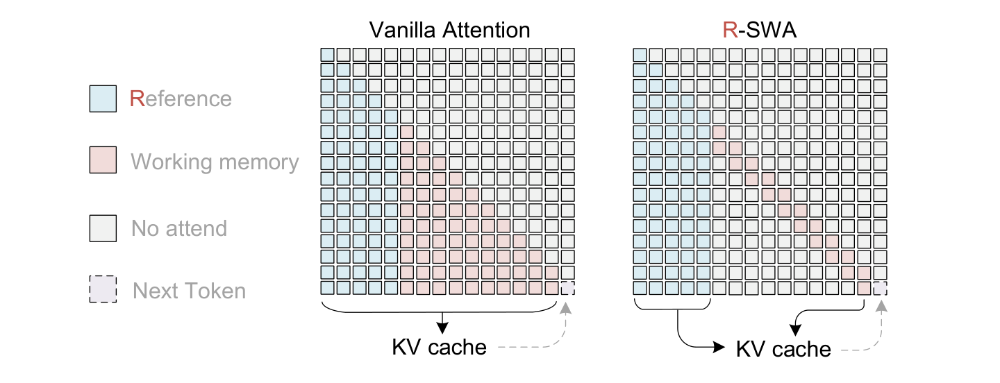
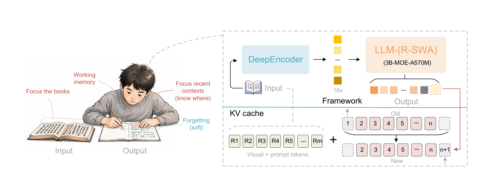
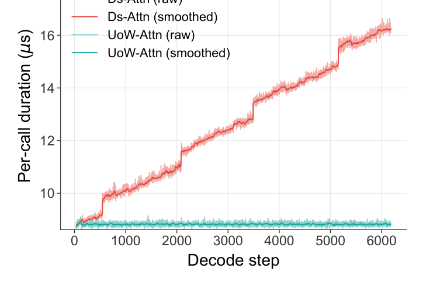
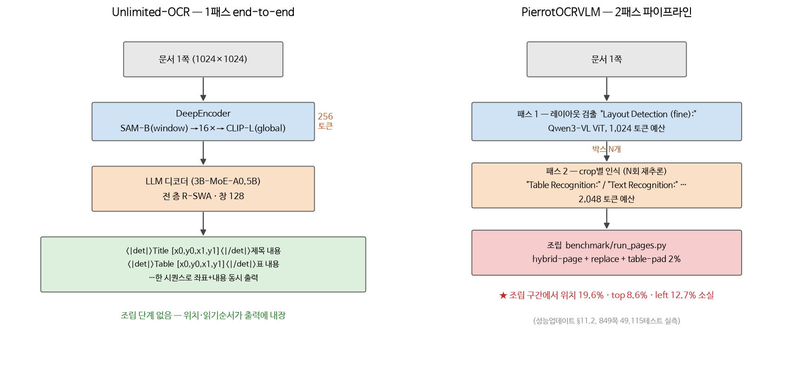
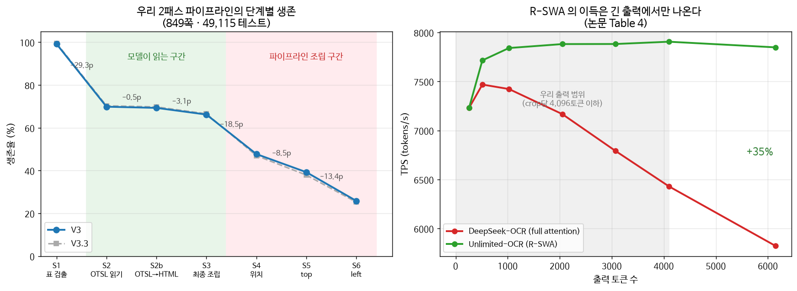

# Unlimited OCR Works (Baidu, 2026-06) — 리뷰와 우리 적용 검토

> 조사일 2026-08-19 · 대상: [github.com/baidu/Unlimited-OCR](https://github.com/baidu/Unlimited-OCR) ·
> [arXiv 2606.23050](https://arxiv.org/abs/2606.23050) (14쪽) ·
> [HF baidu/Unlimited-OCR](https://huggingface.co/baidu/Unlimited-OCR) (MIT)
>
> 논문 전문 + HF 실제 구현 코드(`modeling_deepseekv2.py`, `modeling_unlimitedocr.py`, `config.json`)를
> 직접 읽고, 우리 [성능업데이트.md](../성능업데이트.md)·[V3.4.md](../V3.4.md) 실측치와 대조했다.

## 요약

**DeepSeek-OCR을 그대로 두고 디코더의 어텐션만 R-SWA로 갈아끼운 뒤, 2M 데이터로 4,000스텝
이어학습한 모델이다.** 새 아키텍처가 아니라 **어텐션 1개 교체 + 데이터**다.

| 질문 | 답 |
|---|---|
| 무엇이 새로운가 | **R-SWA** — 이미지·프롬프트는 항상 전부 보고, 생성한 텍스트는 최근 128개만 본다 |
| 얻는 것 | KV 캐시가 출력 길이와 무관하게 **상수** → 수십 쪽을 한 번에 파싱 |
| 성능 | OmniDocBench v1.5 **93.23** (DeepSeek-OCR 87.01), v1.6 93.92로 end-to-end SOTA |
| 데이터셋 공개? | **아니다.** 가중치·추론코드·논문뿐 |
| 학습 코드 공개? | **아니다.** (ms-swift에 커뮤니티 지원이 들어가 파인튜닝은 가능) |
| 우리에게 쓸 것 | **① 윈도우 n-gram 금지**(즉시) · **② det+내용 인터리브 출력 포맷**(중기) |
| 우리에게 안 쓸 것 | **R-SWA 자체** — 우리 출력은 crop당 4,096토큰이라 KV 캐시가 병목이 아니다 |

---

## 1. R-SWA — 원리



```
토큰 t 가 보는 것 = [ 프리픽스 전체 (이미지 + 프롬프트, m개) ] ∪ [ 직전 출력 n개 (기본 128) ]
KV 캐시 크기      = m + min(n, T)      ←  출력 길이 T 와 무관하게 상수
```

논문의 비유가 그대로 설계다. 사람이 책을 베껴 쓸 때 ① **원본 책은 계속 본다** ② **방금 쓴 몇
글자만 본다** ③ 다음 글자를 쓴다. 그래서 이름이 "**Reference** Sliding Window".



**바닐라 SWA와 무엇이 다른가.** 보통 SWA는 창이 밀리면 오래된 것부터 전부 버린다 —
비전 토큰도 같이 밀려 나간다. R-SWA는 **비전 토큰을 창 밖으로 내보내지 않는다.** 논문 표현으로,
리니어 어텐션처럼 비전 특징이 state transition을 거치며 점점 흐려지는(progressive blurring)
문제를 피한다. 이미지는 **한 번 인코딩되어 끝까지 고정**이다.

**왜 이게 성립하나.** 인코더 압축률이 충분히 높기 때문이다. DeepEncoder는 1024×1024 한 쪽을
**256토큰**으로 줄인다. 20~30쪽이면 프리픽스가 겨우 ~7K 토큰이고, 그걸 통째로 붙들고 있어도
32K 컨텍스트 안에 들어간다. **고압축 인코더가 없으면 R-SWA도 성립하지 않는다.**

## 2. R-SWA — 실제 구현 (링 버퍼)

HF 코드 [`modeling_deepseekv2.py` L1330-L1370](https://huggingface.co/baidu/Unlimited-OCR/blob/main/modeling_deepseekv2.py#L1330-L1370) 의 핵심:

```python
# 스테디 디코드: 프리픽스는 고정, 그 뒤 W(=128)칸만 제자리 덮어쓰기
for t in range(q_len):
    slot = prefill_len + ring_pos
    kcache[:, :, slot:slot+1, :] = key_states[:, :, t:t+1, :]
    vcache[:, :, slot:slot+1, :] = value_states[:, :, t:t+1, :]
    ring_pos = (ring_pos + 1) % W
```

**왜 슬롯 순서가 뒤섞여도 되나** — RoPE를 **캐시에 쓰기 전에** 적용하기 때문이다. 위치 정보가
이미 key에 박혀 있고 softmax는 key 순서에 대해 순열 불변이라, 물리적 저장 순서는 무의미하다.
재정렬·재할당이 전혀 없어 **메모리도 지연도 상수**가 된다. 이 트릭 자체는 우리가 나중에 SWA를
쓰게 되면 그대로 재사용할 수 있다.

부수적으로 필요한 처리가 둘 있다:
- `config.sliding_window = None` 으로 꺼둬야 HF `DynamicCache`가 **프리필을 잘라먹지 않는다**
  (창 밖 = 이미지 토큰이므로 잘리면 치명적). 실제 창 크기는 `config._ring_window`에 따로 넣는다.
- 워밍업 구간(창이 아직 안 찼을 때)은 평범한 cat-append로 붙이다가, 다 차면 링으로 전환한다.



FlashAttention v3 커널 호출 시간이 DeepSeek-OCR은 디코드가 진행될수록 계속 오르는데(계단은 KV
길이가 정렬 경계를 넘을 때의 전송 효율 저하), Unlimited-OCR은 **평평하다.**

## 3. 스펙 실측 (config.json)

| 항목 | 값 |
|---|---|
| 디코더 | DeepSeek-V2 MoE, **12층**, hidden 1280, routed 64 + shared 2, top-6 → 3B 중 활성 **0.5B** |
| `sliding_window_size` | **128** |
| `max_position_embeddings` | 32,768 |
| 인코더 | DeepEncoder = SAM-ViT-B(window attn) → **16× 압축** → CLIP-L(global attn) |
| 압축률 | 1024×1024 한 쪽 → **256 토큰** |
| 해상도 모드 | gundam(단일쪽, 동적) / base(다쪽, 1024²) — DeepSeek-OCR 5종 중 2종만 유지 |
| 출력 포맷 | `<\|det\|>타입 [x0,y0,x1,y1]<\|/det\|>내용` 인터리브, **좌표 0~1000 정규화** |
| 다쪽 입력 | `<image>` 한 자리에 N쪽 토큰을 이어붙이고 쪽 사이에 구분자 1토큰 |
| 라이선스 | **MIT** (가중치 포함) |

`<|det|>`·`<page>`는 **특수 토큰이 아니라 평문**이다(`special_tokens_map.json`에는 User/Assistant뿐).

## 4. 성능

| Model | Size | v1.5 Overall ↑ | Text Edit ↓ | Formula CDM ↑ | Table TEDS ↑ | R-order ↓ |
|---|---|---|---|---|---|---|
| DeepSeek-OCR (baseline) | 3B-A0.5B | 87.01 | 0.073 | 83.37 | 84.97 | 0.086 |
| DeepSeek-OCR 2 | 3B-A0.5B | 89.17 | 0.049 | 86.85 | 85.60 | 0.060 |
| **Unlimited-OCR** | 3B-A0.5B | **93.23** | **0.038** | **92.61** | **90.93** | **0.045** |

v1.6에서도 93.92로 Qianfan-OCR(93.90)·Logics-Parsing-v2(93.33)·FireRed-OCR(93.26)을 근소하게 상회.

**장기 파싱** (in-house 벤치, 쪽수별):

| Pages | 2 | 5 | 10 | 15 | 20 | 40+ |
|---|---|---|---|---|---|---|
| Distinct-35 ↑ | 99.87% | 99.98% | 99.83% | 99.99% | 99.89% | 96.90% |
| Edit Distance ↓ | 0.0362 | 0.0452 | 0.0526 | 0.0787 | 0.0572 | **0.1069** |

## 5. ★ 논문을 비판적으로 읽기

우리가 이걸 따라 하기 전에 반드시 짚어야 할 4가지.

### 5.1 "free lunch"는 증명되지 않았다

+6.22p는 **R-SWA 교체**와 **2M 신규 데이터 4,000스텝 이어학습**이 **섞인 결과**다.
같은 데이터로 full-attention vs R-SWA를 돌린 **ablation이 논문에 없다.** 저자 본인도
*"R-SWA **may** allow the model to focus more on dense OCR tasks"* 라고 조건부로 쓴다.
같은 계보의 DeepSeek-OCR 2도 이어학습만으로 87.01 → 89.17을 얻었다 —
**개선분의 상당 부분은 데이터일 가능성이 크다.**

우리 [V3.4.md](../V3.4.md)가 세 번 연속 배운 교훈과 같은 종류다: **바꾼 게 둘이면 원인을 못 가린다.**

### 5.2 Distinct-n은 정확도 지표가 아니다

Distinct-n은 "같은 n-gram이 반복되지 않았는가"만 잰다. **반복 감지기지 정확도가 아니다.**
40쪽+에서 Distinct-35 96.9%는 좋아 보이지만, 같은 줄의 **Edit Distance는 0.1069로 2쪽(0.0362) 대비 3배**다.
"장기 파싱이 **된다**"와 "장기 파싱의 **품질이 유지된다**"는 다른 얘기다.

### 5.3 장기 벤치가 비공개다

"소설·문서·논문을 골라 쪽수별로 나눈 in-house 세트, 각 범주 10권 이상" — **검증 불가능**하다.
OmniDocBench 숫자만 재현 가능하다.

### 5.4 HF 구현은 batch 1 · eager 전제다

- `ATTENTION_CLASSES`에서 `mha_flash_attention_2`가 **주석 처리**돼 있다 → MHA 경로는 eager 강제.
- 스테디 디코드 경로는 `attention_mask`를 **아예 쓰지 않고** 캐시 전체를 본다 →
  **배치 패딩이 있으면 pad 슬롯까지 어텐션한다.**

즉 논문의 속도 수치는 SGLang/vLLM 경로 얘기고, HF `trust_remote_code` 경로는 **참조 구현**이다.
우리가 배치 추론(현재 `--batch-size 8`)에 이 코드를 그대로 가져오면 조용히 틀린다.

---

## 6. 데이터셋 — **공개되지 않았다**

HF API로 파일 목록을 직접 확인했다. 가중치·추론코드·논문·에셋뿐이고 `datasets:` 메타데이터도,
데이터 링크도 없다. HF 디스커션에도 공개 요청만 있고 저자 답변이 없다.

**논문 §4.1이 밝힌 데이터의 정체 (약 2M):**

| 항목 | 내용 |
|---|---|
| 단일쪽 : 다쪽 | **9 : 1** |
| 단일쪽 라벨 | **PaddleOCR로 자동 주석** — 즉 **전량 silver**. 블록별 좌표+내용을 이어붙여 검출+파싱 GT 구성 |
| 좌표 정규화 | **0~1000** ← **우리와 동일 규약** |
| 다쪽 데이터 | **전부 합성** — 단일쪽을 이어붙임. 약 200K 샘플, 각 **2~50쪽**, `<page>` 구분자 |
| 패킹 | 전부 32K 시퀀스로 random packing |

**학습 레시피 (§4.2):** DeepSeek-OCR 체크포인트에서 출발 → **DeepEncoder 동결, LLM만 학습** →
4,000스텝, global batch 256, **128×A800**, AdamW + cosine, **lr 1e-4**, DeepEP(EP=4), Megatron-LM.

**학습 코드도 비공개**다(리포에 `infer.py` 하나뿐). 다만 ms-swift에 `unlimited_ocr` 지원이
들어가 있어(GitHub 코드검색 확인) **파인튜닝 자체는 가능**하다. 가중치가 MIT라 상업 이용·증류에
법적 제약은 없다.

> **참고:** 우리 [Datasets.md](../Datasets.md)에 추가할 항목은 없다 — 새로 받을 수 있는 데이터가 없다.

---

## 7. 우리와의 차이



| | Unlimited-OCR | PierrotOCRVLM |
|---|---|---|
| 규모 | 3B MoE (활성 0.5B) | **0.99B dense** |
| 인코더 | DeepEncoder, 1024² → **256토큰** | Qwen3-VL ViT 306M, 1024² → **1,024토큰** |
| 디코더 | DeepSeek-V2 MoE 12층 | Qwen3-0.6B dense |
| 어텐션 | **R-SWA (창 128)** 전 층 | 표준 full causal |
| 컨텍스트 | 32K | **6,144** ([args/pierrotocrvlm.py:94](../../../args/pierrotocrvlm.py#L94)) |
| 해상도 예산 | 고정 2모드 | 태스크별 분리 — 인식 2,048 / 레이아웃 1,024 토큰 ([args/pierrotocrvlm.py:66-72](../../../args/pierrotocrvlm.py#L66-L72)) |
| 추론 구조 | **1패스 end-to-end**, 좌표+내용 인터리브 | **2패스 파이프라인** — 레이아웃 → crop 인식 → 조립 |
| 다중 페이지 | 수십 쪽 동시 | 쪽 단위 |
| 태스크 스위치 | 프롬프트 문장 | 프롬프트 문장 ([tools/pierrotocr_common.py:20-40](../../../tools/pierrotocr_common.py#L20-L40)) — **같은 방식** |
| 좌표 | 0~1000 | **0~1000 (동일)** |
| 출발점 | DeepSeek-OCR 이어학습 4,000스텝 | 하이브리드 이식 후 Stage 0→3 |
| 데이터 | 2M, PaddleOCR silver, **비공개** | 1.58M, 자체 빌더, 한국어 중심 |
| 한국어 | 검증 없음 (multilingual 태그뿐) | 특화 |

### 가장 중요한 구조적 차이

그들은 페이지 하나를 **256토큰으로 압축해 한 번에** 읽고, 우리는 **crop을 떠서 여러 번** 읽는다.
우리 방식은 작은 한글을 읽기 위한 선택이었지만, 대가로 **조립 손실**을 낸다.



왼쪽이 [성능업데이트 §11.2](../성능업데이트.md) 실측이다. **모델이 읽는 구간(S1~S3)의 손실은
S2 읽기 29.2% 하나뿐**이고, S4~S6에서 위치 19.6% · top 8.6% · left 12.7%를 더 잃는다.
**이 뒤쪽 손실은 인터리브 포맷이면 원리적으로 존재하지 않는 비용**이다 — 좌표가 내용과 같은
시퀀스에 있으면 "어느 박스의 내용인가"를 맞출 일 자체가 없다.

오른쪽은 왜 **R-SWA를 지금 가져오면 안 되는지**를 보여 준다. 이득이 벌어지는 구간(4K 토큰 이상)이
**우리 출력 범위 밖**이다.

---

## 8. 우리에게 적용할 것 (ROI 순)

### ★ A. 반복 억제를 "정지"에서 "금지"로 — 즉시, 재학습 불필요

우리는 반복이 감지되면 **생성을 끊는다**
([pierrotocrvlm.py:347-363](../../../pierrot/models/pierrotocrvlm/modeling/pierrotocrvlm.py#L347-L363),
CLI는 [run_pages.py:77](../../../benchmark/run_pages.py#L77) `--table-stop-on-cycle`).
[성능업데이트 §12.2](../성능업데이트.md) 실측: 상한 도달 33.5% → 3.4%로 폭주는 확실히 잡히는데
**점수는 −0.01~−0.16p**. 폭주를 막은 대신 **표의 나머지를 통째로 잃기** 때문이다.

그들은 대신 **윈도우 n-gram 금지**를 쓴다 (`SlidingWindowNoRepeatNgramProcessor`,
`ngram_size=35`, `window=128`):

```python
# 최근 window 토큰 안에서, 지금 접미사와 같은 (n-1)-gram 뒤에 왔던 토큰만 -inf
search_start = max(0, len(sequence) - self.window)
current_prefix = tuple(sequence[-(self.ngram_size - 1):])
for idx in range(search_start, len(sequence) - self.ngram_size + 1):
    ngram = sequence[idx:idx + self.ngram_size]
    if tuple(ngram[:-1]) == current_prefix:
        banned.add(ngram[-1])          # 생성은 계속된다 — 다른 토큰으로 밀어낼 뿐
```

**우리 격자 붕괴 86건 중 85건이 `<nl>`을 한 번도 못 낸다**([성능업데이트 §12.3](../성능업데이트.md)).
끊지 말고 **다른 토큰으로 밀어내면 `<nl>`이 나올 기회**가 생긴다.

- n=35는 매우 보수적이라 **표의 정당한 반복**(빈 셀·같은 숫자)은 건드리지 않는다 —
  우리가 전역 `repetition_penalty`를 못 쓴 이유가 그대로 해소된다.
- 붙일 자리: [pierrotocrvlm.py:291-301](../../../pierrot/models/pierrotocrvlm/modeling/pierrotocrvlm.py#L291-L301)
  의 `next_logits` → `argmax` 사이. 배치 차원만 유지하면 30줄 안쪽이다.
- 기존 `stop_on_cycle`은 **안전망으로 남긴다**(둘은 배타적이지 않다).

> **주의:** [성능업데이트 §12.5](../성능업데이트.md)에서 확인했듯 **재추론 A/B는 배치 구성까지
> 맞춰야 한다.** 안 맞추면 모델 특성이 아니라 실험 조건 차이를 잰다.

### ★ B. `<|det|>타입 [박스]<|/det|>내용` 인터리브 포맷 — 중기, 최대 구조적 이득

레이아웃과 내용을 **한 시퀀스에 같이** 뱉으면 S4~S6 조립 손실이 사라진다.
우리 좌표 규약(0~1000)이 **이미 같으므로 재라벨링이 필요 없다** — 기존 레이아웃 gold와
crop 인식 쌍을 **합치기만 하면** 새 태스크 `Page Parsing:` 데이터가 만들어진다
([tools/pierrotocr_common.py:20-40](../../../tools/pierrotocr_common.py#L20-L40)에 프롬프트 상수 추가).

**리스크:** 우리 페이지 예산은 1,024토큰이다. 그 해상도로 작은 한글이 읽히는지가 관건이고,
읽히지 않는다면 그게 애초에 crop으로 간 이유다.

**현실적 설계 — 하이브리드.** 인터리브 패스로 **위치·읽기순서·구조**를 확보하고, 내용은 기존
crop 인식으로 채운다. 지금 `--hybrid-place replace`가 **후처리로** 하는 일을
**모델이 직접** 하게 만드는 방향이다.

**선행 검증(재학습 전에 반드시):** 849쪽에서 "페이지 1,024토큰 예산으로 본문이 읽히는가"를
crop 인식 결과와 문자 단위로 대조한다. 이게 안 되면 B는 그 자리에서 기각이다.

### C. 다쪽 합성 데이터 — 저비용, 우선순위 낮음

단일쪽을 이어붙여 2~50쪽 샘플을 만드는 건 우리도 한나절이면 한다. 다만 **KDoc 평가가 쪽 단위**라
점수에 직접 기여하지 않는다.

값어치가 있는 곳은 **머리말/꼬리말 판별** 하나다 — 우리 HF 축은 792건이 전부 `absent`(지워야 통과,
[V3.4.md §1](../V3.4.md)). 쪽을 넘나들며 반복되는 문자열이 러닝 헤더라는 신호는 **다쪽 문맥에서만**
배울 수 있다. 다만 현재 HF는 이미 97.6%라 **개선 여지가 2.4p뿐**이다.

### D. R-SWA 자체 이식 — 지금은 **비추천**

우리 출력은 crop당 4,096토큰 이하라 **KV 캐시가 병목이 아니다.** 간판 효과(상수 메모리·상수 TPS)가
우리에겐 거의 무의미하고(위 그림 오른쪽), 정확도 개선분은 §5.1대로 **데이터와 분리되지 않았다.**
지금 우리 최대 병목은 **S2 읽기 소실 29.2%**이지 어텐션이 아니다.

**재검토 시점:** B(인터리브 1패스)로 가면 출력이 페이지당 수천~수만 토큰이 된다. 그때는 값어치가 생긴다.
학습 측 마스크는 PyTorch FlexAttention `create_block_mask`로 몇 줄이면 표현된다
(프리픽스 열은 항상 True + 그 뒤는 밴드) — 그들이 Megatron으로 짠 부분을 우리는 그렇게 대체할 수 있다.

### E. 학습 레시피에서 참고할 것

- **인코더 동결 + 디코더만 학습으로 태스크 전환.** 우리 Stage 0의 반대 방향인데, 부품이 이미
  정렬된 뒤 **출력 포맷만 바꿀 때**는 이쪽이 맞다. B를 할 때 쓸 패턴이다.
- **32K random packing.** 우리 `--max-suffix-tokens 2900` 필터가 긴 표를 계속 걸러내는
  문제(학습 2,900 / 추론 4,096 불일치, [성능업데이트 §11.4](../성능업데이트.md))에 대한 구조적 대안이다.
- **lr 1e-4로 4,000스텝.** 우리는 V3에서 1e-5/6,170스텝을 썼다. 다만 그들은 **활성 0.5B MoE**라
  실효 LR 성격이 다르다 — **숫자를 그대로 옮기면 안 된다.**

### F. 하지 말 것

- **Unlimited-OCR을 한국어 silver 라벨러로 쓰기.** 학습 데이터가 PaddleOCR 자동 라벨이라 한국어
  품질이 검증된 바 없고, 우리는 이미 V3.1(silver 19.8%)·V3.2(silver 27.5%)에서 **silver 과다로
  두 번 실패**했다([V3.4.md §2](../V3.4.md)).
- **DeepEncoder로 인코더 교체.** 256토큰/쪽은 한글 소자 인식에 위험하고, 우리 ViT는 공식 HF와
  **비트 단위 일치(diff 0.0)**까지 검증한 자산이다([plan.md M0](../plan.md)).
- **HF `trust_remote_code` 구현을 배치 추론에 그대로 이식.** §5.4 참고.

---

## 9. 다음 액션

| 순서 | 할 일 | 비용 | 성공 기준 |
|---|---|---|---|
| 1 | A — 윈도우 n-gram 금지 구현 + 849쪽 A/B (**배치 구성 고정**) | 반나절 | 표 점수 ≥ 26.65 유지하면서 상한 도달률 하락 · 격자 붕괴 6.7% 감소 |
| 2 | B 선행 검증 — 페이지 1,024토큰 예산의 본문 가독성 측정 | 반나절 | crop 인식 대비 문자 정확도 하락이 5p 이내면 B 진행 |
| 3 | (2 통과 시) B — `Page Parsing:` 태스크 데이터 빌드 + 학습 | 수일 | S4~S6 손실 구간 소멸 |

R-SWA(D)와 다쪽 합성(C)은 **B가 성립한 뒤에** 다시 본다.

---

## 참고

- 코드/논문: [github.com/baidu/Unlimited-OCR](https://github.com/baidu/Unlimited-OCR) ·
  [arXiv 2606.23050](https://arxiv.org/abs/2606.23050) ·
  로컬 사본 `ocr/Unlimited-OCR/`
- 가중치: [huggingface.co/baidu/Unlimited-OCR](https://huggingface.co/baidu/Unlimited-OCR) (MIT)
- 데이터셋 공개 요청 스레드(답변 없음): [HF discussions #2](https://huggingface.co/baidu/Unlimited-OCR/discussions/2)
- 서빙: [vLLM recipe](https://recipes.vllm.ai/baidu/Unlimited-OCR) · SGLang(리포에 wheel 동봉)
- 계보: [DeepSeek-OCR](https://github.com/deepseek-ai/DeepSeek-OCR)(baseline) · DeepSeek-OCR 2 · PaddleOCR(라벨러)

### 그림 재생성

이 문서의 그림 5장은 전부 스크립트로 재생성된다 —
[tools/make_unlimited_ocr_figs.py](../../../tools/make_unlimited_ocr_figs.py):

```shell
conda activate flux2 && python tools/make_unlimited_ocr_figs.py
```

- `fig1~3` : 논문 PDF(`ocr/Unlimited-OCR/Unlimited-OCR.pdf`)에서 좌표로 잘라낸 원본 그림
- `pipeline-compare` / `funnel-and-tps` : 우리 실측치([성능업데이트 §11.2](../성능업데이트.md))와
  논문 Table 4 로 직접 그린 것 — **수치를 고치면 스크립트의 리스트만 고친다**
