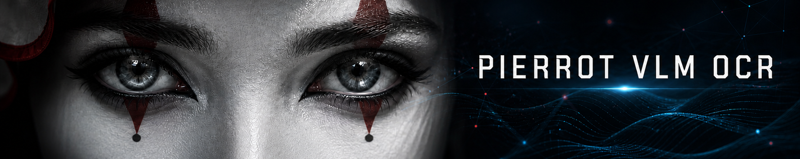

<p align="center">
  
</p>

<h1 align="center">📄 PIERROT VLM · OCR</h1>

<p align="center">
  <b>A from-scratch PyTorch document-parsing VLM — PierrotOCRVLM inference distribution</b>
</p>

<p align="center">
  
  
  
  
  
  
  
</p>

<p align="center">
  <a href="README.md">한국어</a> | <b>English</b>
</p>

---

## 💡 Introduction

**PIERROT VLM · OCR** is a **one-person VLM research and development project** on
VLM-based text recognition in images. It covers not just character recognition but also
document block detection and detection in ordinary photographs.

**The goal is also maximum performance at minimum size.** GPU resources were tight even in
development, and inference cost matters once it actually runs. Above all, having a
**smaller model deliver bigger performance** is the goal itself — so this project settled
on **0.986B**, and that single model covers the whole pipeline, from layout detection to
text, table, and formula recognition.

Input is one page image; output is **Markdown / JSON**.

> **Origin of the name** — Pierrot is originally a pantomime clown character who **mimics and
> imitates others**. It resonates with [Pierrot Universe](https://github.com/Pierrot-vision)'s first
> philosophy (MimiC) — following and combining the good parts of existing research — which is why we use this name.

* The training code and trained weights are not publicly released at this time.

## 📰 News

- 2026-08-24 — 📈 **V3.6** — 3-axis mean **73.42** (**+1.56p** over V3.5's 71.86) · **all three axes up** — Table **45.98** (+1.88p) · Header/Footer **94.95** (+1.52p) · Long Text **79.33** (+1.29p). Still 2nd overall and 1st on Long Text
- 2026-08-22 — 🏆 **2nd on [KDoc-OCRBench-V2](https://huggingface.co/datasets/ONTHEIT/KDoc-OCRBench-V2)** — **1st** excluding commercial models, and **1st overall on Long Text** (3-axis mean 71.86)
- 2026-08-22 — 🚀 **Inference code released**

---

## 📊 Performance — [KDoc-OCRBench-V2](https://huggingface.co/datasets/ONTHEIT/KDoc-OCRBench-V2) (all 849 pages)

| Rank | Model | Size | Header/Footer | Long Text | Table | 3-axis mean |
|---:|---|---:|---:|---:|---:|---:|
| 1 | BizOnAI-OCR *(commercial)* | undisclosed | 94.70 | 77.90 | **58.10** | **76.90** |
| **2** | **Ours** | **0.99B** | 94.95 | **79.33** | 45.98 | 73.42 |
| 3 | PaddleOCR-VL | 0.9B | 95.60 | 66.20 | 48.90 | 70.20 |
| 4 | DeepSeek OCR | ~3B *(MoE, 0.57B active)* | 95.80 | 64.50 | 46.60 | 69.00 |
| 5 | olmOCR v0.2.0 | 7B | 95.20 | 65.00 | 44.90 | 68.40 |
| 6 | GLM-4.1V-OCR | 9B | **97.40** | 52.90 | 30.00 | 60.10 |

---

## 🎬 Demo

**Two-column academic paper**


**Public-sector report**


---

## 📦 Installation

```bash
# 1) create and activate a conda environment
conda create -n pierrot-ocr python=3.10 -y
conda activate pierrot-ocr

# 2) install dependencies
cd Pierrot_VLM_OCR
pip install -r requirements.txt
```

---

## 🔮 Inference

### One page — `infer/infer_pierrotocrvlm.py`

```bash
# default: coarse-to-fine two-pass → Markdown + JSON
python infer/infer_pierrotocrvlm.py --model ./outputs/pierrotocrvlm_v3/final \
    --image page.png --out results/parsed --save-viz

# single-pass whole-page reading (fast and strong on simple layouts)
python infer/infer_pierrotocrvlm.py --model ./outputs/pierrotocrvlm_v3/final \
    --image page.png --mode page

# outdoor photos (signs, storefronts): word-box detection → crop recognition
python infer/infer_pierrotocrvlm.py --model ./outputs/pierrotocrvlm_v3/final \
    --image photo.jpg --layout-prompt wild
```

Main arguments:

| Argument | Default | Description |
|---|---|---|
| `--mode` | `coarse-to-fine` | `page` for single-pass reading |
| `--layout-prompt` | `fine` | `coarse` (DocLayNet convention) / `wild` (outdoor words) |
| `--batch-size` | 8 | Crops generated in parallel |
| `--max-new-tokens` | 1024 | Generation budget for body crops |
| `--table-max-new-tokens` | 4096 | **Tables only** — statistical tables have hundreds of cells |
| `--stop-on-cycle` | 32 | Degenerate-repetition cutoff (0 = off). Scores stay identical while output halves |
| `--save-viz` | off | Draw layout boxes on the original for review |
| `--dtype` | `bfloat16` | `float32` / `float16` |

Outputs: `<stem>.md` (Markdown in reading order) · `<stem>.json` (per-element class, box,
text) · `<stem>_layout.jpg` (with `--save-viz`).

### Many pages — `benchmark/run_pages.py`

```bash
# the best benchmark path (the combination that produced 71.86 over 849 pages)
python benchmark/run_pages.py --model ./outputs/pierrotocrvlm_v3/final \
    --images "/path/pages/*.jpg" --out results/md \
    --mode hybrid-page --body-fill --relayout-bands

# split across GPUs with shards
CUDA_VISIBLE_DEVICES=0 python benchmark/run_pages.py ... --shard 0 --num-shards 4 &
CUDA_VISIBLE_DEVICES=1 python benchmark/run_pages.py ... --shard 1 --num-shards 4 &
```

| Argument | Description |
|---|---|
| `--mode` | `coarse-to-fine` / `page` / `hybrid` / `hybrid-page` |
| `--body-fill` | Append the body crops `hybrid-page` would discard (**+3.85p**) |
| `--relayout-bands` | Re-detect only the bands the layout pass skipped (**body text +1.87p**) |
| `--table-pad` | Ratio padding for table crops (0.02 = 2%). Measured optimum is 2% |
| `--page-no-repeat-ngram` | n-gram ban for whole-page reading only — **never applied to tables/crops** |
| `--save-layout` / `--save-trace` | Save raw layout output / untruncated per-crop traces (diagnostics) |
| `--shard` / `--num-shards` | Multi-GPU split |

### From Python

```python
from PIL import Image
from pierrot.models.pierrotocrvlm import load_pretrained
from tools.pierrotocr_common import PROMPT_LAYOUT_FINE, PROMPT_TABLE

model, processor = load_pretrained("./outputs/pierrotocrvlm_v3/final", device="cuda")
model.eval()

enc   = processor([Image.open("page.png").convert("RGB")], [PROMPT_LAYOUT_FINE])
enc   = {k: v.to("cuda") for k, v in enc.items()}
out   = model.generate(enc["input_ids"], enc["pixel_values"], enc["image_grid_thw"],
                       enc["attention_mask"], max_new_tokens=768,
                       eos_token_id=processor.eos_token_id)
print(processor.tokenizer.decode(out[0][enc["input_ids"].shape[1]:], skip_special_tokens=True))
```

---

## 🧾 Output format

**Markdown** — assembled in reading order, per class:

| Class | Output |
|---|---|
| `Title` / `Section-header` | `# ` / `## ` prefix |
| `Text` / `Footnote` | Plain text |
| `List-item` | `- ` prefix |
| `Caption` | `*italic*` |
| `Table` | OTSL → restored **HTML table** |
| `Formula` | `$$ … $$` |
| `Picture` | `` placeholder (recognition skipped) |
| `Page-header` / `Page-footer` | Excluded from the body |

**JSON** — `{image, size, elements: [{label, box, text}]}`. `box` is in 0–999 normalized
coordinates, so it can be reused regardless of the original page size.

**OTSL** — the table serialization format ([tools/otsl.py](tools/otsl.py)). It roughly
halves tokens versus HTML and makes unclosed tags grammatically impossible.
`otsl_to_html()` converts back.

---

## 📁 Directory layout

```
Pierrot_VLM_OCR/
├── infer/
│   └── infer_pierrotocrvlm.py  # ★ single-page CLI — two-pass parsing, assembly, visualization
├── benchmark/
│   └── run_pages.py            # ★ batch runner — load once, mode/shard/diagnostic options
├── eval/
│   └── metrics_ocr.py          # layout output parser (parse_layout) + metrics (NED · TEDS · F1 · tau)
├── tools/
│   ├── pierrotocr_common.py    # single source of task prompts (= the task switch)
│   ├── otsl.py                 # OTSL ↔ HTML table converter
│   ├── hybrid_merge.py         # page ↔ c2f merging, column splitting, uncovered-band detection
│   ├── make_demo_viewer.py     # 3-panel replay viewer (page + RAW stream + reflow) as HTML
│   ├── compare_modes.py        # side-by-side comparison image for two modes
│   └── record_demo_gif.py      # viewer → demo GIF recording (needs playwright)
├── requirements.txt
├── LAB/pierrotocrvlm/          # one lab note — design, training, experiments, results, failures
├── docs/                       # architecture figure, LAB figures, banner
└── pierrot/
    └── models/pierrotocrvlm/   # algorithm package (inference paths only)
        ├── config.py           #   PierrotOCRConfig / Text / Vision (1:1 with HF config.json)
        ├── modeling/
        │   ├── vision.py       #     dynamic-resolution ViT + bilinear pos interpolation + PatchMerger + DeepStack
        │   ├── text.py         #     Qwen3 decoder (RMSNorm + M-RoPE + QK-Norm + GQA + SwiGLU, + KVCache)
        │   └── pierrotocrvlm.py#     merge (masked_scatter) + M-RoPE positions + generate (cycle / n-gram guards)
        ├── processor.py        #   dynamic-resolution patching (smart_resize) + ChatML prompt encoding
        ├── detection.py        #   detection/layout output parsing & visualization
        └── weights.py          #   checkpoint loading (config + safetensors/model.pt + sidecar)
```

---

## 🧪 LAB notes

Design, training method, experiments, and results are consolidated into **one document**:
[**LAB/pierrotocrvlm/pierrotocrvlm.md**](LAB/pierrotocrvlm/pierrotocrvlm.md) (written in Korean).

It does not record only what worked. **15 rejected hypotheses** and **13 measurement
defects** are in there too — those were the most expensive part of this project.

| Section | Content |
|---|---|
| 1 Overview · 2 Architecture | What changed from the MinerU2.5 skeleton · lineage · why the 4 PatchMergers were the biggest risk |
| 3 Tasks · 4 Inference | Prompt = task switch · three detection conventions · OTSL · assembly +11.81p · band re-detection |
| 5 Training · 6 Data | Stage 0–3 curriculum · **blend by tokens, not records** · data lessons and 3 incidents |
| 7 Experiments · 8 Performance | v1 → v2 → v3 → three straight losses → teacher distillation → V3.5/3.6 · leaderboard comparison |
| 9 Rejected hypotheses · 10 Measurement defects · 11 Remaining bottlenecks | What not to retry · suspect the instrument first · stage-by-stage survival |

Where the document mentions `args/`, `training/`, or `tools/build_*`, it refers to the
**training repository** — those files are not in this distribution.

---

## 📚 Reference

Paper notes and reviews → [Pierrot-vision/Reading-Papers — VLM](https://github.com/Pierrot-vision/Reading-Papers#-vlm)

- **[KDoc-OCRBench-V2](https://huggingface.co/datasets/ONTHEIT/KDoc-OCRBench-V2)** · **OmniDocBench** · **CC-OCR** — evaluation benchmarks

---

## 📄 License

This project (code and documentation) is licensed under **CC BY-NC-SA 4.0** — attribution, non-commercial, share-alike. See [LICENSE](LICENSE) for details. (Third-party datasets, models, and libraries follow their own licenses.)

> ⛔ **NonCommercial** — for non-commercial use only. Please contact us separately for commercial use.

---

## 📮 Contact

- Please reach out via [email](mailto:peternara@naver.com) or a [GitHub Issue](https://github.com/Pierrot-vision/Pierrot-VLM/issues). I will answer as best I can.
- Note that questions already answered on GitHub (README, code, docs) may not receive a reply.
